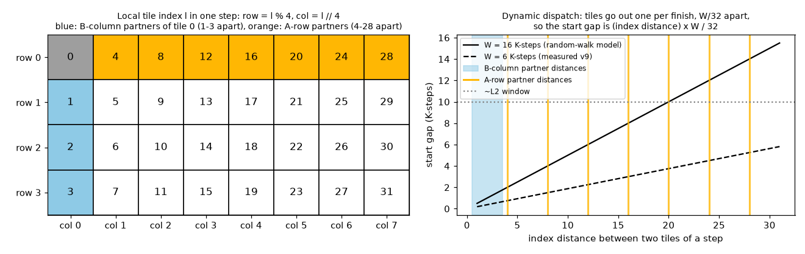
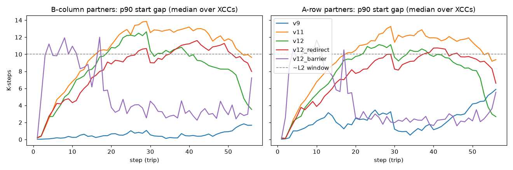
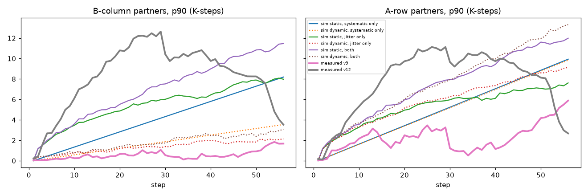

# CU drift and L2 reuse in persistent GEMM kernels

Why do the persistent a16w16 kernels (v10-v13) lose L2 hit rate against v9 on long-running shapes,
even with the identical tile order? The answer is **CU drift**: tiles that share data stop
running at the same time. This note summarizes the reasoning and the measurements on
16384x57344x8192 (bf16, v9 tile order, MI355X).

## TL;DR

- **L2 reuse needs partners in step.** Each XCD runs 32 tiles at once, sharing 4 A rows and 8 B
  columns. The 4 MB L2 holds only about a 10 K-step window of that shared data, so tiles that
  share an A row or a B column must be within about 10 K-steps of each other to hit.
- **Drift grows like √n even when no CU is slow.** Random per-tile variation makes each CU's
  average *speed* even out, but its *position* (how far ahead or behind it is) is a running sum
  and wanders by about √n.
- **Persistent kernels pair tiles by CU, dynamic dispatch pairs them by time.** With fixed tile
  lists, partners are fixed CUs whose positions wander apart without bound. With dynamic dispatch
  (v9), consecutive tiles go to whichever CUs finish next, so they start close together.
- **That bound only covers B-column partners** (consecutive indices). A-row partners are 4-28
  indices apart and aren't protected by dynamic dispatch. Real v9 keeps them close anyway, which
  is unexplained.
- **Causal test:** a per-XCD barrier at every trip restores the L2 hit rate to 80% on all 8
  chiplets. It costs +12% time, so it proves the cause but isn't a fix.
- **The odd chiplets drift the most** (up to 18 K-steps, 45-54% L2 hit rate when instrumented).
- **Same access pattern:** v9 and v12 map identical tiles to identical XCCs, verified offline and
  on the device (100% of tiles on XCC `index % 8`).

## 1. Why drift matters: L2 reuse

In the v9 tile order, each XCD's 32 concurrent tiles form a 4 (A rows) x 8 (B columns) block, and
every XCD walks the same B columns at the same time. Per K-step, those 32 tiles read
4 x 32 KB of A plus 8 x 32 KB of B, about **384 KB**. So a 4 MB L2 can keep roughly **10 K-steps**
of shared data. If two tiles that share a panel read it more than about 10 K-steps apart, the
second read misses.

Measured L2 hit rate on 16384x57344x8192:

| Build | L2 hit rate | Per XCC 0-7 | Time (µs) |
|---|---|---|---|
| v9 | 79.2% | 80 78 80 78 80 79 80 79 | 9,594 |
| v12 | 74.4% | 79 72 78 72 77 71 76 71 | 9,578 |
| v12, instrumented | 59.7% | 70 50 72 54 67 47 70 48 | 10,035 |
| v12 + per-XCD barrier | 80.2% | 80 80 80 80 80 80 80 80 | 10,743 |

Across builds and chiplets, the late-kernel partner gap tracks the L2 hit rate at **r = −0.89**.

## 2. How drift accumulates

**Coin-flip example.** Each tile takes 100 µs, plus or minus 1 µs at random (1 µs ≈ 1.3 K-steps).
Neither CU is slow on average. "Position" is the running total of errors; "speed error" is that
total divided by the number of tiles.

| Tile | A error | A position | A speed | B error | B position | B speed | Gap between A and B |
|---|---|---|---|---|---|---|---|
| 1 | +1 | +1 | +1.00 | −1 | −1 | −1.00 | 2 |
| 2 | −1 | 0 | 0.00 | −1 | −2 | −1.00 | 2 |
| 4 | +1 | +2 | +0.50 | −1 | −2 | −0.50 | 4 |
| 6 | +1 | +2 | +0.33 | +1 | −2 | −0.33 | 4 |
| 8 | −1 | +2 | +0.25 | −1 | −4 | −0.50 | 6 |

The speeds converge towards zero, but the gap reaches 6 µs, about 8 K-steps. In general:

| Tiles n | Typical speed error (1/√n) | Typical position (√n) |
|---|---|---|
| 1 | 1.0 | 1 |
| 4 | 0.5 | 2 |
| 16 | 0.25 | 4 |
| 64 | 0.125 | 8 |

Randomness evens out speed; it doesn't even out position. A systematic difference Δ per tile adds
n·Δ on top, growing linearly.

**Pairing by CU versus pairing by time.** Four CUs after 8 tiles are at positions A +2, B −4,
C 0 and D −2 µs. The next four tiles form two pairs that share data, (1, 2) and (3, 4).

- **Persistent (static):** partners are fixed CUs, A with B and C with D, giving gaps of 6 and
  2 µs.
- **Dynamic (v9):** in finish order B, D, C, A, the tiles go to (B, D) and (C, A), giving gaps of
  2 and 2 µs.

The CU positions are the same in both cases. Dynamic dispatch doesn't reduce the drift; it pairs
each tile with the CU nearest in time.

**At real scale.** The measured jitter is about 0.39% per tile, which is 0.5 K-steps. After 56
tiles (trips per program on this shape):

- The spread of 32 CU positions is about 4 × 0.5 × √56 ≈ **15 K-steps**, under both schemes.
- **Static:** a fixed pair is about 4 K-steps apart typically, and about 9 at the 90th
  percentile. Small systematic CU offsets push this towards the measured 10-14.
- **Dynamic:** consecutive hand-outs are spread / 32 ≈ 0.5 K-steps apart. Once CU phases are
  spread across a whole tile, the bound is about tile / 32 ≈ **4 K-steps**.

On the square shapes studied earlier, programs made only 4 trips. That gives about 1-3 K-steps of
drift and a ~1% L2 effect, against 56 trips here. The 8192³ control confirms it: the late gap stays
at 2.3 K-steps or less.

## 3. A and B reuse under dynamic dispatch

With `GROUP_SIZE_M = 4`, the local index `l` within a step maps to row `l % 4` and column
`l // 4` (left panel):

- **B-column partners** (same column) are consecutive indices, 1-3 apart.
- **A-row partners** (same row) are 4, 8, …, 28 apart.

Dynamic dispatch hands out one tile per finish. If the 32 CUs finish across a window W, the start
gap is (index distance) × W / 32 (right panel). With the random-walk W of 16 K-steps:

| Partners | Index distance | Start gap |
|---|---|---|
| B column, tiles 0 and 3 | 3 | 1.5 K-steps |
| A row, tiles 0 and 4 | 4 | 2 K-steps |
| A row, tiles 0 and 28 | 28 | 14 K-steps, past the window |

Under static assignment the index distance doesn't matter: every pair is two independent random
walks, so A and B partners suffer equally. At step 56 (90th percentile, K-steps):

| | B column | A row |
|---|---|---|
| Static (Monte Carlo) | 11.5 | 12.0 |
| Dynamic (Monte Carlo) | 3.1 | 13.3 |
| Real v9 (measured) | 1.7 | 5.9 |

**In short:** static and dynamic assignment drift at the same rate; they differ in which pairs pay
for it.
- **Static** spreads the damage evenly over all sharing pairs.
- **Dynamic** concentrates it on pairs far apart in dispatch order and spares the adjacent ones.
  With `GROUP_SIZE_M = 4`, the spared pairs are the B partners, so dynamic wins on B and roughly
  ties or loses on A.
- **The advantage shrinks as drift grows.** Adjacent hand-outs are W/32 apart, so B partners
  (3 apart) reach the ~10 K-step window when W is about 100 K-steps. At that point the spread is
  close to one whole tile (128 K-steps), and the advantage is gone.

**Open question: real v9 beats the dynamic model on A rows.** Its measured window W stays at
2-9 K-steps rather than growing to about 15, and 28/32 × 6 ≈ 5 K-steps matches the measured 5.9.
Something keeps v9's CUs finishing together. Two explanations were ruled out:

- **Catch-up:** late tiles don't run shorter (slope of duration against lateness about 0).
- **Dispatch clipping:** early finishers don't wait longer for their next workgroup (slope +0.01;
  the gap is about 1 µs of launch time).

v9 starts tiles in index order 81-92% of the time, against about 50% for v12.

## 4. Measured figures

**Partner start gap per step** (90th percentile, median over XCCs; left B columns, right A rows).
The persistent builds climb to 10-14 K-steps by around step 29, past the L2 window. v9 stays at
0-2 (B) and 1-6 (A). The dip at step 29 is where each XCD switches to its second group of A rows.
The barrier curve shows arrival skew at the barrier, not real drift (see Notes).

**Monte Carlo with the measured parameters** (thin lines), overlaid on measured v9 and v12 (thick).
The per-tile jitter is 0.39% for v12 and 0.34% for v9, and the CU offset sd is 0.06% and 0.05%, so
the two kernels are about equally noisy. Static assignment with those numbers reproduces v12's
growth. Measured v9 stays below even the dynamic model for A rows (the open question in section 3).

**Odd chiplets.** Even in v9, the odd XCCs clock 30-50 MHz lower, and XCC1 and XCC3 have the
widest CU-to-CU speed spread (0.35% and 0.33% max-min, against 0.09-0.26% elsewhere). Under static
assignment, the odd XCCs drift the most: 12-18 K-steps, with a 45-54% L2 hit rate (instrumented),
against 66-72% on the even ones. With the barrier, every XCC is at 80%, so the deficit comes from
drift, not from the L2 itself. Why the odd chiplets are slower in the first place is a hardware
question these counters can't answer.

## Notes

- **Instrumentation overhead:** recording adds 2.7% (v11) and 4.4% (v12) and lowers v12's L2 hit
  rate, so instrumented builds show an exaggerated version of the effect. Correlations use
  counters from the same instrumented builds.
- **Barrier curve:** a trip's recorded start is the previous trip's end, taken before the
  barrier, so the barrier build's gap is arrival skew. Its L2 result comes from the counters.
- **Fitted jitter:** measured as residuals against each XCD's per-step mean, so whole-XCD speed
  changes (clock) are excluded. They create no partner gap.
- **Smaller tiles (prediction, not measured):** 128x128 tiles halve the L2 footprint per K-step
  (a ~20 K-step window) but make 4x the trips. That gives ~2x the random drift and ~4x the
  systematic drift, and the lost reuse costs more at half the arithmetic intensity. Expect a
  larger effect.
- **Candidate fix:** dynamic assignment within each XCD, using an atomic tile counter fetched one
  tile ahead to keep the cross-tile prefetch. It still needs a mechanism for A-row partners.
- **Setup:** MI355X, 8 XCDs × 32 CUs, bf16, `llir+force-agpr+amdgcnas`, GPU 4,
  `PERSISTENT_TILE_ORDER=v9`.
- **Regenerate:** `python make_figures.py` rebuilds `images/concept_*.png` with no GPU. The
  measurement tooling (instrumented builds, driver, report) is in
  `kernels/gemm/intra_wave/a16w16/tmp/tensoratlas_bf16/drift/`, which is gitignored. The full
  report is `out/report.md` there.
- **More figures:** `images/concept_random_walk.png` shows 32 CUs whose speed evens out while
  their positions spread like √n. `images/concept_pairing.png` shows the Monte Carlo partner gap,
  static against dynamic, for B columns and A rows.
