# HBM bandwidth vs CU / XCD placement on MI355X

How much HBM bandwidth can a memory-bound kernel get from `W` workgroups, and does it matter
which CUs and XCDs those workgroups run on? In particular: if a memory-bound kernel has 32
workgroups, does splitting it over 64 CUs (as split-k does) buy bandwidth?

```bash
HIP_VISIBLE_DEVICES=0 python bench.py --sweep check        # placement validation (1 s)
HIP_VISIBLE_DEVICES=0 python bench.py --sweep A B C D E F --full   # HBM sweeps, about 2.5 minutes
HIP_VISIBLE_DEVICES=6 python bench.py --sweep check D G H I J --results-dir results/gpu6  # cache tiers
HIP_VISIBLE_DEVICES=6 python pmc.py --results-dir results/gpu6    # counter validation, about 2 minutes
python plot.py                                                     # results/*.csv -> images/*.png
```

Machine: MI355X, 8 XCDs x 32 CUs, SPX compute partition, NPS1 memory partition, memory clock
2000 MHz (8 TB/s theoretical), Triton 3.8 Gluon. All data points are the median of 10 runs. Before
each timed run, a 1 GB read-only stream evicts L2 and the 256 MB MALL (Infinity Cache), so every
byte comes from HBM ("cold") unless stated otherwise.

## TL;DR

- **The first limit a memory-bound kernel hits is per CU, not per XCD or HBM.** One CU reads at
  most about 60 GB/s from HBM (about 25 B/clk), however many waves or loads in flight it has. From
  the MALL it reaches about 100 GB/s, so the cap behaves like a fixed number of outstanding misses
  per CU divided by memory latency. Writes are posted and reach about 150 GB/s per CU.
- **With the default round-robin dispatch, read bandwidth scales linearly with CUs up to about 130
  CUs** (roughly 5.5 TB/s), then saturates at 6.0-6.3 TB/s.
- **32 vs 64 CUs:** with round-robin, 64 workgroups read 3.38 TB/s against 1.82 TB/s for 32 (1.85x).
  Copy gains 1.67x, write 1.24x. So splitting a 32-workgroup memory-bound kernel across 64 CUs nearly
  doubles its bandwidth, *provided the kernel already keeps enough loads in flight per CU*. If it
  doesn't, putting 2 workgroups on each CU, or doubling waves or unroll, gives the same gain without
  more CUs (sweep B).
- **Per-XCD ceiling:** about 1.33 TB/s for reads, 1.30 TB/s for writes, and 1.31 TB/s for read+write
  combined. You only reach it when you pack more than about 22 CUs of one XCD. Round-robin never
  does that below about 176 workgroups.
- **Topology:** XCDs 0-3 together cap at 4.0 TB/s of reads (XCDs 4-7 likewise), while any 4 XCDs
  spanning both halves reach 5.2 TB/s. Writes are shared by XCD pairs (0+1, 2+3, 4+5, 6+7), with
  1.85 TB/s per pair.
- **Split-k proxy:** a 2-way split beats no split by 1.7x once each output tile reads 16 MB or more,
  and 4-8 splits by 2.6-3x. With 1 MB per tile, launch overhead dominates and splitting gains
  nothing. fp32 atomics are much worse than a second reduction kernel except at the largest size.
- **Cache tiers, chip-wide reads (sweeps G-J):**

  | where the data is | read bandwidth |
  |---|---|
  | L2 hits | 31.7 TB/s with 4 waves, 38.8 TB/s with 16 waves (100% of the 2 KB/clk per XCD peak) |
  | MALL hits | 7.0-7.9 TB/s |
  | HBM | 6.2-6.4 TB/s |

  - **Per CU:** 64 B/clk (153 GB/s) from L1 or L2, about 110 GB/s from the MALL, about 60 GB/s
    from HBM.
  - **The MALL ceiling is set by the fabric, not the MALL.** MALL hits obey the same limits as HBM:
    1.35 TB/s per XCD, 4.1 TB/s for XCDs 0-3, 7.5-7.9 TB/s for all 8.
  - **L2 contents survive kernel launches.**
- **Ridge band (bf16 dense):** 195-402 FLOP/byte against HBM, and about 65 against L2. Serving
  bytes from the MALL only moves the measured ridge from 249 to 196.

## Method

### Kernel ([kernel.py](kernel.py))

`bw_kernel` streams fp32 with 16 B-per-thread `buffer_load` / `buffer_store` (read, write or copy). A
tile is `num_warps x 64 x 4 x UNROLL` elements. Read and copy double-buffer in registers: tile `i+1`
is issued before tile `i` is consumed, so each thread keeps between `UNROLL` and `2 x UNROLL` 16 B
loads in flight.

Placement: the grid is always `256 x WPC` workgroups, and each one maps its program id to a worker id
or exits immediately:

| mode | active workgroups | worker id |
|---|---|---|
| `rr` | `pid < W` | `pid` (natural dispatch: `pid % 8` is the XCD) |
| `packed` | `xcd*32*WPC + pid//8 < W` | same expression: XCD 0 fills first, then XCD 1, ... |
| `subset` | XCD in a mask and `pid//8 < per_xcd` | rank of the XCD in the mask x `per_xcd` + `pid//8` |
| `hwsel` | the workgroup's physical CU is in a selected set, up to `cap` per CU (atomics) | atomic counter |

`hwsel` reads `HW_REG_XCC_ID` and `HW_REG_HW_ID` (SE, SH and CU ids), so it can pin workgroups to
exact CUs. That enables the key control "64 workgroups on 32 CUs" vs "64 workgroups on 64 CUs".

Occupancy is fixed by allocating LDS: 96 KB (out of 160 KB) allows 1 workgroup per CU (`WPC=1`),
64 KB allows 2. The allocation is split into two power-of-two buffers, and both are kept live to
the end of the kernel so the allocator can't alias them.

Instrumentation: every workgroup records its XCC/SE/CU ids, `s_memrealtime` (100 MHz) and
`s_memtime` (shader clock) at start and end. The end timestamp is taken after `s_waitcnt vmcnt(0)`
and `s_barrier`. `bench.py` turns these records into placement checks (XCDs used, distinct CUs,
maximum workgroups per CU), in-kernel bandwidth (bytes / (last end - first start)), launch overhead
(event time - in-kernel span) and the effective SCLK.

### Pitfalls found while building it

- **Waterfall loops.** A worker id that comes from an atomic returns through LDS, so LLVM can't prove
  it is wave-uniform. Every `buffer_load` addressed from it then got wrapped in a
  `v_readfirstlane` loop (82 of them), costing 20% bandwidth. `_uniform()` fixes this: it applies a
  `v_readfirstlane_b32` inline asm with an SGPR (`=s`) output to a 1-element tensor. The hardware-id
  reads use the same 1-element trick.
- **The compiler reduces loads in flight.** With `acc += buffer_load(...)`, the machine scheduler
  interleaved each load with its add and reused registers, leaving only 1-3 loads in flight
  whatever `UNROLL` was. Reads at `UNROLL=8` fell to 24 GB/s per CU. `_pin()`, an empty
  side-effecting asm that takes all of a thread's tile registers at once, plus the register double
  buffering, restores the intended number of loads in flight.
- **The early-exit trick costs nothing.** Launching 256 workgroups and exiting 256-W of them matches a
  plain grid of W to within 1% (black dots in the sweep A plots).
- **`pid % 8 == XCC_ID` held for all 256 pids**, and `rr`/`packed` with `WPC=1` always put active
  workgroups on distinct CUs. In `rr` mode the dispatcher spreads workgroups one per CU even when
  LDS would allow 2, so packing onto fewer CUs needs `hwsel`.
- **Clocks aren't a confound.** The in-kernel SCLK stays at 2.39-2.40 GHz for W up to 128 and
  2.3-2.39 GHz at 256.

## Results

### A. Active CUs: round-robin vs XCD-packed

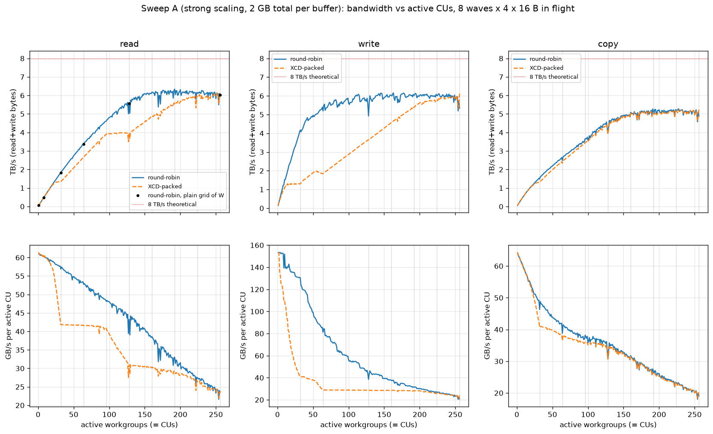

Strong scaling: 2 GB per buffer, split over W workgroups; 8 waves, `UNROLL=4`. The weak-scaling
version (32 MB per workgroup, [images/A_weak.png](images/A_weak.png)) looks the same.

| GB/s | W=1 | 8 | 16 | 32 | 48 | 64 | 96 | 128 | 192 | 256 |
|---|---|---|---|---|---|---|---|---|---|---|
| read, round-robin | 61 | 483 | 941 | **1820** | 2589 | **3376** | 4619 | 5538 | 6341 | 6039 |
| read, packed | 61 | 479 | 934 | 1339 | 2002 | 2660 | 3920 | 3961 | 5574 | 6107 |
| write, round-robin | 153 | 1220 | 2285 | **4176** | 4899 | **5193** | 5788 | 4922 | 6019 | 5339 |
| write, packed | 153 | 938 | 1308 | 1308 | 1830 | 1847 | 2762 | 3641 | 5393 | 6170 |
| copy (read+write), round-robin | 64 | 484 | 883 | **1482** | 2149 | **2482** | 3668 | 3950 | 5160 | 4882 |
| copy (read+write), packed | 64 | 482 | 893 | 1303 | 1915 | 2336 | 3455 | 3921 | 5027 | 5275 |

- Round-robin reads cost only about 60 GB/s per CU, falling slowly as HBM fills. Scaling is close to
  linear up to about 130 CUs.
- Packed reads flatten at 1.33 TB/s per XCD. The plateau between 96 and 128 CUs is the 4.0 TB/s
  ceiling for XCDs 0-3 (sweep D). Packed writes saturate one XCD with only about 9-10 CUs.
- Copy is almost placement-independent, because each CU's read side limits it before any XCD does.

The time view of the split-k region is in [images/A_strong_time_zoom.png](images/A_strong_time_zoom.png).

### B. Loads in flight vs more CUs

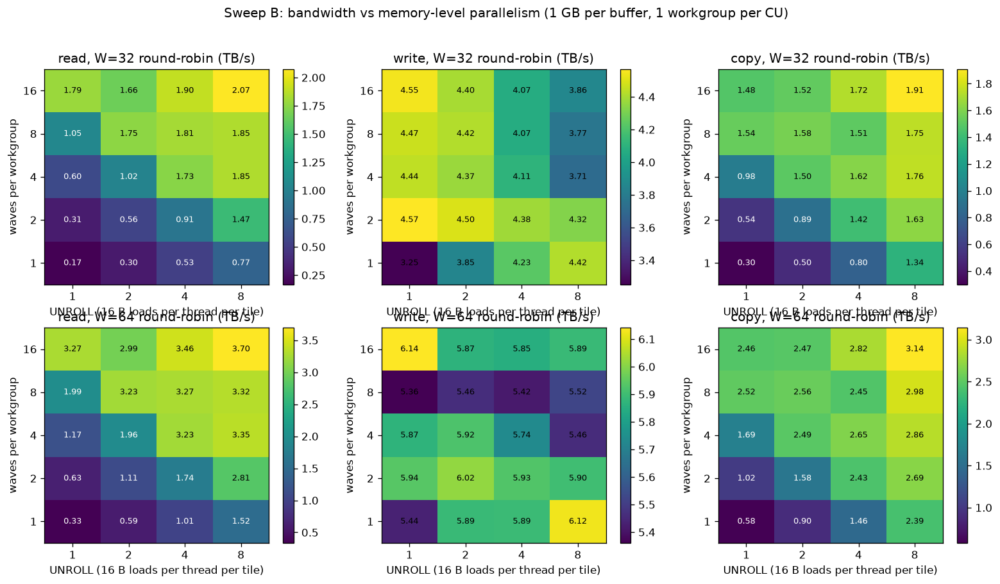

Reads need about 4 waves x `UNROLL=4` (16 KB to 32 KB in flight per CU) to reach the per-CU
ceiling. Beyond that, extra waves or unroll add at most about 10%.

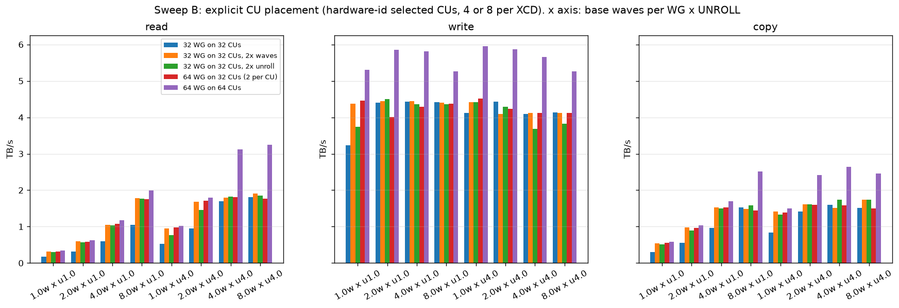

The CUs here are selected by hardware id: 4 per XCD for the 32-CU cases and 8 per XCD for the
64-CU case. Values are read TB/s.

| base config | 32 WG / 32 CU | + 2x waves | + 2x unroll | 64 WG / 32 CU (2 per CU) | 64 WG / 64 CU |
|---|---|---|---|---|---|
| 1 wave, u1 | 0.17 | 0.32 | 0.30 | 0.32 | 0.34 |
| 4 waves, u1 | 0.60 | 1.06 | 1.04 | 1.08 | 1.17 |
| 4 waves, u4 | 1.70 | 1.80 | 1.82 | 1.81 | **3.12** |
| 8 waves, u4 | 1.81 | 1.91 | 1.86 | 1.77 | **3.24** |

This is the key control:

- **With too few loads in flight, doubling the workgroups helps whether they land on new CUs or
  share the old ones.** The gain comes from loads in flight, not from the extra CUs.
- **Once each CU is saturated, nothing but more CUs helps.** 64 CUs deliver 1.8x.

Writes are already about 4.1-4.4 TB/s on 32 CUs, and 64 CUs add about 1.3x.

### C. Working-set size (L2 / MALL / HBM)

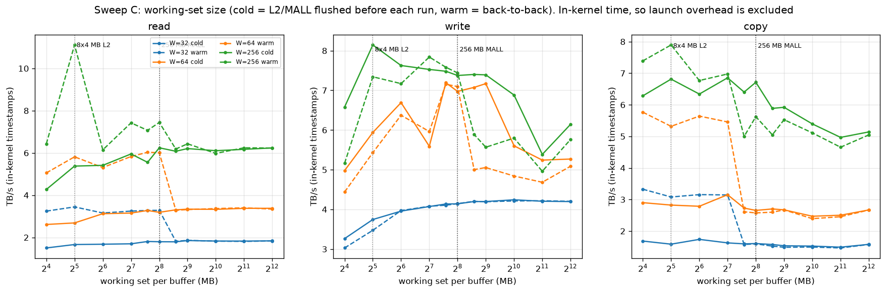

This plot uses in-kernel time, because back-to-back ("warm") launches of small kernels are limited
by CPU launch rate: about 15 µs of overhead at 16-32 MB.

- **Cold runs:** bandwidth reaches its HBM plateau by about 256 MB per buffer. Smaller cold runs
  lose to ramp-up and fixed costs: at W=256 and 16 MB, the in-kernel span is only 4 µs.
- **Warm runs, working set at or below 256 MB:** the MALL serves the data. W=32 then reads
  3.2-3.4 TB/s, about 100 GB/s per CU, against 1.8 TB/s from HBM. W=256 peaks at 7.4 TB/s.
  That is the evidence that the per-CU cap is latency-bound (outstanding misses / latency).
- **Warm, above 256 MB:** falls back to the cold numbers.
- **W=256, warm, 32 MB:** reads hit 11 TB/s, because the data fits in the 8 x 4 MB of L2. This
  was a single short (3 µs) point. Sweeps G and J confirm it properly: L2-resident reads run at
  31.7-38.8 TB/s, and L2 contents do survive between launches.
- **Writes (and the write half of copy) below about 1 GB:** in-kernel rates above 7-8 TB/s are not
  HBM bandwidth. Stores are acknowledged once they reach L2 or the MALL, and the write-back to HBM
  happens after the end timestamp. Use the event-timed `gbps` column in `results/C.csv` for writes.

### D. XCD subsets and topology

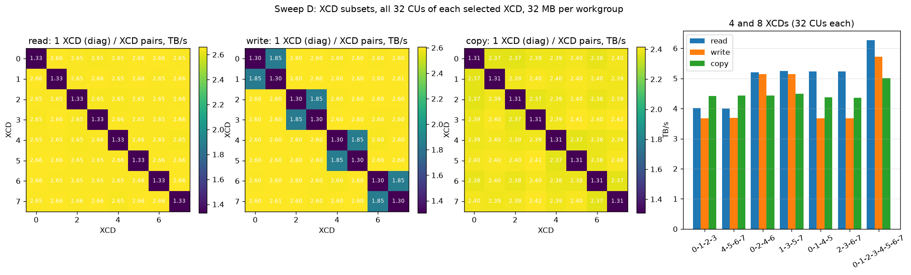

- **Single XCDs are identical:** 1.33 read, 1.30 write, 1.31 copy (TB/s).
- **Reads:** every pair of XCDs gets 2.65 TB/s, i.e. perfectly additive. XCDs 0-1-2-3 or 4-5-6-7
  together get 4.0 TB/s, but quads that span both halves (0-2-4-6, 1-3-5-7, 0-1-4-5, 2-3-6-7) get
  5.2 TB/s. That points to XCDs 0-3 and 4-7 each sharing a path (most likely one IOD per half)
  capped at about 4 TB/s of reads.
- **Writes:** pairs 0+1, 2+3, 4+5 and 6+7 get only 1.85 TB/s, against 2.6 TB/s for any other pair.
  Any quad containing two such pairs gets 3.7 TB/s, against 5.15 TB/s for 0-2-4-6 and 1-3-5-7.
- **Copy:** about 4.4 TB/s for every quad, since copy is limited per CU and XCD rather than by
  topology.

### E. Access pattern

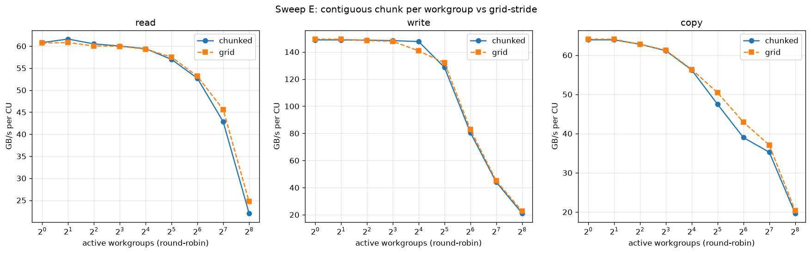

A contiguous 32 MB chunk per workgroup and grid-stride perform the same to within a few percent at
every W. HBM channel interleaving is fine-grained enough that few-workgroup kernels don't suffer
from channel imbalance.

### F. Split-k proxy

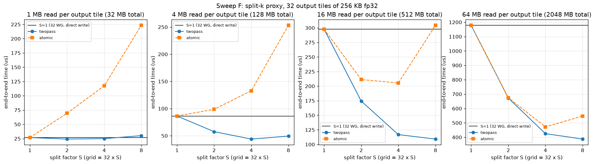

The proxy has 32 output tiles, each 256 KB of fp32. Each tile sums R MB of input. Splitting by S
gives a grid of 32 x S. The two-pass variant writes fp32 partials and then runs a reduce kernel.
The atomic variant zeroes the output and uses fp32 `atomic_add`. Times are end to end, in µs.

| R per tile (total) | S=1 | S=2 two-pass | S=4 two-pass | S=8 two-pass | S=2 atomic | S=4 atomic | S=8 atomic |
|---|---|---|---|---|---|---|---|
| 1 MB (32 MB) | 26.9 | 24.2 | 25.0 | 30.2 | 69.4 | 117.4 | 223.4 |
| 4 MB (128 MB) | 86.3 | 57.5 | **43.9** | 49.3 | 98.6 | 132.8 | 253.2 |
| 16 MB (512 MB) | 297.8 | 174.4 | 116.8 | **109.2** | 211.3 | 205.5 | 304.4 |
| 64 MB (2 GB) | 1178 | 673 | 425 | **388** | 675 | 473 | 548 |

A 32-workgroup kernel reads at about 1.8 TB/s, so splitting pays off exactly as sweep A predicts,
until the reduction traffic and the second launch (about 5-10 µs) eat the gain. The best split
grows with the problem: 1 MB per tile gains nothing, 4 MB is best at S=4, and 16 MB or more is best
at S=4-8. fp32 atomics on 256 KB tiles are dominated by atomic throughput and only compete at the
largest size.

## Cache tiers (sweeps G-J, GPU 6)

### Method

- **Repeated passes.** `bw_kernel` takes a `wrap` argument: iteration `i` touches tile `i % wrap`.
  Each worker then re-reads a fixed footprint `passes = n_iter / wrap` times inside one kernel. The
  default `passes=1` reproduces sweeps A-F exactly: `check` and the tuning sweep matched to within 1%.
- **Steady-state bandwidth** comes from the difference between `P` and `4P` passes,
  `slope = (bytes(4P) - bytes(P)) / (t(4P) - t(P))`. That cancels launch overhead, ramp-up and the
  cold first pass. `P` is chosen so the `4P` run takes about 1 ms. Event-timed and in-kernel slopes
  agree to within 0.5% (median). The exceptions are points at tier boundaries, which differ by up
  to 7%.
- **Device.** Everything in this section ran on GPU 6, with results in `results/gpu6/`. Re-running
  the cold XCD-subset sweep (D) on GPU 6 matched GPU 0 to within 0.5%. The one exception is
  full-chip writes on the XCD sets that span both halves, which are 7-8% lower on GPU 6 (5.34 vs
  5.72 TB/s for all 8 XCDs).

### G. Tiers vs footprint

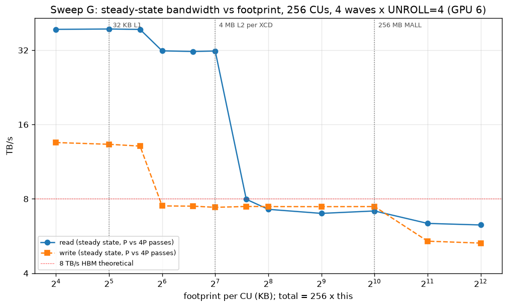

Setup: 256 CUs, round-robin, 4 waves x `UNROLL=4` (16 KB tiles). All values are steady-state TB/s.

| footprint per CU (total) | read | write | what the counters show (`pmc.py`) |
|---|---|---|---|
| 16-48 KB (4-12 MB) | 38.8-39.0 | 13.1-13.5 | L1 hit rate 43% at 32 KB, 10% at 48 KB; the rest are L2 hits. Dirty lines stay in L2 (written back once per kernel) |
| 64-128 KB (16-32 MB) | 31.6-31.8 | 7.4 | 0% L1 hits and 100% L2 hits in steady state. Writes still hit L2, but every line is written back on every pass |
| 192 KB (48 MB) | 8.0 | 7.5 | L2 hit rate 15%, 85% of bytes cross the fabric |
| 256 KB-1 MB (64-256 MB) | 7.0-7.3 | 7.4-7.5 | 0% L2 hits; everything comes from beyond the XCD, i.e. MALL hits |
| 2-4 MB (0.5-1 GB) | 6.3-6.4 | 5.3-5.4 | HBM |

- **Read tiers:**
  - **Up to 48 KB per CU:** the CU's own load path limits bandwidth, at 64 B/clk
    (152 GB/s x 256 CUs = 39 TB/s), whether a line hits in L1 or L2.
  - **64-128 KB per CU:** every line comes from L2. With 4 waves this is latency-bound at
    31.7 TB/s, and 16 waves reach 38.8 TB/s (sweep I).
- **Write tiers:** the step between 48 and 64 KB per CU (1.5-2 MB per XCD) isn't capacity. L2 still
  hits 97% of writes. Above about 1.5-2 MB of dirty data per XCD, it starts writing every dirty line
  back as it goes, while keeping a copy (the whitepaper mentions this "write back dirty data and
  retain a copy" behaviour).
  - So writes run at 7.4 TB/s, which is exactly 4 x the 1.85 TB/s per-XCD-pair write ceiling from
    sweep D.
  - Kernels that write more than about 1.5 MB per XCD per pass pay fabric write bandwidth, even when
    the data would fit in L2.

### H. Where the MALL ceiling comes from

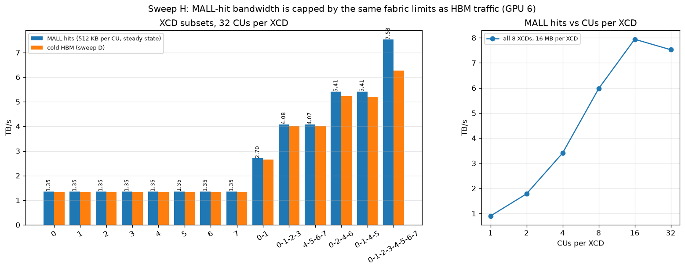

The footprint is 16 MB per XCD (4x its L2), 128 MB total at most (inside the MALL). All values are
steady-state TB/s.

| XCDs (32 CUs each) | MALL hits | cold HBM (sweep D, GPU 6) |
|---|---|---|
| any single XCD | 1.35 | 1.33 |
| 0-1 | 2.70 | 2.66 |
| 0-3 or 4-7 | 4.08 | 4.00 |
| 0-2-4-6 or 0-1-4-5 | 5.41 | 5.21-5.23 |
| all 8 | 7.53 | 6.27 |

- **MALL hits hit the same fabric ceilings as HBM traffic:** the XCD link at about 1.35 TB/s, and
  the per-half limit at about 4.1 TB/s. That per-half limit fits half of NPS1 traffic crossing the
  5.5 TB/s IOD-to-IOD bisection.
- **Only the full chip gains from MALL hits** (7.5 vs 6.3 TB/s), because only there is HBM
  efficiency, rather than the fabric, the binding limit for cold traffic.
- **CUs per XCD** (all 8 XCDs, 16 MB each): 1, 2, 4, 8 and 16 CUs per XCD give 0.90, 1.78, 3.40,
  5.97 and 7.94 TB/s.
  - That's about 110 GB/s per CU from the MALL, against about 60 GB/s from HBM (sweep A). This is
    the latency effect: outstanding misses per CU divided by latency.
  - The chip-wide MALL ceiling of about 7.9 TB/s is already reached with 16 CUs per XCD.
- **Compared with [docs/roofline.md](../../docs/roofline.md):** as seen from the XCDs in NPS1, the
  MALL delivers 7.5-7.9 TB/s, not the about 17 TB/s the MALL arrays could supply.

### I. L2 bandwidth scaling

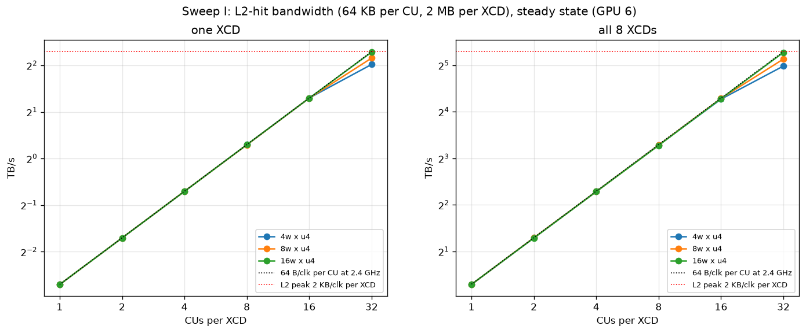

The footprint is 64 KB per CU (2 MB per XCD).

- **Per CU:** exactly 153 GB/s (64 B/clk at 2.4 GHz) for 1-16 CUs per XCD, with any number of
  waves.
- **At 32 CUs, one XCD reaches:**
  - 4.05 TB/s with 4 waves x u4;
  - 4.45 TB/s with 8 waves x u4;
  - 4.87 TB/s with 16 waves x u4. That is 2 KB/clk at the measured 2.38 GHz, so 100% of the
    whitepaper L2 peak.
- **All 8 XCDs scale exactly 8x,** to 31.6 / 35.1 / 38.8 TB/s. 256 CUs x 64 B/clk equals
  8 x 2 KB/clk, so the CUs and the L2 are sized to match.
- The high-parallelism config is 16 waves x u4, not the planned 16 x u8, because a tile must fit in
  the 64 KB per-CU footprint.

### J. Does L2 survive a kernel boundary?

One pass per launch, 256 CUs. Times are the mean time per workgroup, in µs.

| footprint | cold (MALL and L2 flushed) | L2 evicted, data still in MALL | back-to-back (warm) | 2nd pass inside the same kernel |
|---|---|---|---|---|
| 64 KB per CU (16 MB, L2-sized) | 2.63 | 2.30 | **0.72** | 0.45 (span) |
| 512 KB per CU (128 MB, MALL-sized) | 20.1 | 16.7 | 16.6 | 17.6 (span) |
| 4 MB per CU (1 GB, HBM) | 167.7 | 169.8 | 166.8 | 170.7 (span) |

- **L2 contents survive kernel launches.** A warm launch over an L2-sized footprint runs about 3x
  faster than the same launch after L2 has been overwritten, and close to an in-kernel second pass.
- **So cross-launch reuse can come from L2**, not only from the MALL (for example, weights re-read
  by consecutive small kernels).
- **The profiler can't show this.** Under `rocprofv3 --pmc`, L2 is flushed between dispatches: the
  warm 64 KB launch drops from 7.4-8.0 to 5.9 TB/s in-kernel, the same as the "L2 evicted" run, and
  the counters report a 5% L2 hit rate. Under plain `rocprofv3 --kernel-trace` it stays at 8.0 TB/s.
  So retention across launches has to be measured without counters.

## Ridge band (bf16 dense)

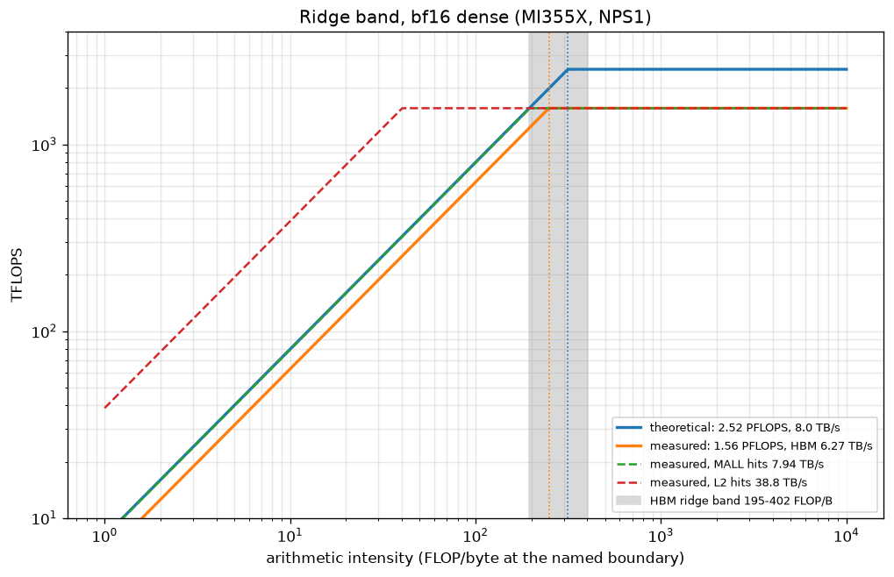

Inputs:
- compute:
  - theoretical: \(F_\text{theo}\) = 256 CUs x 4096 FLOP/clk x 2.4 GHz = 2.52 PFLOPS;
  - measured: \(F_\text{meas}\) = 1.56 PFLOPS, the best a16w16 GEMM in
    [results.md](../../kernels/gemm/intra_wave/a16w16/tmp/compare/results.md);
- bandwidth:
  - theoretical HBM: \(B_\text{theo}\) = 8.0 TB/s;
  - measured: HBM 6.27 TB/s, MALL hits 7.94 TB/s, L2 hits 38.8 TB/s (sweeps G, H and I).

Your best measured numbers are lower bounds on what's achievable, and the datasheet numbers are
upper bounds. So the rigorous ridge interval comes from the *mixed* pairings. The two consistent
pairings are point estimates inside it.

| boundary | \(F_\text{meas}/B_\text{theo}\) (low end) | meas/meas | theo/theo | \(F_\text{theo}/B_\text{meas}\) (high end) |
|---|---|---|---|---|
| HBM | **195** | 249 | 315 | **402** |
| MALL hits (NPS1, as seen by the XCDs) | about 142 (using 11 TB/s, the bisection bound for uniform NPS1 traffic) | 196 | n/a | 317 |
| L2 hits | 40 (using the whitepaper's 39.3 TB/s at 2.4 GHz) | 40 | 64 | 65 |

**How to classify a kernel:** measure its arithmetic intensity at the relevant boundary.
- **Below the band:** memory-bound under every assumption. This is a certificate.
- **Above the band:** compute-bound under every assumption.
- **Inside the band:** the answer depends on the clock and bandwidth the kernel actually gets, so
  it has to be measured.

For HBM, measured/measured (about 250) is the better single guess.

Serving bytes from the MALL rather than HBM only moves the measured ridge from 249 to 196. It is
L2 reuse (about 65 FLOP/byte against L2) that turns a GEMM compute-bound.

Caveats:
- **The clock depends on the workload.** Memory-bound runs here held 2.3-2.4 GHz, while the GEMMs
  sustain about 1.6 GHz (1563 TFLOPS at 92.8% MFMA utilization).
- **L2 bandwidth scales with the shader clock and HBM doesn't.** At 1.6 GHz the L2 peak is about
  26 TB/s.
- **Bandwidth while MFMA is also running hasn't been measured.**

## Answering the question

**Does the round-robin vs XCD-packed comparison make sense?** Yes, but the two answer different
questions:

- **Round-robin** is what a real kernel gets. It never hits the per-XCD limit until about 176
  workgroups, so it measures the per-CU and whole-chip limits.
- **Packed** isolates the XCD's own ceiling (about 1.3 TB/s). It is only reachable if you
  deliberately remap work onto one XCD.

**Is there a memory advantage to spreading a 32-workgroup kernel over 64 CUs?** Yes, close to 2x for
reads and 1.7x for copy, as long as each CU already keeps about 16-32 KB of loads in flight. The
32-workgroup kernel is limited by the per-CU cap of about 60 GB/s, far below the XCD ceiling (only
4 CUs per XCD are busy) and the HBM ceiling. More CUs is the only lever left.

If the kernel keeps less in flight (one wave, or small tiles without prefetch), the cheaper fix is
more waves, deeper prefetch, or 2 workgroups per CU. Those give the same gain without the split-k
reduction cost. Writes gain much less (1.24x), because 32 CUs already write at over 4 TB/s.

## Files

- [kernel.py](kernel.py): `bw_kernel`, the placement modes, the instrumentation helpers
  (`_getreg`, `_uniform`, `_pin`, `_timestamps`) and the split-k proxy kernels.
- [bench.py](bench.py): sweeps `check`, `T` (tuning), `A`-`J`, timing, record analysis and the
  `P` vs `4P` slope measurement (`run_passes`).
  - Writes `<results-dir>/<sweep>.csv` plus `<sweep>_clocks.txt` (`amd-smi` snapshots).
  - `--point G:read_512KB --passes 16 --reps 5` runs a single point back to back, for profilers.
- [pmc.py](pmc.py): rocprofv3 counter validation of the tiers. Writes `results/gpu6/pmc.csv`.
- [plot.py](plot.py): `images/*.png`. Sweeps A-F are read from `results/`, G-J from `results/gpu6/`
  (`--tiers-dir`).
