# Stream-K on gfx950: summary of v15-v20

This is the short version. The kernel mechanics, memory ordering, the cost experiments and the full measurements are in [v14_streamk/STREAMK_EXPLAINED.md](v14_streamk/STREAMK_EXPLAINED.md), and each version's numbers are in its `WORKLOG.md`. Paper references are to Osama et al., [Stream-K](https://arxiv.org/html/2301.03598v1) (2023).

Units: a **k-step** is one 256x256x64 MAC step, about 1.21 us when all 256 CUs are busy. **S** is the number of leftover tiles, `total_tiles % 256`. The figures are generated by [v14_streamk/streamk_versions_diagrams.py](v14_streamk/streamk_versions_diagrams.py), which replays each version's work assignment on a toy problem and checks its invariants.

**Scope.** Every measurement here uses one tile, 256x256x64 bf16, on v14's pipeline. That tile is not the best choice for every shape (section 4, item 5). We fixed it so that we could explore the stream-K design space first; the tile size is a lever of its own (section 5).

**Terms.**
- **Split, chunk, n.** Splitting a tile cuts its K loop into n **chunks** of consecutive k-steps, run by n programs on n CUs. Each chunk produces a partial sum; adding the partials gives the tile. Data-parallel is n = 1. `ipt` (iters_per_tile) is the number of k-steps in a tile, `K / 64`.
- **Contributor, owner, ending.** A contributor stores its partial to the workspace and raises a flag. The owner adds the partials and writes C. The **ending** is everything after a program's own k-steps: store, wait, collect and write C.
- **Tile-major, chunk-major.** Two ways to number the `S x n` pieces of the leftover tiles before handing them to consecutive programs (32 consecutive programs share one XCD).
  - Tile-major: chunk j of tile t is piece `t * n + j`. An XCD holds whole tiles. With 16 tiles of 16 chunks, XCD 0 holds all chunks of tiles 0 and 1, and reads 16 different k-ranges at once.
  - Chunk-major: the piece is `j * S + t`. An XCD holds the same chunk of many tiles. XCD x holds chunks 2x and 2x+1 of all 16 tiles, and reads 2 k-ranges at once.
- **One-tile, two-tile, spread.** Which work goes to stream-K:
  - one-tile: the S leftover tiles only;
  - two-tile: the leftover tiles plus one full wave;
  - spread: the leftover tiles, cut end to end rather than along tile boundaries.

  In two-tile, `d = ipt * S / 256` is the lag: how many k-steps beyond one tile each program's range runs.

## In short

- **A split costs about 20 k-steps, however it is done.** Stream-K pays only when the data-parallel last wave leaves more idle time than that: `(256 - S) / 256 * iters_per_tile` above about 20 k-steps. That rules out K <= 1024, and S > 128 except `spread` at K >= 32768.
- **Cap the split.** By default every leftover tile is split over all 256 programs, which over-splits when S is small. With the split capped, one-tile stream-K ties or beats two-tile on the one-wave shapes measured. Two-tile keeps a 0.2-1.5% lead only with more waves before the tail. Most of the earlier case for two-tile (v19, v20 `auto`) was the over-split default (section 6, "Capping the split").
- **Keep an XCD's programs reading the same k-steps.** Aligned cuts and the reversed order keep the L2 hit rate close to data-parallel's. Drifting k offsets lose it, and with it the bandwidth that keeps a CU fed (section 4).
- **What a split costs is bandwidth.** Moving 256 KiB partials is limited by one CU's bandwidth when an owner collects alone, and by the chip's when every program stores or reads at once (section 4).
- **A smaller tile is the competing fix.** When the last wave is at most half full and K is small, data-parallel with 256x128 tiles fills the GPU with no fixup: it is 26-29% faster than our best 256x256 kernel at K <= 2048. Stream-K on the larger tile catches up near K = 7168 and is 13% faster at K = 8192 (section 4).

## 1. What stream-K is

A GEMM with 256x256 tiles runs in waves of 256 tiles, one per CU. When the tile count is not a multiple of 256, the last wave is partly empty: S CUs work through whole tiles while the rest sit idle. Stream-K spreads the last wave's k-steps over all the CUs instead:
- A **contributor** computes part of a tile's k-steps, writes its fp32 partial accumulator to a workspace and raises a flag.
- The tile's **owner** computes its own part, waits for the flags, adds the partials, adds bias and writes C.

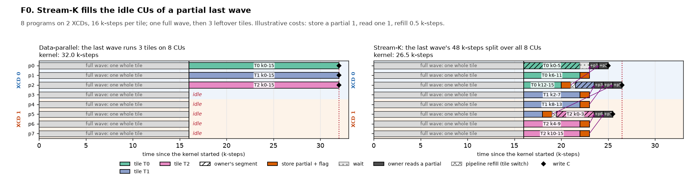

## 2. Split-K, stream-K and data-parallel

- **Split-K** cuts every tile into the same number of pieces.
- **Stream-K** splits the total k-steps evenly over the programs and lets the cuts fall wherever they land, including across tile boundaries.

Stream-K generalizes both (paper §4): if the grid is a whole multiple of the tile count it is split-K, and if it equals the tile count it is data-parallel.

On our hardware (256 CUs, 128 k-steps per tile at K = 8192), with 33 leftover tiles:

| scheme | programs | k-steps per program | idle CUs | partials per tile |
|---|---|---|---|---|
| data-parallel | 33 | 128 | 223 | 0 |
| split-K, 7 ways | 231 | 18-19 | 25 | 6 |
| split-K, 8 ways | 264 pieces | 16, but 8 pieces run in a second round (32) | 0 | 7 |
| stream-K | 256 | 16 or 17 | 0 | 7-8 |

With 16 leftover tiles, stream-K gives every program exactly 8 k-steps, which is split-K 16 ways. The paper's own example is 9 tiles on 4 SMs: data-parallel reaches 75% utilization, split-K 2 ways 90%, and stream-K 100%. Split-K is commonly used when there are fewer tiles than CUs, but it applies to any partial wave. Its limits are that it pays the fixup on every tile and rarely fits the CUs exactly.

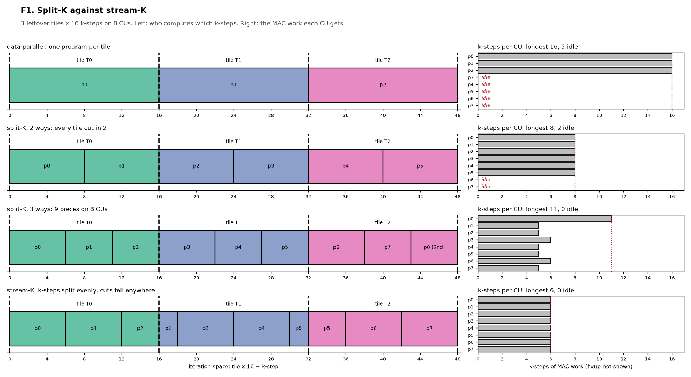

**Split-K with a separate reduce kernel.** Libraries often split K, store the partials, and add them in a second kernel. That does not avoid waiting for the stores: a kernel boundary is itself a device-wide wait for every store to land. Our in-kernel reduce-scatter ending (v20) is roughly the same reduce kernel without the launch. What a separate kernel buys is simplicity: no persistent grid, no flags or spin-waits, and no fixup code adding registers to the GEMM. It is the usual choice for small M x N with large K, where the partials are small against the K work and the launch is amortized.

One observation: our best one-tile kernel, v17, is in effect split-K of the leftover tiles only, with a split count chosen per tile. We moved back from stream-K's even split because aligned cuts turned out to matter more than perfect balance (section 4).

## 3. One-tile and two-tile hybrids

The paper restricts stream-K to a tile-aligned part of the work and runs the rest as data-parallel waves (§5.2):

- **Data-parallel + one-tile stream-K.** Only the S leftover tiles are stream-K. Each program gets less than one tile of work, so each tile is shared by about `256 / S` programs. The paper itself notes this hides little latency and serializes the owner's collection.
- **Two-tile stream-K + data-parallel.** One full wave is moved into stream-K, so each program gets between one and two tiles of work. Every tile then has at most one peer, and the skew between programs hides the wait. This is the paper's recommended schedule.

Two-tile does not reduce partial traffic. Every seam inside a tile costs one partial: 240 on 4352x4096x8192 under both policies. What it removes is the owner's serial chain of 15 reads.

What the paper does not address is cache reuse. It notes that skewed k offsets "may preclude these fragments from seeing reuse across CTAs in the GPU's cache structure" (§5.2). But it treats the hybrids as the fix and does not note that two-tile spreads the skew over a whole extra wave. With only one full wave, two-tile leaves nothing data-parallel; the paper claims its benefit only for two or more full waves.

**Why skew costs more on MI355X.** Reuse needs the second reader of a k-slice to arrive while the line is still in L2. How long a line survives depends on how many distinct bytes pass through that L2 per k-step. That in turn depends on how much the programs sharing the cache reuse each other's data:

| | one L2 serves | distinct bytes per k-step, sharing like data-parallel | window | nothing shared | window |
|---|---|---|---|---|---|
| A100 (paper: 128x128x32 fp16 tiles) | all 108 SMs, 40 MB in 2 partitions | about 170 KiB (a 9x12 block of tiles) | about 120-240 k-steps | 1.7 MB | about 23 k-steps |
| MI355X (256x256x64 bf16 tiles) | the 32 CUs of one XCD, 4 MB | 384 KiB (a 4x8 block: 4 A and 8 B slices of 32 KiB) | about 10 k-steps | 2 MiB | about 2 k-steps |

The MI355X data-parallel figure is measured ([experiments/cu_drift_l2_reuse](../../../../experiments/cu_drift_l2_reuse/README.md)); the others are the same arithmetic. The skew pattern itself is the same on both GPUs. Three things make it cost more here:

1. **The window is 10-20 times shorter.** Our XCD mapping puts tiles that share data on one XCD, which is what gives data-parallel its 10 k-steps. It cannot stop the stream-K programs of that XCD from drifting apart.
2. **The reuse groups are smaller.** With one L2 for the whole GPU, any of the 108 concurrent tiles can supply a slice. On MI355X only the 31 others on the same XCD can, so a drifting program has fewer chances that some partner is still near its k-step. Misses do have a shared backstop, the 256 MB Infinity Cache behind all eight XCDs, but each XCD reaches it through a 1.33 TB/s link (section 4).
3. **There are far fewer waves.** The same GEMM has many more waves on an A100: fewer SMs and smaller tiles. 4352x4096x8192 is 1088 tiles of 128x128 on 108 SMs there, 10 full waves plus 8 tiles. On MI355X it is 272 tiles of 256x256, one full wave plus 16. Two-tile moves one full wave into stream-K, so on the A100 about 11% of the kernel runs skewed, and on MI355X all of it does.

   Our four-wave shapes show this dilution. On 4096x16640x8192, two-tile's L2 hit rate is 74% against data-parallel's 77%. With one wave (4352x4096x8192) it is 62% against 73%. The four-wave shapes are also the only ones where two-tile still beats the capped one-tile split (section 6).

## 4. Trade-offs

1. **Fixup cost.** Each seam inside a tile costs a partial store (about 1.5 k-steps, but 4-11 when every contributor publishes at once) and a read (1.8-2.8). One-tile adds a serial chain: the owner reads `256 / S - 1` partials one after another, which is 63 at S = 4. A one-tile S = 16 fixup measured 36 k-steps, against 8 of MAC work. Capping the number of programs per tile removes most of this (section 6, "Capping the split").
2. **L2 reuse.** Unaligned cuts make every program start at its own k offset. One XCD's programs then read many k-slices at once, further apart than the 2-10 k-step window covers (section 3). Why that matters so much is below.
   - One-tile with long ranges: 76% hits fall to 10% (3840x4096x8192, v15).
   - Forward-order two-tile: 65% falls to 11% (4352x4352x8192).
3. **Tile switches.** A program that crosses a tile boundary must:
   - end its first segment without a steady state;
   - store a 256 KiB fp32 partial, twice the bytes of a C tile;
   - drain every outstanding load and store before it may raise the flag (the release), which also drains its prefetch;
   - restart the pipeline cold.

   That costs about 3.4 k-steps, 1.2 of it the restart, and it lands on the critical path, because the next segment is the owner of the next tile. Segments of 1-3 k-steps run at 23-47% efficiency.
4. **The prize is smaller than it looks.** Take 4352x4096x8192: 272 tiles, one full wave of 256 plus 16 leftover, 128 k-steps per tile.
   - **Expected:** the last wave takes as long as a full wave, 128 x 1.21 us = 155 us, and stream-K saves most of that.
   - **Measured (v13):** the kernel time minus one full wave's is 97 us, or 80 full-chip k-steps. The 16 busy CUs have the memory system and the power budget almost to themselves, so each of their k-steps takes about 0.76 us instead of 1.21. At K = 4096 the last wave takes 36 us, or 30 full-chip k-steps. Stream-K has to beat these numbers, not 155 us.
   - **Stream-K's ideal:** 16 x 128 / 256 = 8 k-steps per program, about 10 us, before the ending.
   - **Its MAC phase is slower than that.** The 8 k-steps take 15.6 full-chip k-steps, about 19 us. Each leftover tile reads its own 4 MiB of B (256 columns x 8192 x 2 B), and those 64 MiB are read by all 256 programs within about 19 us, roughly 3.6 TB/s. In data-parallel the same B is read by 16 CUs over 97 us. So the tail's MAC work is bandwidth-bound, not compute-bound.
5. **A smaller tile may fill the GPU without stream-K.** This is the trade-off the paper opens with (Fig. 1): halving the tile lifts a 75% utilization ceiling to 90%, but smaller tiles use the caches and the scratchpad less efficiently. Below is a real example.

Stream-K also needs every program resident at once (a persistent grid), release/acquire ordering on the flags, and flags that are re-armed every launch. See STREAMK_EXPLAINED sections 11 and 13.

### The tile-size alternative

These shapes have 128 tiles at 256x256, half a wave, but exactly 256 tiles at 256x128. The data comes from [experiments/aiter_lixun_shapes](../../../../experiments/aiter_lixun_shapes/run_v20_vs_aiter.py) (`results/details.csv`: do_bench with CUDA graphs, same GPU). The smaller-tile kernel is the one AITER's tuned dispatch picked. TFLOPS:

| shape | k-steps per tile | smaller tile, one full wave | our 256x256, data-parallel | our 256x256, v20 `auto` | smaller tile against our best |
|---|---|---|---|---|---|
| 2048x4096x512 | 8 | 621 (hipBLASLt 256x128) | 482 | 301 | +29% |
| 2048x4096x1024 | 16 | 846 (hipBLASLt 256x128) | 664 | 510 | +27% |
| 2048x4096x1536 | 24 | 953 (hipBLASLt 256x128) | 755 | 648 | +26% |
| 2048x4096x2048 | 32 | 1038 (hipBLASLt 256x128) | 824 | 783 | +26% |
| 1024x8192x4096 | 64 | 1234 (FlyDSL 128x256) | 991 | 1078 | +14% |
| 4096x2048x7168 | 112 | 1304 (hipBLASLt 256x128) | 1058 | 1268 | +3% |
| 8192x1024x7168 | 112 | 1156 (hipBLASLt 256x128) | 1061 | 1283 | -10% |
| 1024x8192x8192 | 128 | 1165 (FlyDSL 256x128) | 1078 | 1317 | -11% |

- **Most of the gap is the tile, not the library.** Where hipBLASLt and FlyDSL run 256x256 on a full wave, they are within -8% to +5% of our v20 at the same K (for example 4096x4096x2048: 1322 against 1286).
- **Why small K favours the smaller tile.**
  - At K = 2048, hipBLASLt's 256x128 kernel on a full wave runs at 78% of its 256x256 kernel's rate (1038 against 1322).
  - Our 256x256 kernel on a half-empty wave runs at 64% of its full-wave rate (824 against 1286).
  - Stream-K could recover the idle half, but its fixed ending of about 20 k-steps is too large against 32 k-steps per tile.

  The smaller tile pays its lower arithmetic intensity on every k-step, while stream-K pays a fixed cost per tail. So small K favours the smaller tile and large K favours stream-K; here the crossover is near 112 k-steps.
- **Halving the tile only helps when the last wave is at most half full.** With `T = 256 w + S` tiles, the `2T` half-size tiles take `2w + 1` half-length waves when S <= 128. When S > 128 they take `2w + 2`, the same time as `w + 1` full waves, so the smaller tile gains nothing and pays its lower efficiency in every wave.

  For S > 128, stream-K has little to offer either: data-parallel wins at K <= 16384, and `spread` gains 5-10% only at K >= 32768. Other tile shapes can still fit those tile counts better, so S > 128 is a tile-tuning question.
- **A smaller tile does not make the fixup much cheaper in its own k-steps.** Partial bytes and the work per k-step both scale with tile area:

  | | 256x256 | 256x128 |
  |---|---|---|
  | partial (fp32) | 256 KiB | 128 KiB |
  | one k-step, full chip | 1.21 us | about 0.78 us (half the flops at about 78% of the rate) |
  | store one partial at about 150 GB/s per CU | about 1.4 k-steps | about 1.1 k-steps |

  So the fixup is only about 20% cheaper in k-steps, though it halves in microseconds. What changes more:
  - the tile count, so S and the number of full waves (more waves favour two-tile, section 3);
  - the L2 window: (256 + 128) x 64 x 2 B = 48 KiB per k-step instead of 64;
  - the free registers, which leave room for things such as keeping a program's own reduce-scatter slice.

  The ~20 k-step threshold and the fits for n were all measured at 256x256 and need re-measuring for any other tile.
- **This is also a tuning trap.** A tuner that searches only data-parallel kernels picks a smaller tile to fill the GPU even where a stream-K tail on the larger tile is faster. On 1024x8192x8192, AITER's tuned choice is FlyDSL's 256x128 kernel, one exact wave, at 1165 TFLOPS. 256x256 with a stream-K tail runs at 1317. At small K the same reasoning goes the other way: there are too few k-steps to pay for a split, and the smaller tile is the right choice.

### What a split costs

Section 7's threshold says a split pays only when it recovers more than about 20 k-steps of idle time. The costs behind that number, from [experiments/streamk_costs](../../../../experiments/streamk_costs/README.md), v20's per-phase timing (4352x4096x8192, 16 programs per tile) and [experiments/hbm_bandwidth_xcd](../../../../experiments/hbm_bandwidth_xcd/README.md):

| cost | k-steps | what limits it |
|---|---|---|
| pipeline restart at a segment start | 1.2 | prologue loads that nothing overlaps |
| release drain before raising the flag | about 0.5 | the program's own stores landing |
| store one partial, few programs storing | 1.5 | one CU writes about 150 GB/s: 256 KiB in about 1.4 k-steps |
| store one partial, every program at once | about 8 (4-11) | the chip's write bandwidth: 64 MiB at about 7 TB/s |
| owner reads one partial | 1.8-2.2, serially | one CU reads about 110 GB/s from the Infinity Cache: 256 KiB in about 2 k-steps |
| reduce-scatter slice read, every program at once | about 8 | the chip's Infinity Cache bandwidth, 7-7.9 TB/s |
| flag or barrier wait | 6-15 | the slowest store of the burst landing |
| the tail's MAC phase | 15.6 for 8 k-steps of work | the leftover tiles' unique B coming from HBM |

A contributor's ending runs in four steps:
1. store its 256 KiB partial (1 KiB per thread, 64 stores of 16 B);
2. release: `s_waitcnt vmcnt(0)`, which waits until every store is acknowledged;
3. a workgroup barrier;
4. raise its flag.

The owner, or every program under reduce-scatter, then waits for the flags and collects. v20's per-phase timing on 4352x4096x8192 with 16 programs per tile, in k-steps ([results/fixup_timing.md](v20_streamk_reduce_scatter/results/fixup_timing.md)):

| ending | own MAC | store | wait | collect | tail |
|---|---|---|---|---|---|
| owner | 15.4 | - | 14.5 (last flag) | 33.3 (15 serial reads and the C store) | 70.3 |
| reduce-scatter | 15.6 | 8.9 | 6.2 (barrier) | 8.0 (slice) | 47.9 |

- **The wait on the write is small; moving the bytes is not.** The release drain costs about 0.5 k-steps. Most of the 6-15 k-step wait is the store burst draining. Everything else is 256 KiB partials limited by bandwidth: one CU's, when an owner collects alone, or the whole chip's, when every program stores or reads at once.
- **Switches cost 3.4 k-steps** (restart, partial store and drain together), which is why the best schedules avoid them. But they are not the largest cost: a reduce-scatter ending is about 23-25 k-steps with no switch at all.
- **Short chunks are not the limit by themselves.** A split pays when the data-parallel last wave (about `ipt` k-steps) is longer than the split tail: one chunk plus the ending of about 20 k-steps.
  - **3328x5120x2048** has 13 x 20 = 260 tiles: one full wave plus S = 4, with 32 k-steps per tile. Data-parallel runs the 4 leftover tiles on 4 CUs for 32 k-steps. Splitting each tile 8 ways (reduce-scatter, 32 CUs) gives chunks of 4 k-steps plus the ending, about 24. That saves about 8 k-steps, and the measurement agrees: 9.5 us, from 79.8 us (v13) to 70.3 us, +13.5%.
  - **4352x4096x1024** has 272 tiles: S = 16, 16 k-steps per tile. Data-parallel's last wave is 16 k-steps; the best split is at least 1 + 20 = 21. Every split loses.

  The chunk was short in the winning case. What decides is `ipt` against the fixed ending. The rule in section 7, `(256 - S) / 256 * ipt > 20`, is the same test written as the idle time available.
- **Reducing the bytes would move the threshold.** Candidates:
  - fewer partials, which capping the split already does;
  - bf16 partials, which halve the store and the read, at a cost in precision;
  - each program keeping its own slice in registers under reduce-scatter, saving 1/n of the read;
  - staggered publishes, which two-tile gets for free: 1.5 k-steps per store instead of 4-11.

  Halving the bytes would cut a reduce-scatter ending from about 24 to about 12 k-steps (an estimate). That would bring K = 1024 shapes with small S to about break-even. Atomics are not the answer: fp32 atomics are slower than a store and a read, and bf16 `pk_add` into C helps only with a single peer ([experiments/streamk_atomics](../../../../experiments/streamk_atomics/README.md)).
- **Cache bits.** The partials are stored with `gl.amd.cdna3.buffer_store(..., cache=".wt")` and read with `cache=".cv"`.
  - **Encoding.** On gfx950 both lower to SC1 = 1, SC0 = 1, NT = 0: system scope, no non-temporal hint (Triton's `getCtrlBitsForCacheModifierOn_CDNA3_CDNA4`).
  - **What is needed.** Device-wide coherence needs only SC1 (agent scope in LLVM's gfx942 memory model), and no Gluon store modifier gives SC1 alone.
  - **What it costs.** The release/acquire flags already order the partials, and `experiments/streamk_costs` measured default caching at the same cost as `.wt` / `.cv`.
  - **Not confirmed.** How the Infinity Cache treats each bit combination.

### Why the L2 hit rate matters

At full speed every CU reads 64 KiB of A and B per k-step. Data that misses L2 has to come over paths that cannot carry that rate:

| | demand at full speed | supply from L2 | supply from beyond L2 |
|---|---|---|---|
| one CU | 54 GB/s | 153 GB/s | about 60 GB/s from HBM, about 110 GB/s from the Infinity Cache |
| one XCD (32 CUs) | 1.73 TB/s | about 5 TB/s | 1.33 TB/s, its fabric link |
| whole chip | 13.9 TB/s | 32-39 TB/s | 6.2-6.4 TB/s from HBM, 7.0-7.9 TB/s from the Infinity Cache |

Supply figures are from [experiments/hbm_bandwidth_xcd](../../../../experiments/hbm_bandwidth_xcd/README.md).

- **It is mostly bandwidth.** To keep every CU at full speed, at least 23% of reads must hit L2 to fit through an XCD's link, and about 45-55% to fit through the chip's HBM and Infinity Cache. Data-parallel runs at 70-80% hits. A drifting stream-K schedule at 10% (v15 on 3840x4096x8192) asks beyond-L2 paths for about 12.5 TB/s, twice what exists, and runs at about half speed. Two-tile at 56-65% is near the limit, with the partial traffic competing for the same links.
- **Latency is the first symptom.** One CU's ceiling from HBM, about 60 GB/s, is a fixed number of outstanding misses divided by memory latency, and it barely exceeds the 54 GB/s a CU needs. A CU whose loads mostly miss therefore sits at that ceiling. v14's pipeline keeps a fixed 2 k-steps of loads in flight and cannot issue more, so the latency stops being hidden. This is not because stream-K pipelines worse (apart from segment restarts); it is because more of its loads miss.
- **Power is a plausible third factor on long kernels, not yet measured.** Full-wave GEMMs at K = 8192 already run at the board's 1.41 kW limit (S = 240: 1410 W for both v13 and v17). Bytes from HBM or the fabric cost more energy than L2 hits, so a lower hit rate should mean lower clocks. The S = 16 tail kernel draws 1364 W, just under the limit. We have not measured clocks against hit rate.

## 5. Levers

### Four ways to handle a partial last wave

When the tiles do not fill the GPU, these are the four options, each with what it fixes and what it costs. Numbers are rocprof kernel times at K = 8192 unless marked.

**1. A smaller tile, with no stream-K.** Choose a tile whose count fills the GPU, for example 256x128 when S <= 128.
- *Fixes:* the idle CUs, with no workspace, no fixup and no change to the L2 pattern.
- *Costs:* lower arithmetic intensity on every k-step of every wave. hipBLASLt's 256x128 runs at 78% of its 256x256 rate (K = 2048). Halving the tile helps only when the last wave is at most half full.
- *Wins:* at small K, where there are too few k-steps to pay for a split: +26-29% over our best 256x256 at K <= 2048. It loses by 11% at K = 8192.

  Picking it everywhere is the wrong-tile trap: a data-parallel tuner fills the GPU with the smaller tile even where stream-K on the larger one is faster (section 4).

  A smaller tile can also be combined with options 2-4. Their thresholds and best n were measured at 256x256 and need re-measuring for that tile.

**2. Two-tile: the leftover tiles plus one full wave in stream-K.**
- *Fixes:* the fixup chain. Every tile has at most one peer, so an owner makes a single read. The publishes are spread over the range, so a store costs about 1.5 k-steps instead of the 4-11 of a burst. The total number of partials does not change.
- *Costs:* L2 reuse, over more of the kernel. Reversed order keeps the skew to two groups `d` k-steps apart, but they cannot share once `d` exceeds the window: 62% L2 hits against data-parallel's 73% at S = 16, and 26-77% more memory reads than v17 at S = 16-128.

  It also moves a whole wave that would have run with full reuse into the skewed part, and with one full wave nothing stays data-parallel. Each program runs 2-3 segments, with restarts and spills.
- *Wins:* only with several full waves before the tail, where the skewed part is a small share of the kernel: 0.2-1.5% ahead of option 3 on the two four-wave shapes measured. With one full wave, option 3 or 4 is level or faster.

**3. One-tile with the split capped: split-K on the last wave.** Only the leftover tiles are split, along tile boundaries, n ways each (tile-aligned, as in v17). The other programs idle, spread evenly over the XCDs. This is split-K applied to the last wave only.
- *Fixes:* most of the one-tile fixup cost. The owner reads `n - 1` partials instead of `256 / S - 1`, and the best n is near `sqrt(iters_per_tile / c)`: 8 at S = 4, 6 at S = 16, 4 at S = 38. Aligned cuts keep the L2 hit rate at or near data-parallel's: 74% against 74% on 3328x5120x8192, where the default split had 69%.
- *Costs:* idle CUs, for example 32 busy programs at S = 4. The collection is still serial, so the best split stays small.
- *Wins:* -39% kernel time against the default split at S = 4, -10% at S = 16, -4% at S = 38. With the owner ending it is the best option from S = 38 to S = 128.

**4. One-tile, reduce-scatter.** As option 3, but every program of a tile stores its partial and sums 1/n of the tile.
- *Fixes:* the serial collection. The ending costs about the same, 23-25 k-steps, at any n, so more splits pay: the best n is 16 at S = 1-4 and 8 at S = 7-16.
- *Costs:* a flat ending, bandwidth-bound by the store and read bursts. It is worse than the owner ending when a tile has 4 programs or fewer, and at n = 2 it moves twice the bytes.
- *Wins:* when more splits are useful, that is small S. Capped at the best n it is 10% faster than option 3 at S = 4 (195 against 216 us) and 4% at S = 16. The owner ending is 2% faster at S = 38.

Around these four: data-parallel (no split) is right when the split would recover less than about 20 k-steps of idle time, `(256 - S) / 256 * iters_per_tile < 20`, which includes every K <= 1024. For S > 128, halving the tile does not help and no split pays at K <= 16384; `spread` gains 5-10% at K >= 32768. `STREAMK_POLICY=capped` (section 7) encodes options 3 and 4 with these limits.

### Everything we can change

| lever | options | tried in | what we found |
|---|---|---|---|
| tile size | 256x256x64 only so far; smaller tiles with or without stream-K | not yet (section 4) | a smaller data-parallel tile wins at small K when it fills the GPU |
| how much work goes to stream-K | none; the leftover tiles (one-tile); the leftover tiles plus a full wave (two-tile); end to end over the leftover tiles (`spread`) | v15-v20 | two-tile needs more waves before the tail; `spread` only for S > 128 at K >= 32768 |
| programs per leftover tile | all 256; capped at n, with the idle programs spread over the XCDs | split-count experiment | the largest single gain: up to 39% at S = 4 |
| where the cuts go, and in what order | end to end or tile-aligned; forward or reversed | v16-v19 | aligned cuts or reversed order keep L2 |
| the ending | serial owner; reduce-scatter; atomics or bf16 `pk_add` into C | v17, v20, atomics experiment | reduce-scatter from 8 programs per tile; atomics do not pay |
| partial format | row-major or lane-contiguous; fp32 or bf16; own slice kept in registers | v16 | lane-contiguous halves the cost; bf16 not tried |
| placement on the XCDs | tile-major or chunk-major; which chunk owns; which programs idle | v18, split-count experiment | spread the owners (up to 8%) and the idle programs (11-15%) |
| which tiles are left over | tile order; grouping leftover tiles that share B | v9 against split order only | the tail's MAC phase is bandwidth-bound on unique B |

Not yet tried:
- **A smaller tile for the tail only.** Run the full waves at 256x256 and the S leftover tiles as 2S data-parallel 256x128 tiles: no workspace and no fixup. When S <= 128 it should cut the tail to about two thirds: half the work per tile at about 78% of the rate (section 4).
- **Stream-K first.** Run the stream-K work before the data-parallel waves instead of after. The paper's two-tile schedule is named "Two-tile SK + DP" (Fig. 3c), which suggests that order. Fixups and their bursts would then overlap other CUs' data-parallel tiles instead of forming the end of the kernel.
- **Arrival-order reduction.** Reduce whichever partials have landed, instead of waiting for the whole burst. The owner polls every peer's flag relaxed and adds whichever partial is ready. Under reduce-scatter, one flag per partial replaces the per-tile barrier, and each program sums its slice as partials arrive.
  - **Expected gain for reduce-scatter.** At most the 6-9 k-step barrier wait plus part of the slice read. The writes run at about 0.78 TB/s per XCD, and an XCD's combined read+write ceiling is about 1.31 TB/s, so reads have about 0.5 TB/s of headroom to overlap with them. Best case 6-12 k-steps of a 24 k-step ending.
  - **Expected gain for the owner ending.** Only the wait is hidden: the serial reads stay capped by one CU's bandwidth.
  - **Cost.** The order of the fp32 additions depends on arrival, so results are no longer bitwise reproducible from run to run.
  - **Measure first** (section 10).
- **Phase-aligned two-tile.** A tile-aligned two-tile collapses into one-tile: one whole tile per program plus one aligned chunk is the data-parallel wave plus v17. Under the reversed order, each program reads k = t during its head piece and k = t - d afterwards, switching at a time set by its head length. Mapping programs with the same head length to the same XCD would make each XCD read one k-slice at a time. Each program's peer would then sit on another XCD, which costs nothing extra because partials bypass L2 anyway. The catch is that an XCD's tiles would no longer be neighbours in the tile order, so they may share less A and B.
- **Partial stores with SC1 alone** (device scope, no SC0), through a patched cache-policy value or inline asm (section 4, "Cache bits").
- **A deeper prefetch in the tail**, for the bandwidth-bound MAC phase.
- **BLOCK_K.** It sets the number of k-steps per tile, and with it how often the fixed costs above recur.

## 6. The versions

All versions build on v14 (v13 with its last wave peeled out of the persistent loop) and differ only in the stream-K tail. The figures put the previous version on the left and the new one on the right:
- **Top:** one row per program on two XCDs. Hatched bars are owner segments.
- **Below, one strip per XCD:** the k-step each program is reading over time. The band is ±1 k-step, the L2 window when an XCD's programs share nothing (section 3). Lines whose bands overlap can share L2.

How to read the strips:
- The x axis is time and the y axis is the k-step a program is reading within its tile.
- Each line is one segment, rising one k-step per unit of time from the segment's first k-step to its last.
- Lines on top of each other are programs reading the same k-slice at the same moment; the toy assumes the tiles share A rows. The vertical gap between two lines is their k offset.
- The label counts, at each moment, how many different k-steps that XCD's busy programs read, and gives the mean and the maximum.
- A program that crosses a tile boundary has two segments, so it draws two lines. In F2, v15's XCD 0 shows five lines for four programs because p2 does the tail of T0, then, after its store and a refill, the head of T1.

Toy costs are illustrative; the measured ones are above.

### v15: one-tile stream-K ([worklog](v15_streamk_onetile/WORKLOG.md))

**Change.** TensorAtlas's stream-K tail ported onto v14's pipeline, with the minimum of changes:
- work handed out in pairs of k-steps;
- release/acquire flags;
- owners re-arm the flags.

Partials are row-major.

**Offers.** A baseline that matches the model: the tail is within 10-30% of the row-major cost model.

**Result.** It loses wherever the owners collect many partials: -11% against v13 on 4352x4096x8192 (15 peers) and -56% on 3328x5120x8192 (63 peers). It wins where the last wave is long: +13% at K = 16384 and +9% with 128 leftover tiles.

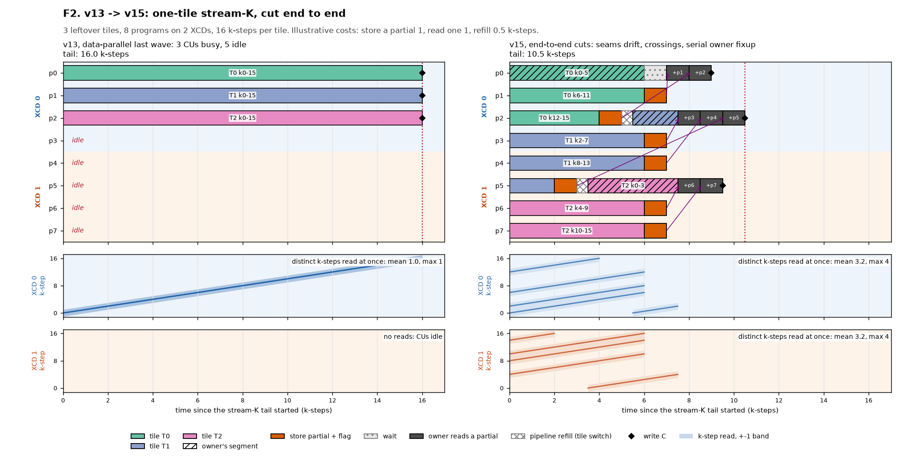

### v16: lane-contiguous partials ([worklog](v16_streamk_lane_partials/WORKLOG.md))

**Change.** Only the workspace address map. Partials are written in the accumulator's own register layout, `[16 register vectors][4 warps][64 lanes][4 fp32]`, so one wave's store instruction writes 1 KiB contiguously instead of 16 half cache lines. The owner reads them back with the same map.

**Offers.** Halves the cost of a partial: a store goes from 4.1 to 1.5 k-steps and a read from 4.9 to 1.8.

**Result.** The 4352x4096x8192 tail falls from 131 to 67 us. v16 is the first version to beat v13 on the main shapes: +17% on 4352x4096x8192 and +16% on 4352x4352x8192. Long-range shapes do not move (3840x4096x8192 is still -43%), because their loss is L2.

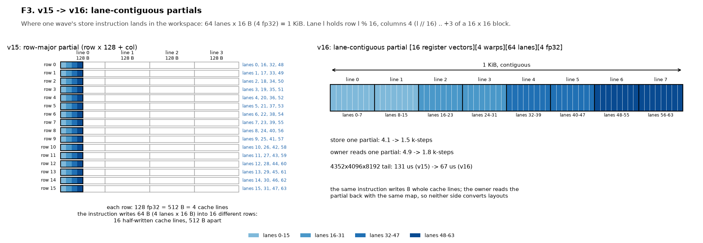

### v17: tile-aligned cuts ([worklog](v17_streamk_tile_aligned/WORKLOG.md))

**Change.** Cuts are made only inside tiles, never across them. Each tile gets `256 / S` programs (the first `256 % S` tiles get one more), and its k-steps are split evenly among them.

**Offers.**
- No tile switches.
- Chunk j of every tile covers the same k-steps, so an XCD's programs read 1-2 k-slices at a time.
- One segment per program, which removes all VGPR spills.

**Result.** On 3840x4096x8192 the L2 hit rate goes from 8% to 76%, data-parallel's level, and the kernel goes from -43% to +4.8% against v13. The main shapes gain +18% and +19%. What remains is the serial collection when tiles have many programs: 3328x5120x8192 is still -21%.

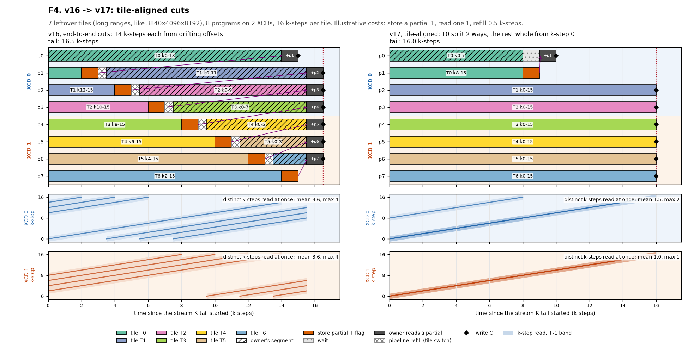

### v18: chunk-major placement ([worklog](v18_streamk_chunk_major/WORKLOG.md))

**Change.** Chunk-major instead of tile-major numbering (see Terms). Chunk j of tile t goes to program `j * S + t` instead of `t * n + j`, so an XCD holds the same chunk of many tiles rather than a few whole tiles. With 16 tiles of 16 chunks:
- v17: XCD 0 holds all chunks of tiles 0 and 1 and reads 16 k-ranges at once;
- v18: XCD x holds chunks 2x and 2x+1 of all 16 tiles and reads 2.

The owner rotates (chunk `t % n`) so that owners are spread over the XCDs.

**Offers.** In the model, one or two k-slices per XCD instead of many, so tiles that share A or B can share it in L2.

**Result.** Neutral on the original shapes: within ±3% of v17, with the same L2 counters. Two reasons:
- The stream-K phase carries little of the A/B traffic: the 16 leftover tiles of 4352x4096x8192 are 6% of the tiles, and their tail is dominated by collecting partials.
- Under v9 order the leftover tiles come in vertical pairs that share a B column, and tile-major v17 already keeps each pair on one XCD. Chunk-major had no further sharing to find.

The later 30-shape sweep found v18 slightly better: 0-4 points more L2 hits at S = 32-128, and 1-2% faster at S = 38-64 at the default split (section 9, finding 7).

**The lasting lesson is about the owner.** If chunk 0 owned every tile, all the owners would sit on one or two XCDs and read every partial through those XCDs' ~1.33 TB/s links. Rotating the owner was worth 2-8% (+8.3% on 4352x4352x8192). Owners must be spread over the XCDs whenever programs are grouped by chunk.

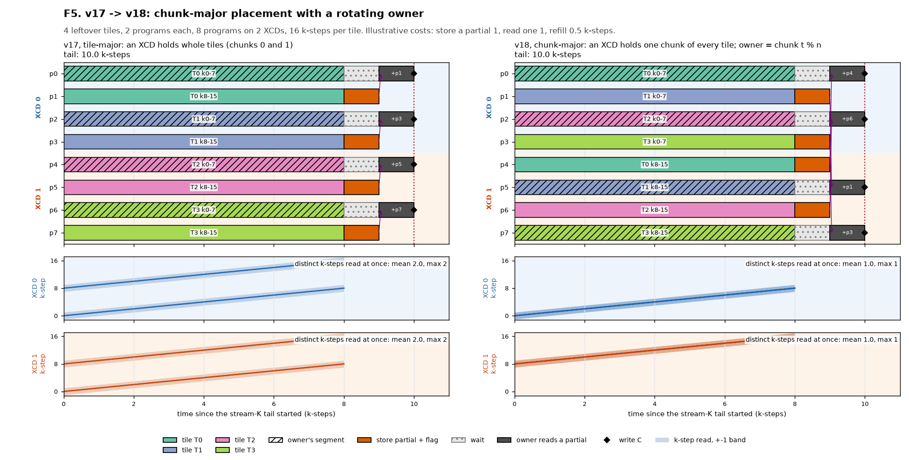

### v19: two-tile, reversed order ([worklog](v19_streamk_two_tile_reversed/WORKLOG.md))

**Change.** When there is a full wave to borrow, it uses the paper's two-tile hybrid, but each program processes its pieces last to first:
1. the head of its last tile, starting at k-step 0, published as its only partial;
2. any whole tile;
3. the tail of its first tile, which it owns.

**Offers.** At most one peer per tile, and every program starts at k-step 0. An XCD's programs fall into just two groups, one reading k-step `t` and the other `t - d`, where `d = iters_per_tile * S / 256` is the lag.

**Result.**
- Reversed order beats forward order by 2-55% on every shape.
- v19 is the best version for S <= 16: +38% over v13 at S = 2, +32% at S = 4 and +23% at S = 16. This was against the one-tile split at its default, all 256 programs. With the split capped, one-tile ties or beats it ("Capping the split", below).
- From S = 64 v17 is better, and from S = 192 v19 loses 6-26% to v13.

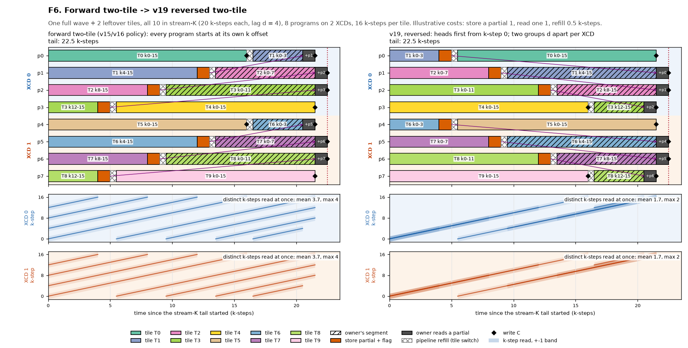

**Reversal does not fully restore L2.** The two groups are `d` k-steps apart, and once `d` is larger than the window they cannot share. v19's extra memory reads track `d`:

| S | d | L2 hits, v13 / v17 / v19 | v19 memory reads vs v17 | vs v13 |
|---|---|---|---|---|
| 4 | 2 | 74 / 69 / 68% | +3% | +17% |
| 16 | 8 | 73 / 68 / 62% | +26% | +39% |
| 33 | 16.5 | 70 / 66 / 60% | +22% | +33% |
| 64 | 32 | 77 / 73 / 63% | +50% | +62% |
| 128 | 64 | 78 / 76 / 61% | +77% | +86% |

The lost reuse is one part of two-tile's roughly fixed overhead. The other parts are a pipeline restart per extra segment, a partial for every program, and 14 VGPR spills. It is not the only cause of the crossover with v17:
- At the same `d` = 16, v19 leads v17 by 10 points at S = 16 but trails by 5 at S = 64.
- What changes with S is v17's collection: `256 / S - 1` serial reads, so 15 at S = 16 but only 3 at S = 64.

Two-tile wins while v17's collection costs more than two-tile's overhead.

### v20: reduce-scatter, host rule and spread ([worklog](v20_streamk_reduce_scatter/WORKLOG.md))

**Change.** A new ending for v17's tile-aligned split:
1. every program of a tile stores its partial;
2. a self-resetting per-tile barrier;
3. each program sums 1/n of the tile from all n partials and writes that slice of C.

v20 also adds a host rule that chooses the policy (below), and an experimental `spread` policy for S > 128.

**Offers.** The ending costs about 25 k-steps whatever n is: a store of about 8, a barrier of 7-9 and a slice read of 8-10. The owner's ending costs about 10 plus 2.2 per peer, so the two cross at n = 8.

**Result.**
- Reduce-scatter gains +64% over v17 at S = 2-4 and +11-19% at S = 16, and loses 3.5-7.4% where n <= 4.
- Against v19 the result depends on the memory system at launch. do_bench zeroes 256 MB before every launch, and the dirty write-back costs v19 14% and v20 2%. With clean or mildly dirty caches, two-tile still wins by 3-15% wherever n >= 7 and d <= 18. Most of that margin was the over-split default, as the next section shows.

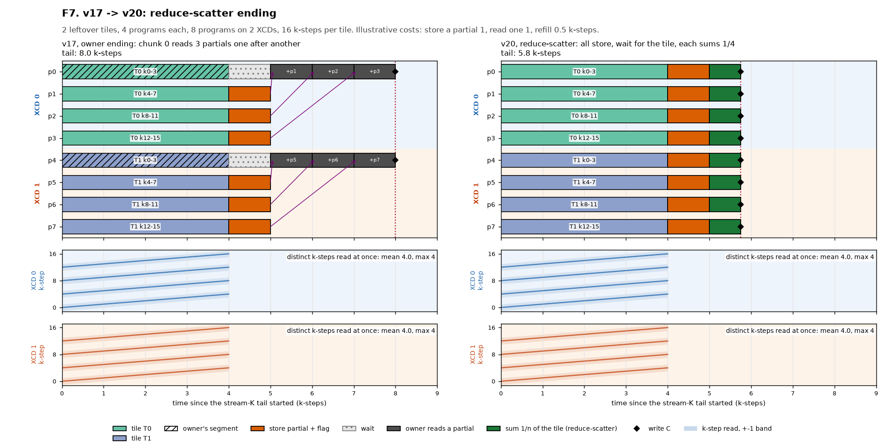

**Spread (S > 128).** With the tile-aligned split, most leftover tiles keep one program and run whole, so stream-K can at best equal data-parallel. `spread` cuts the leftover tiles end to end in reversed order instead. At S = 192 against data-parallel:
- -4% at K = 8192;
- level at K = 16384;
- +7% at K = 32768 and +10% at K = 65536, where the ideal is 12.5%.

Its fixed cost is about 40-75 us at every K, while the saving grows with K. Forward order is 17-40% behind at S = 224-240. `auto` does not pick `spread` yet.

What `spread` is:
- **The partition is v15/v16's:** the leftover tiles' k-steps laid end to end and cut evenly, so every program gets S/256 of a tile and the cuts fall anywhere.
- **It runs on v19's reversed path** (`END_TO_END` in the kernel): each program does its head piece first.
- **Why reversal matters here but not in v17.** A tile-aligned split gives each program one segment, and tiles with the same n share chunk boundaries, so there is nothing to reorder. An end-to-end split makes programs cross tile boundaries. In forward order each then starts at its own k offset (4 distinct k-steps per XCD at S = 192, 16 at S = 240). In reversed order a crossing program starts its head piece at k-step 0.
- **Not every program starts at 0.** At S = 192, four programs share three tiles, cut at 0, 0.75, 0.5 and 0.25 of a tile. The program that lies inside one tile starts at 0.25, so an XCD reads about 2 k-steps at once.
- **Why S > 128 needs end-to-end at all.** A tile-aligned split gives most tiles a single program (`256 // S = 1`), so the tail stays a whole tile long.

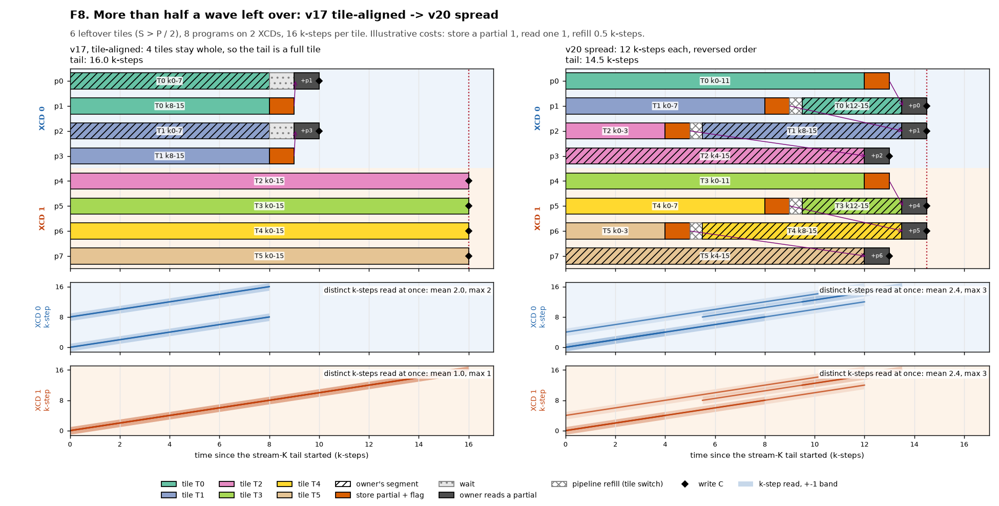

### Capping the split (v15-v20, [experiments/streamk_split_count](../../../../experiments/streamk_split_count/README.md))

Everything above split each leftover tile over all 256 programs, about `256 / S` ways. This changes the conclusions.

**Change.** `STREAMK_NUM_PROGRAMS` now works in every version. Only `S * n` programs join the tail, so each leftover tile gets n of them. The idle programs are spread evenly over the XCDs. `STREAMK_POLICY=capped` chooses n on the host ([v20 worklog](v20_streamk_reduce_scatter/WORKLOG.md), entries 4 and 5).

**Why it helps.** A tile split n ways costs about `iters_per_tile / n` k-steps of MAC work plus its ending:
- The owner's ending grows with n, about 10 + 2.2 (n - 1) k-steps. Its best n is therefore near `sqrt(iters_per_tile / c)`, where c is the cost of one partial read: 2.2 k-steps, rising to about S / 5 when many programs publish at once.
- Reduce-scatter's ending is nearly flat in n, so it wants more splits.

The default gives n = 256 / S, which is 64 at S = 4, far past either optimum.

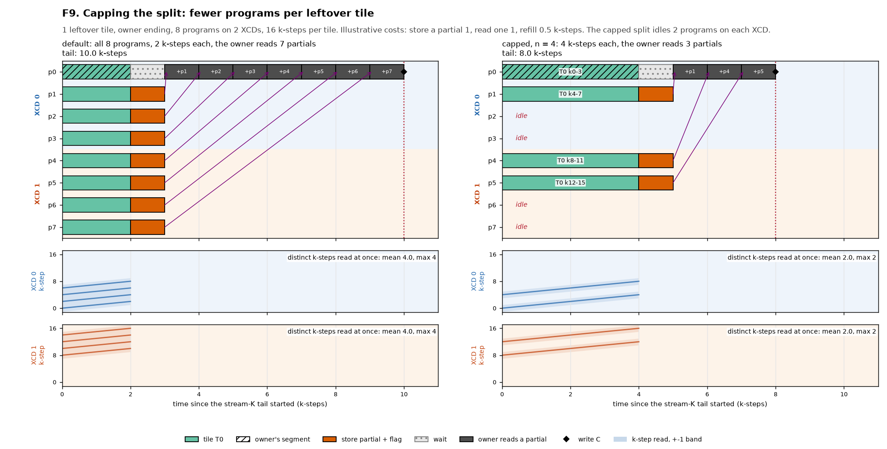

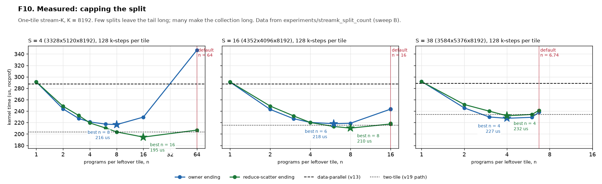

**Result** at K = 8192:
- Capping cuts the owner ending's kernel time by 39% at S = 4, 10% at S = 16 and 4% at S = 38. It gains nothing from S = 64, where the default is already 2-4 ways.
- Reduce-scatter gains 6%, 3% and 3%.
- Spreading the idle programs over the XCDs is worth 11-15% against idling whole XCDs.

**The general conclusion changes.** With the split capped, one-tile stream-K ties or beats two-tile:
- On the 9 compute shapes with S = 2-33, `capped` wins 6, by 0.3-4.0%. It loses 3, by 0.2-1.5%: 4352x4096x4096 and both four-wave shapes.
- On the short-K and skinny shapes with a full wave, it is 4.6-45% ahead.
- Fewer programs only slow two-tile down (213 to 315 us at S = 16, going from 256 to 128 programs), because its tiles already have one peer each.

So two-tile's measured advantage now rests on shapes with several full waves before the tail, which section 3 explains. Two shapes are not enough to decide whether it stays (section 10).

## 7. The host rules (v20 `STREAMK_POLICY=auto` and `capped`)

### `auto` (the default)

With `n = 256 // S` programs per tile in the one-tile split and `d = iters_per_tile * S / 256`:

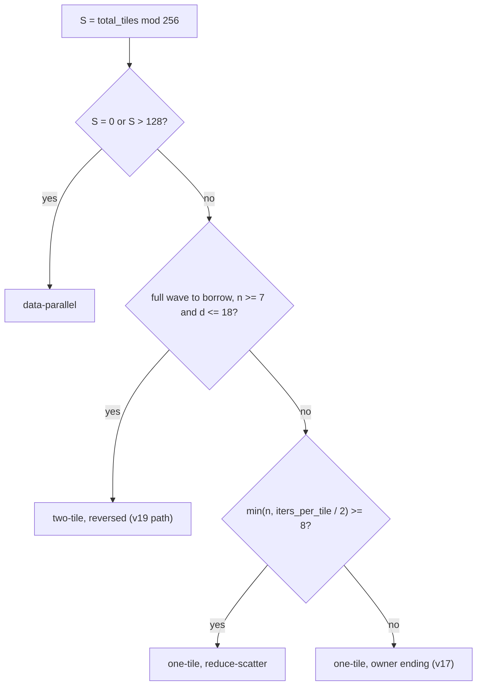
```mermaid
flowchart TD
    start["S = total_tiles mod 256"] --> dpCheck{"S = 0 or S > 128?"}
    dpCheck -->|yes| dp["data-parallel"]
    dpCheck -->|no| ttCheck{"full wave to borrow, n >= 7 and d <= 18?"}
    ttCheck -->|yes| twoTile["two-tile, reversed (v19 path)"]
    ttCheck -->|no| rsCheck{"min(n, iters_per_tile / 2) >= 8?"}
    rsCheck -->|yes| rs["one-tile, reduce-scatter"]
    rsCheck -->|no| owner["one-tile, owner ending (v17)"]
```

With clean caches this picks the best version on every measured shape but one. Proposed but not applied: `spread` for S > 128 when `iters_per_tile >= 512` (K >= 32768).

The split count `n` here is the default, all 256 programs. The two-tile thresholds were set against that uncapped one-tile split.

### `capped` (an alternative, not the default)

`STREAMK_POLICY=capped` ([v20 worklog entry 5](v20_streamk_reduce_scatter/WORKLOG.md)) never picks two-tile. Instead it caps the one-tile split at n programs per leftover tile (`STREAMK_NUM_PROGRAMS = S * n`), and adds the threshold below which no split pays, and `spread` at large K. With `k = iters_per_tile`:

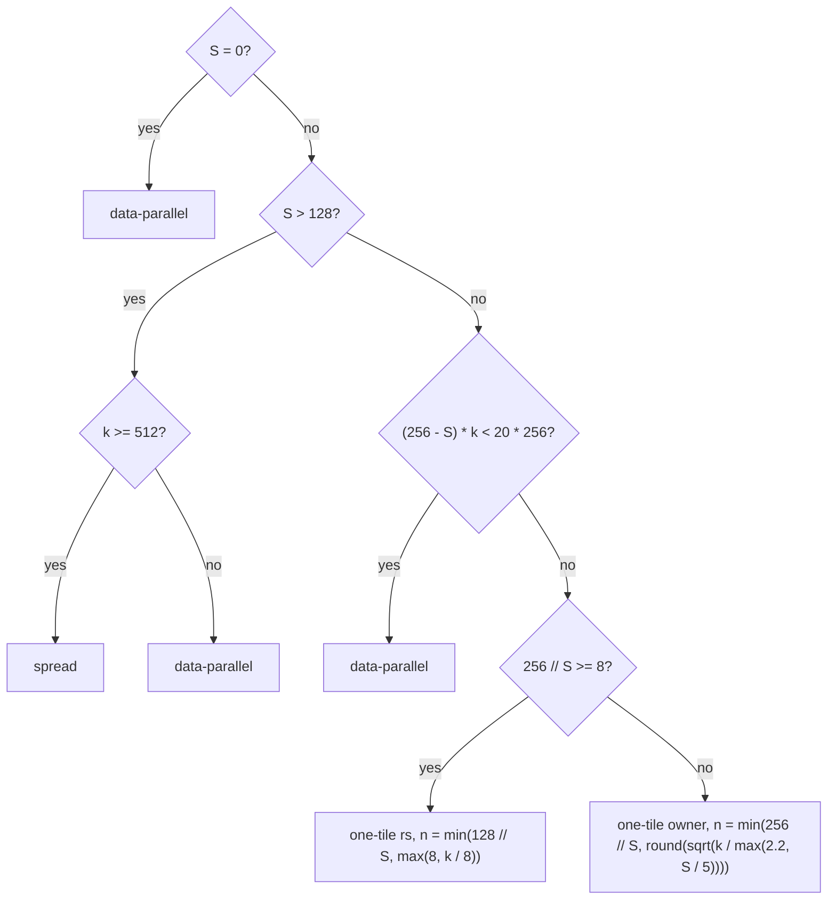
```mermaid
flowchart TD
    s0{"S = 0?"} -->|yes| dp1["data-parallel"]
    s0 -->|no| big{"S > 128?"}
    big -->|yes| spr{"k >= 512?"}
    spr -->|yes| spread["spread"]
    spr -->|no| dp2["data-parallel"]
    big -->|no| thr{"(256 - S) * k < 20 * 256?"}
    thr -->|yes| dp3["data-parallel"]
    thr -->|no| fix{"256 // S >= 8?"}
    fix -->|yes| rs["one-tile rs, n = min(128 // S, max(8, k / 8))"]
    fix -->|no| own["one-tile owner, n = min(256 // S, round(sqrt(k / max(2.2, S / 5))))"]
```

- **The data-parallel threshold:** the idle share of the data-parallel last wave, `(256 - S) / 256 * k` k-steps, has to exceed about 20, the fixed cost of any split.
- **The owner's n:** this is section 9 of STREAMK_EXPLAINED's `sqrt(k / c)`, where `c` is the cost of one serial partial read. That cost grows once many programs publish at once.
- **Reduce-scatter's n:** its ending costs about the same at any n, so it wants more splits. In practice that is 16 for S = 1-4 at K = 8192, and 8 for S = 7-16.

The coefficients are fits to the sweeps in section 9 and in [experiments/streamk_split_count](../../../../experiments/streamk_split_count/README.md). It is measured against `auto` in section 9.

## 8. Observations

- **Alignment beats balance.** Every large gain after v16 came from making one XCD's programs read the same k-slices at the same time: v17's aligned cuts, and v19's and spread's reversed order. Perfect balance with drifting offsets loses to slightly uneven, aligned work.
- **The cache window is 2-10 k-steps on MI355X**, from no sharing to data-parallel's sharing, against roughly 20-240 on an A100. Our GEMMs also have far fewer waves to dilute the skew, so the paper's two-tile argument does not carry over.
- **Over-splitting hid the best one-tile results.** With the split capped, most of two-tile's advantage disappears.
- **Stream-K competes with tile choice.** At small K a smaller data-parallel tile beats any split; at large K, stream-K on the larger tile beats the smaller tile.
- **Bursts cost more than steady traffic.** Traffic that every program issues at the same moment costs several times as much as the same traffic spread out:
  - a partial store takes 4-11 k-steps in a burst, against 1.5;
  - the reduce-scatter slice read takes about 8, against 2;
  - the tail's 8 k-step chunks take 15.6 k-steps while the leftover tiles' B is read.
- **Benchmark methodology changes the winner.** do_bench's 256 MB flush leaves dirty lines that penalize kernels which publish early (v19). Clean-cache and back-to-back timings are needed alongside it.
- **Power.** At S = 240 and K = 32768 both data-parallel and stream-K sit at the board's 1.4 kW limit. Spreading work saves energy only when it also shortens the kernel.

## 9. All versions on the test shapes

v9-v20 on 30 shapes. These are the stream-K test shapes of the worklogs, plus two groups that are not compute-bound:
- **short K**: 16-32 k-tiles;
- **skinny**: M = 256, about 256 flop/byte, below the ridge.

v20 appears once per policy, including `capped` (section 7). The driver is [experiments/streamk_version_tables/sweep.py](../../../../experiments/streamk_version_tables/sweep.py), and the full tables, including every split count, are in [results/tables.md](../../../../experiments/streamk_version_tables/results/tables.md).

- **TFLOPS**: cold rocprof, the median kernel time over 1000 launches on a rotating 512 MB of inputs. Each main-grid case was timed in 3 processes and the figures use the median. Split-count cases were timed in one process, except on the skinny shapes. bf16, no bias, v9 tile order, GPU 0.
- **L2 hit rate**: `TCC_HIT / (HIT + MISS)` over warm launches 3-10 on the same inputs, as in `rocprof_check.py`.
- **Correctness**: every case matched torch (1104 cases).
- **Checks**: v20's same-path builds match the versions they copy. The median ratio is 1.000 for v20 `owner` against v17, v20 `two_tile` against v19 and v20 `dp` against v13.
- **Noise**:
  - On the compute and short-K shapes the median run-to-run spread is 0.1-0.6% (the "spread" column), so margins below about 1% are not significant.
  - On the two skinny shapes without a full wave, the same kernel varies by 13-30% between processes, for example v20 `dp` at 872-1078 TFLOPS. Those two rows do not rank the versions.
  - Identical builds can differ by up to 4% between processes on a few other shapes. For example, v20 `capped` picks `dp` on 4096x6144x2048 and compiles to the same kernel as v20 `dp`, yet measured 1158 against 1200 TFLOPS.

### Shapes and winners

"Runner-up" is the fastest configuration from another version, with v20's policies counting as one version; it is often a copy of the same schedule. "Next schedule" is the fastest configuration that runs a different schedule, which is the margin the schedule itself wins by. With S = 0 every configuration is data-parallel. Spread is the median / maximum over configurations of the difference between a configuration's slowest and fastest process.

| shape | class | tiles | full waves | S | k-tiles | d | v20 auto picks | v20 capped picks | best (schedule) | runner-up, best ahead by | next schedule, best ahead by | best vs v13 | spread |
|---|---|---|---|---|---|---|---|---|---|---|---|---|---|
| 4096x4096x8192 | compute | 256 | 1 | 0 | 128 | 0 | data-parallel | data-parallel | v9 (data-parallel) | v20 dp, +0.1% | - | +0.6% | 0.6% / 1.1% |
| 8192x8192x8192 | compute | 1024 | 4 | 0 | 128 | 0 | data-parallel | data-parallel | v12 (data-parallel) | v11, +0.1% | - | +0.4% | 0.1% / 0.3% |
| 1536x11008x8192 | compute | 258 | 1 | 2 | 128 | 1 | two-tile | one-tile rs, n = 16 | v20 capped (one-tile rs, n = 16) | v19, +2.3% | two-tile (v20 two_tile), +2.1% | +46.8% | 0.5% / 3.3% |
| 3328x5120x8192 | compute | 260 | 1 | 4 | 128 | 2 | two-tile | one-tile rs, n = 16 | v20 capped (one-tile rs, n = 16) | v19, +4.1% | two-tile (v20 two_tile), +4.0% | +46.8% | 0.4% / 1.4% |
| 4352x4096x4096 | compute | 272 | 1 | 16 | 64 | 4 | two-tile | one-tile rs, n = 8 | v20 auto (two-tile) | v19, +0.2% | one-tile rs, n = 8 (v20 capped), +0.8% | +24.1% | 0.6% / 1.5% |
| 4352x4096x8192 | compute | 272 | 1 | 16 | 128 | 8 | two-tile | one-tile rs, n = 8 | v20 capped (one-tile rs, n = 8) | v19, +3.3% | two-tile (v20 auto), +3.2% | +37.1% | 0.4% / 1.2% |
| 4352x4096x16384 | compute | 272 | 1 | 16 | 256 | 16 | two-tile | one-tile rs, n = 8 | v20 capped (one-tile rs, n = 8) | v19, +0.3% | two-tile (v19), +0.3% | +44.2% | 0.5% / 3.4% |
| 4096x16640x8192 | compute | 1040 | 4 | 16 | 128 | 8 | two-tile | one-tile rs, n = 8 | v20 two_tile (two-tile) | v19, +0.1% | one-tile rs, n = 8 (v20 capped), +0.2% | +11.1% | 0.3% / 0.6% |
| 4096x4608x8192 | compute | 288 | 1 | 32 | 128 | 16 | two-tile | one-tile rs, n = 4 | v20 capped (one-tile rs, n = 4) | v19, +1.0% | one-tile rs (v20 rs), +0.3% | +28.2% | 0.4% / 2.3% |
| 8192x8448x8192 | compute | 1056 | 4 | 32 | 128 | 16 | two-tile | one-tile rs, n = 4 | v19 (two-tile) | v20 two_tile, +0.1% | one-tile rs (v20 rs), +1.1% | +10.1% | 0.3% / 0.7% |
| 4352x4352x8192 | compute | 289 | 1 | 33 | 128 | 16.5 | two-tile | one-tile owner, n = 4 | v20 capped (one-tile owner, n = 4) | v19, +2.7% | two-tile (v20 auto), +2.4% | +28.6% | 0.4% / 2.8% |
| 3584x5376x8192 | compute | 294 | 1 | 38 | 128 | 19 | one-tile owner | one-tile owner, n = 4 | v20 capped (one-tile owner, n = 4) | v18, +2.4% | one-tile owner (v18), +2.4% | +27.9% | 0.4% / 1.4% |
| 4096x5120x8192 | compute | 320 | 1 | 64 | 128 | 32 | one-tile owner | one-tile owner, n = 3 | v20 capped (one-tile owner, n = 3) | v18, +0.3% | one-tile owner (v18), +0.3% | +21.2% | 0.3% / 2.2% |
| 4096x6144x8192 | compute | 384 | 1 | 128 | 128 | 64 | one-tile owner | one-tile owner | v20 capped (one-tile owner) | v17, +0.1% | spread (v20 spread), +0.8% | +7.9% | 0.3% / 2.5% |
| 4096x7168x8192 | compute | 448 | 1 | 192 | 128 | 96 | data-parallel | data-parallel | v10 (data-parallel) | v9, +0.2% | one-tile owner (v17), +1.7% | +0.4% | 0.5% / 2.2% |
| 4096x7168x32768 | compute | 448 | 1 | 192 | 512 | 384 | data-parallel | spread | v20 spread (spread) | v11, +5.7% | data-parallel (v20 dp), +5.7% | +7.5% | 2.1% / 3.9% |
| 8192x7936x8192 | compute | 992 | 3 | 224 | 128 | 112 | data-parallel | data-parallel | v12 (data-parallel) | v11, +0.1% | spread (v20 spread), +1.7% | +0.4% | 0.1% / 1.1% |
| 4096x7936x8192 | compute | 496 | 1 | 240 | 128 | 120 | data-parallel | data-parallel | v11 (data-parallel) | v12, +0.0% | one-tile rs (v20 rs), +1.8% | +0.2% | 0.3% / 2.9% |
| 1792x18688x8192 | compute | 511 | 1 | 255 | 128 | 127.5 | data-parallel | data-parallel | v20 dp (data-parallel) | v11, +0.0% | one-tile rs (v20 rs), +0.9% | +0.1% | 0.4% / 0.6% |
| 3840x4096x8192 | compute | 240 | 0 | 240 | 128 | 120 | data-parallel | data-parallel | v10 (data-parallel) | v9, +0.0% | one-tile owner (v18), +1.9% | +0.7% | 0.3% / 0.7% |
| 4352x4096x1024 | short K | 272 | 1 | 16 | 16 | 1 | two-tile | data-parallel | v11 (data-parallel) | v20 dp, +1.0% | two-tile (v20 two_tile), +23.5% | +1.3% | 1.1% / 5.0% |
| 4352x4096x2048 | short K | 272 | 1 | 16 | 32 | 2 | two-tile | one-tile rs, n = 8 | v20 capped (one-tile rs, n = 8) | v11, +4.5% | data-parallel (v11), +4.5% | +5.3% | 0.3% / 2.8% |
| 3328x5120x2048 | short K | 260 | 1 | 4 | 32 | 0.5 | two-tile | one-tile rs, n = 8 | v20 capped (one-tile rs, n = 8) | v19, +4.6% | two-tile (v19), +4.6% | +13.5% | 0.5% / 4.0% |
| 4096x5120x2048 | short K | 320 | 1 | 64 | 32 | 8 | one-tile owner | one-tile owner, n = 2 | v20 capped (one-tile owner, n = 2) | v11, +1.7% | data-parallel (v11), +1.7% | +2.5% | 0.3% / 0.8% |
| 4096x6144x2048 | short K | 384 | 1 | 128 | 32 | 16 | one-tile owner | data-parallel | v11 (data-parallel) | v12, +0.1% | one-tile owner (v18), +4.9% | +0.5% | 0.3% / 3.6% |
| 4096x7168x1024 | short K | 448 | 1 | 192 | 16 | 12 | data-parallel | data-parallel | v11 (data-parallel) | v12, +0.4% | one-tile owner (v18), +12.4% | +1.1% | 0.6% / 4.8% |
| 256x65792x8192 | skinny | 257 | 1 | 1 | 128 | 0.5 | two-tile | one-tile rs, n = 16 | v20 capped (one-tile rs, n = 16) | v19, +13.1% | one-tile rs (v20 rs), +4.9% | +45.4% | 0.7% / 2.8% |
| 256x67328x4096 | skinny | 263 | 1 | 7 | 64 | 1.75 | two-tile | one-tile rs, n = 8 | v20 capped (one-tile rs, n = 8) | v19, +6.1% | two-tile (v20 auto), +3.9% | +22.3% | 1.5% / 7.0% |
| 256x32768x8192 | skinny | 128 | 0 | 128 | 128 | 64 | one-tile owner | one-tile owner | v18 (one-tile owner) | v14, +0.7% | data-parallel (v14), +0.7% | +1.1% | 9.4% / 30.2% |
| 256x49152x8192 | skinny | 192 | 0 | 192 | 128 | 96 | data-parallel | data-parallel | v20 capped (data-parallel) | v13, +0.5% | one-tile end-to-end (v16), +12.2% | +0.5% | 2.7% / 12.6% |

### G1: speed against v13

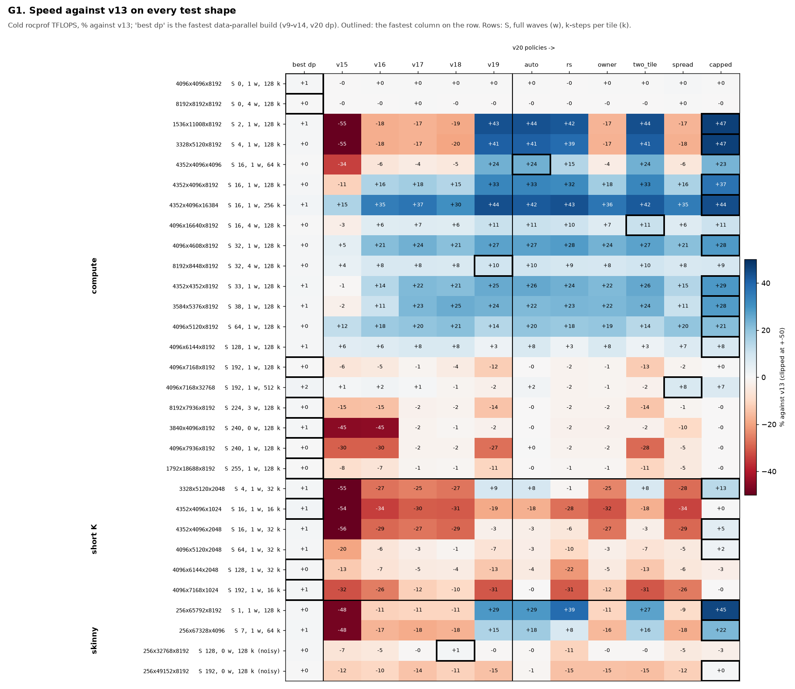

Each cell is a configuration's TFLOPS against v13 on that shape, and the outlined cell is the fastest column. "best dp" is the fastest data-parallel build (v9-v14, v20 `dp`). The TFLOPS of all 18 configurations are in [results/tables.md](../../../../experiments/streamk_version_tables/results/tables.md), sections 2 and 3.

### G2: where stream-K pays

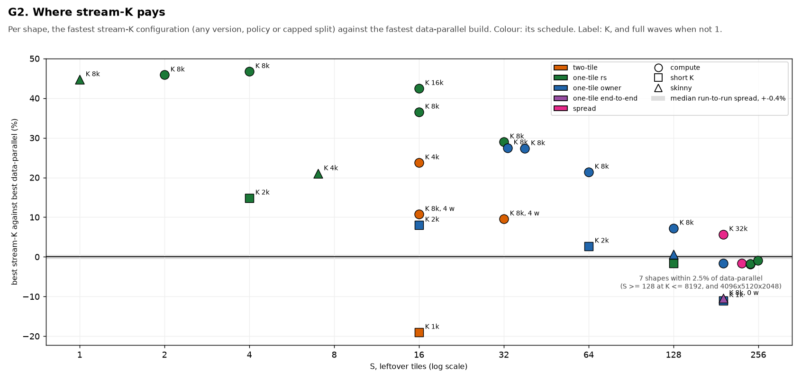

The fastest stream-K configuration of any version, policy or capped split, against the fastest data-parallel build:
- **S <= 64 with one full wave and K >= 4096:** +21% to +47%.
- **Four full waves:** about +10%.
- **S = 128:** +7%.
- **S >= 192:** within 2% at K = 8192, and +6% with `spread` at K = 32768.
- **Short K:** +3% to +15% at K = 2048 with a capped split, and -11% to -19% at K = 1024.

### G3: L2 hit rate

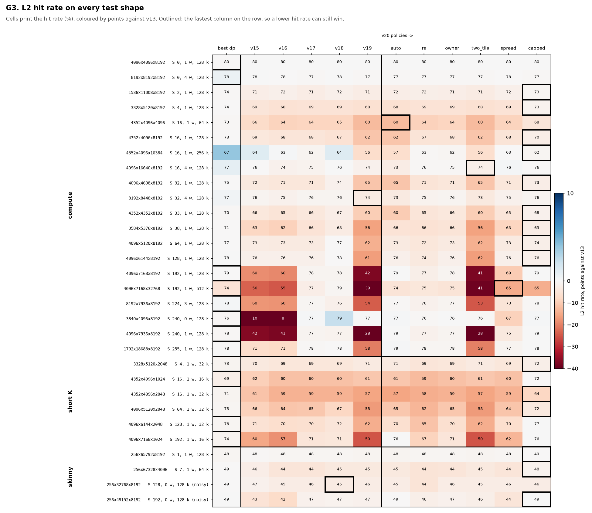

Cells print the hit rate and are coloured by the change against v13. The forward end-to-end versions (v15, v16) and two-tile lose the most. The outlines show that a lower hit rate can still win. The raw hit rates are in [results/tables.md](../../../../experiments/streamk_version_tables/results/tables.md), sections 4 and 5.

### G4: programs per leftover tile

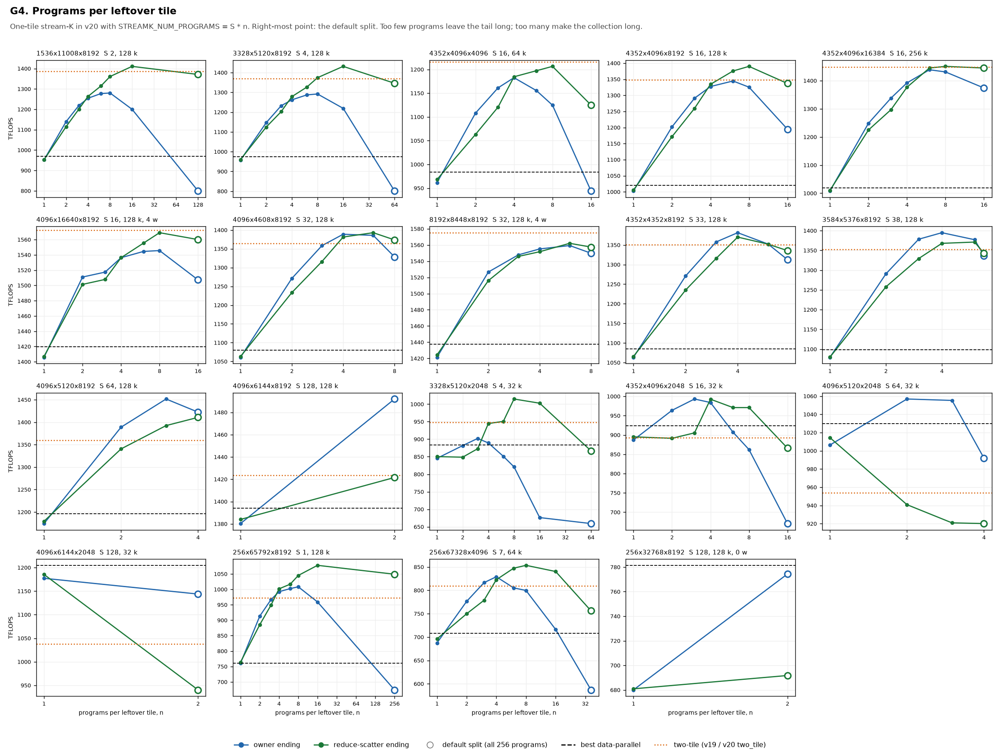

TFLOPS against n for v20's owner and reduce-scatter endings on the 19 shapes of the split sweep (S <= 128, K >= 2048). The right-most point is the default split, and the dashed and dotted lines are the best data-parallel and two-tile results. Every n for all six one-tile configurations, with L2 hit rates, is in [results/tables.md](../../../../experiments/streamk_version_tables/results/tables.md), section 6.

### G5: host rules against the best

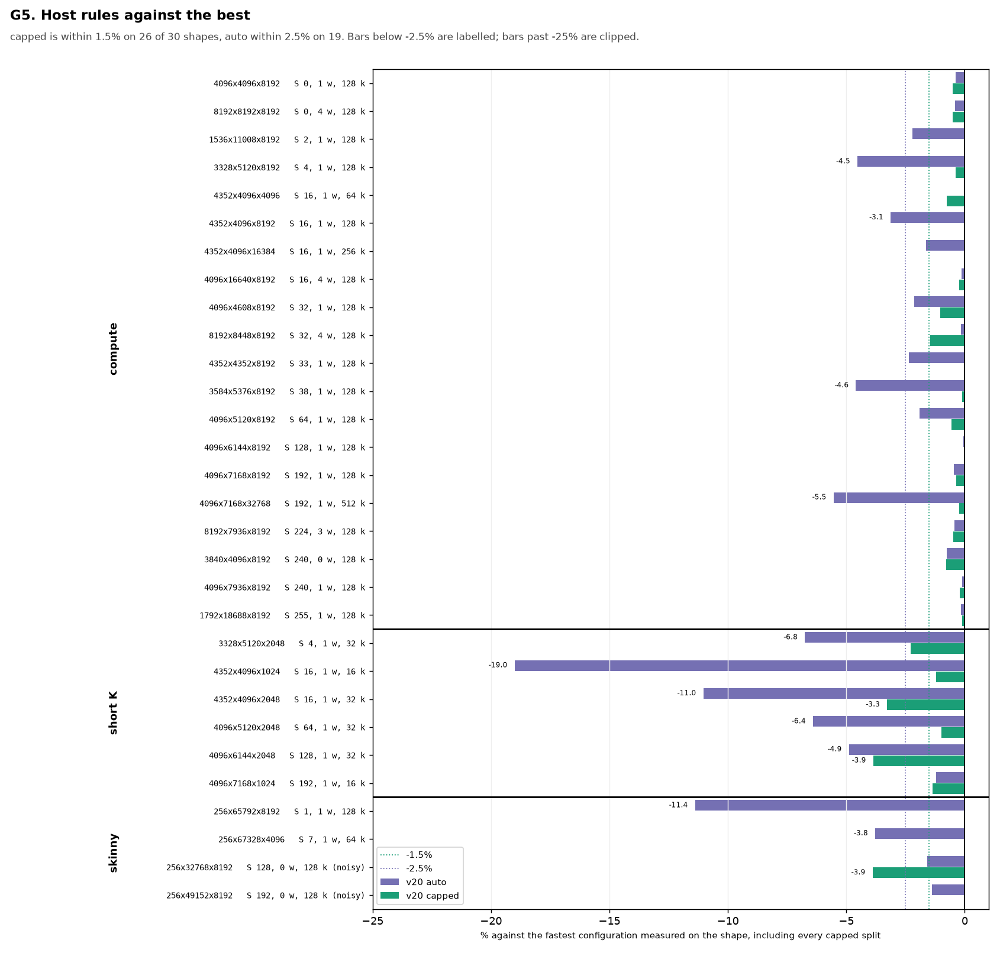

`auto` and `capped` against the fastest configuration measured on each shape, every capped split included. `capped` is within 1.5% on 26 of the 30 shapes and `auto` within 2.5% on 19. `auto`'s misses are on short K, skinny shapes, `spread` and the shapes where a capped split wins.

### What the results show

1. **The data-parallel versions are level** (G1's "best dp" column; each build's TFLOPS are in [results/tables.md](../../../../experiments/streamk_version_tables/results/tables.md), section 2). v9-v14 are within 1-2% of each other on almost every shape, and the order among them changes from shape to shape within the noise. v11 is the fastest on the five short-K shapes that data-parallel wins, 0.5-1.3% ahead of v13. Wherever data-parallel wins (S = 0, S >= 192 at K = 8192, short K), the margin to the next data-parallel version is 0.0-1.0%.
2. **Stream-K wins big where the last wave is mostly empty** (G1, G2). Against v13 the best configuration gains:
   - +24-47% for S <= 38 with one full wave;
   - +10-11% with four full waves;
   - +21% at S = 64 and +8% at S = 128;
   - +45% (S = 1) and +22% (S = 7) on the skinny shapes, even though they are HBM-bound.

   At S >= 192 and K = 8192, data-parallel wins by 0.9-1.9% over the best stream-K schedule. At K = 32768, `spread` wins by 5.7%.
3. **At the default split, two-tile wins 8 of the 9 compute shapes with S = 2-33** (G1, G4). Its margin over the next schedule (v20 `rs`) is 0.2-1.8%, except +8.2% at S = 16 with K = 4096. On the ninth, 4096x4608x8192, `rs` is ahead by 0.7%. The one-tile owner schedule wins at S = 38-128 by 0.8-0.9% (v18 at S = 38 and 64). With the split capped, one-tile beats two-tile on 6 of the 9:
   - rs at n = 16 by 1.7% at S = 2 and 4.4% at S = 4;
   - rs at n = 8 by 3.0% at S = 16, K = 8192, and by 0.2% (noise) at K = 16384;
   - rs at n = 6 by 2.1% at S = 32;
   - v17 at n = 4 by 2.3% at S = 33.

   Two-tile stays ahead by 0.2-0.9% at S = 16 with K = 4096, at S = 16 with four waves, and at S = 32 with four waves. This agrees with the split-count experiment ([experiments/streamk_split_count](../../../../experiments/streamk_split_count/README.md)). It also qualifies section 6's "v19 is the best version for S <= 16", which holds only at the default split.
4. **Short K needs its own rule** (G2, G4).
   - At K = 1024 data-parallel wins on both shapes. The best stream-K schedule is 19% behind at S = 16 (two-tile) and 11% behind at S = 192 (v18).
   - At K = 2048 data-parallel wins at the default split, but a small capped split beats it: v17 at n = 3 by 8.0% at S = 16, rs at n = 8 by 7.0% at S = 4, v17 at n = 2 by 2.7% at S = 64. At S = 128 nothing beats data-parallel.
   - v20 `auto` misses here: by 19% at 4352x4096x1024 (it picks two-tile), and by 5-11% on the K = 2048 shapes against the best capped split.
5. **Skinny shapes** (G1, G3). Every version hits 44-49% in L2: A is a single tile row and B is read once, so there is little to reuse. With a full wave, stream-K still pays:
   - at S = 1, `rs` is 7.8% ahead of two-tile, and 2.8% more at n = 16;
   - at S = 7, two-tile is 9.0% ahead of `rs` at the default split, but `rs` at n = 8 is 3.5% faster than two-tile.

   The two no-full-wave skinny shapes are inside their noise (see above).
6. **L2** (G3). Data-parallel keeps 70-80% on the compute shapes, and the stream-K schedules that read the same k-slices together stay close. On compute shapes v17 and v18 are 0-9 points below data-parallel, and capping the split raises their hit rate by up to 11 points (59 to 70% at 4352x4096x2048). The schedules that drift lose the most:
   - two-tile: 56-65% at S = 16-38 with one full wave, and 28-58% at S >= 192 with a full wave;
   - forward end-to-end v15/v16: 8-10% on 3840x4096x8192, 41-42% at S = 240;
   - `spread`: 65-77% at S >= 192.

   A higher hit rate does not decide the winner. Two-tile wins at S = 16 with 62% against data-parallel's 73%.
7. **v18 is not neutral in L2** (G3). Section 6 says v18 left the L2 counters unchanged. Here v18 has 0-4 points more L2 hits than v17 at S = 32-128 (77% against 73% at S = 64, 74% against 71% at S = 32), and it is 1-2% faster at S = 38-64 at the default split. The gap closes when the split is capped.
8. **Host rules: `capped` against `auto`** (section 7, G5). "Best" below includes every split count in the sweep.
   - **`auto`** is within 2.5% of the best on 19 of the 30 shapes. It misses on short K (up to 19%), at S = 1 skinny (9.5%), at S = 192 with K = 32768 (5.5%, `spread`), and where a capped split wins (2.9-4.6%).
   - **`capped`** is within 1.5% of the best on 26 of 30, and it is the fastest configuration in the main grid on 15 (on two of those within noise). Against `auto`:
     - short K: +22% at 4352x4096x1024 (it picks data-parallel where `auto` picks two-tile), +5-9% on three of the K = 2048 shapes;
     - skinny: +13% at S = 1 and +4% at S = 7;
     - `spread`: +5.6% at S = 192 with K = 32768;
     - compute shapes with S = 2-38: +1.1-4.7% on 7 of 10, -0.1 to -1.3% on the other 3 (4352x4096x4096 and both four-wave shapes, where two-tile wins).
   - **Where `capped` misses.** Only one is a wrong pick: 4352x4096x2048, -3.3%, where it picks rs at n = 8 and v17 at n = 3 is best. On 3328x5120x2048 (-2.3%) it runs the same configuration as the best. On 4096x6144x2048 (-3.9%) it compiles to the same kernel as v20 `dp`. The fourth is 256x32768x8192, which is inside its 30% noise.
   - **Caveat.** These results are in-sample: the rule's coefficients were fit to these shapes.
9. **Two-tile against capped one-tile** (G4, G5). On the 9 compute shapes with S = 2-33, `capped` beats two-tile on 6, by 0.3-4.0%, and loses on 3, by 0.2-1.5%. The three losses are 4352x4096x4096 and both shapes with four full waves before the tail. On the short-K and skinny shapes with a full wave, `capped` is 4.6-45% ahead. So two-tile has no measured advantage except with more waves before the tail, and that rests on two shapes. Shapes with 8-16 waves and real-model shapes should decide whether it can be dropped.

## 10. Open questions and benchmarks

To do (extended benchmarks):
- **L2 window test.** v19's L2 counters at S = 16 with K = 4096, 8192 and 16384 (`d` = 4, 8 and 16). If the extra reads grow with `d` at fixed S, the window explains v19's L2 deficit.
- **Spread rule.** A sweep over S = 136-248 at K = 16384-65536, to place the `spread` threshold.
- **The tail's MAC phase.** It is now the largest part of the S = 16 tail. Ordering the leftover tiles so that tiles sharing B are split together, or prefetching deeper, could shorten it.
- **Two-tile's sensitivity to a dirty memory system.** Publishing its head piece later may remove the do_bench loss.
- **`capped` on held-out shapes.** Its coefficients are fit to section 9's shapes. To test it, and whether two-tile can go: 8-16 full waves, S = 8, 24, 48 and 96, K = 3072 and 6144, and real model GEMMs, with bias.
- **Process-to-process variation on skinny shapes.** On 256x32768x8192 and 256x49152x8192 the same kernel runs 13-30% faster or slower depending on the process (section 9). v13 on 256x32768x8192 alternates between about 710 and 800 TFLOPS. Buffer placement is the first suspect.
- **Tile size against stream-K, on one code base.** The tile-size comparison in section 4 uses library kernels for the smaller tile. A 256x128 variant of v13, plus a smaller tile for the leftover tiles only (section 5), would separate the tile effect from kernel quality.
- **Fewer partial bytes.** bf16 partials and keeping each program's own slice in registers. If halving the bytes halves the ending, the threshold of about 20 k-steps should fall to about 12.
- **Stream-K first.** The paper's order for two-tile, with the fixups overlapping data-parallel tiles.
- **L2, clocks and power.** Log the shader clock alongside the L2 hit rate on long kernels, to see whether a lower hit rate costs clock speed under the 1.41 kW limit.
- **Publish spread.** Record each program's publish time with `fixup_timing.py`'s `s_memrealtime` stamps. If a tile's first and last publishes are far apart (close to the 6-9 k-step barrier wait), arrival-order reduction (section 5) pays; if they land together, it does not.
- **Infinity Cache behaviour of the partial stores.** Time the owner's read of a workspace written with `.wt` (SC0 + SC1), with SC1 alone, and with the default policy. This shows whether the bits matter for the cache behind L2.
