# How the TensorAtlas stream-K kernel works

This note explains the stream-K GEMM in [`TensorAtlas/kernels/gemm/streamk_matmul.py`](/home/jbowley/repos/TensorAtlas/kernels/gemm/streamk_matmul.py) (line numbers below refer to that file). It is the reference for v14's stream-K tail. It checks the nine-point description we started from, answers the two open questions (why the k-step-0 program reduces, and how it finds its neighbours), describes the proposed reversed order, compares ways of splitting the tail, and collects what the Gluon port needs to get right: memory ordering, caches and the pipeline. Section 14 records what the first port (v15) measured, and where that corrects the model. Paper references are to Osama et al., *Stream-K: Work-centric Parallel Decomposition for Dense Matrix-Matrix Multiplication on the GPU* ([arXiv:2301.03598](https://arxiv.org/html/2301.03598v1)).

All figures and tables come from [`streamk_diagrams.py`](streamk_diagrams.py). It is a pure-Python replay of the kernel's index arithmetic, and it asserts the invariants claimed below. Run `python streamk_diagrams.py` to regenerate `images/` and print the tables. The two release figures in section 11 are schematic; everything else is computed.

## In short

- The kernel itself is the paper's generic stream-K loop. What makes it the **"data-parallel + one-tile stream-K"** hybrid (§5.2, Fig. 3b) is the host's choice of `STREAMK_TILES = total_tiles % NUM_SMS`. All full waves of tiles run as an ordinary persistent loop, and only the tiles of the last, partial wave are split along K, evenly across **all** programs.
- With that choice there are fewer stream-K tiles than programs, so every program gets **less than one tile's worth** of k-steps. Each program touches at most two tiles, and each tile is shared by roughly `NUM_SMS / STREAMK_TILES` programs. For 4352x4096x8192 on 256 programs, each of the 16 tiles is split 16 ways, 8 k-steps each.
- Setting `STREAMK_TILES = total_tiles % NUM_SMS + NUM_SMS` instead gives the paper's **two-tile** hybrid (Fig. 3c) with the same kernel code: every tile has at most one peer (section 3).
- The program that computes a tile's **k-step 0 owns the tile**: it sums everyone else's partials and writes C. Its peers are always the next consecutive pids. It finds them by re-running the partition formula for `pid + 1, pid + 2, ...` until the running end passes the end of the tile.
- In the one-tile hybrid, the owner's serial collection of partials costs far more than the compute it replaces (section 6). Section 9 compares ways of splitting the tail: tile-aligned cuts, fewer programs, reduce-scatter, and two-tile.
- Measured costs ([experiments/streamk_costs](../../../../../experiments/streamk_costs/README.md), in v14 k-steps of about 1.27 us), with partials written lane-contiguous:
  - storing a partial costs about 1.5, but 4-11 when all 240 contributors publish at once;
  - an owner reading one partial costs about 1.8-2.8;
  - a stream-K tile switch costs about 3.4, of which 1.2 is the pipeline restart;
  - row-major partials cost 2-3x more;
  - a 16-way one-tile fixup measured 36 k-steps, as the model predicts.
- **Measured in v15** (the port, section 14):
  - The data-parallel last wave costs much less than this note first assumed. Its few tiles run on otherwise idle CUs at about 0.76 us per k-step, against 1.21 us when all 256 CUs are busy. On 4352x4096x8192 it takes 97 us (80 k-steps), not 128 contended k-steps, and at K=4096 only 36 us. The tables in section 9 now use the measured value in their "measured" column.
  - v15's one-tile tail follows the model with row-major costs, 10-30% above it, and loses to data-parallel wherever the owners collect many partials.
  - Long stream-K ranges lose their L2 reuse. Each program starts at its own k offset, so the programs of an XCD stop sharing A/B k-slices (76% L2 hits fall to 10% on 3840x4096x8192). Tile-aligned cuts (v17) restore data-parallel's hit rate.
  - Reduce-scatter (v20) makes the one-tile fixup about 25 k-steps at any split count, but reversed two-tile (v19) still wins with short lags when caches are clean. v20's host rule picks among data-parallel, two-tile and one-tile with either ending (finding 9).
- The reversed order (the last-k-step program reduces, segments processed last-to-first) is an exact mirror of the original. It keeps every correctness and latency-hiding property, but in this one-tile regime it changes little for A/B reuse (section 8).
- The reference kernel has a **lock-reset bug** and no formal release/acquire; the Gluon port must not copy either (sections 11 and 13).

## 1. Terminology

| term | meaning |
|---|---|
| k-step / iteration | one `BLOCK_M x BLOCK_N x BLOCK_K` MAC step, the paper's "MAC-loop iteration". `iters_per_tile = cdiv(K, BLOCK_K)`. |
| tile | one `BLOCK_M x BLOCK_N` output block. It takes `iters_per_tile` k-steps to finish. |
| stream-K iteration space | the stream-K tiles laid end to end: iteration `i` is k-step `i % iters_per_tile` of stream-K tile `i // iters_per_tile`. This is the paper's m -> n -> k linearisation. |
| range | the contiguous block of iterations `[start_iter, last_iter)` given to one program. |
| segment | the part of a range that falls inside one tile. A range is cut into segments at tile boundaries. |
| seam | a boundary between two programs' ranges. A seam inside a tile means that tile needs a fixup. |
| owner / reducer | the program whose segment contains a tile's k-step 0. It gathers the other partials, adds bias and writes C. |
| contributor / peer | any other program with a segment in that tile. It writes its partial accumulator to the workspace and raises a flag. |
| `P` | fp32 workspace, one `BLOCK_M x BLOCK_N` slot per program: `P[pid]` is 256 KiB for 256x256 tiles. |
| `locks` | one flag per program. `locks[pid] = 1` means `P[pid]` holds this program's partial. |

`pid` always means the *logical* pid after XCD remapping. TensorAtlas applies `chiplet_transform_chunked` at line 45; v14 uses `get_logical_chiplet_mapped_pids`, which gives 32 contiguous logical pids per XCD. So "neighbouring pids" are, by construction, mostly on the same XCD.

## 2. Phase 1: the data-parallel (persistent) loop

```python
total_tiles = num_pid_m * num_pid_n
total_full_tiles = total_tiles - STREAMK_TILES            # line 49
for tile_id in range(pid, total_full_tiles, NUM_SMS):     # line 61
    ...  # full-K tile, GROUP_SIZE_M swizzle, bias, store C
```

The host sets `STREAMK_TILES = total_tiles % NUM_SMS` (for example `benchmarks/runner.py` and `tests/test_gemm.py`). So `total_full_tiles` is a whole number of waves, **every program runs the same number of full tiles**, and all programs arrive at the stream-K phase at about the same time. Stream-K takes the *last* `STREAMK_TILES` tile ids.

Examples with 256x256 tiles and `NUM_SMS = 256`:

| shape | tiles | full waves | `STREAMK_TILES` |
|---|---|---|---|
| 4352x4096x8192 | 17 x 16 = 272 | 1 (256 tiles) | 16 |
| 4352x4352x8192 | 17 x 17 = 289 | 1 (256 tiles) | 33 |
| 4096x4096x8192 | 16 x 16 = 256 | 1 | 0 (the stream-K code returns at line 161) |

Without stream-K, the 16 leftover tiles of 4352x4096x8192 would run as a last wave of 16 programs doing 128 k-steps each while 240 CUs sit idle. With stream-K, all 256 programs do 8 k-steps each, plus the fixup.

That last wave is cheaper than 128 k-steps suggests. 16 programs running alone get the whole memory system, so each k-step takes about 0.76 us instead of the 1.21 us it takes when all 256 CUs are busy. Measured on v13, the 16-tile last wave costs 97 us, or 80 contended k-steps (section 14).

## 3. Phase 2: partitioning the stream-K iterations

```python
iters_per_tile          = cdiv(K, BLOCK_K)
total_streamk_iters     = STREAMK_TILES * iters_per_tile
streamk_iters_pcu       = total_streamk_iters // NUM_SMS      # L
streamk_remainder_iters = total_streamk_iters %  NUM_SMS      # R
start_iter = total_full_tiles*iters_per_tile + pid*L + min(pid, R)       # lines 180-182
last_iter  = total_full_tiles*iters_per_tile + (pid+1)*L + min(pid+1, R)
```

Program `pid` owns `L + (pid < R)` iterations. The **first `R` programs get one extra**, and the rest get exactly `L`. The `min(pid, R)` term is the running count of extra iterations handed out to lower pids, so the ranges tile the iteration space contiguously, in pid order, with no gaps.

With the host's one-tile choice, `STREAMK_TILES < NUM_SMS`, so `L < iters_per_tile`. A range is at most one tile long, so it spans **at most two tiles**. It is either wholly inside one tile, or it crosses exactly one tile boundary.

**Toy example** (used for most of the small figures): 7 programs, 3 stream-K tiles, 8 k-steps per tile, so 24 iterations, `L = 3` and `R = 3`. Programs p0-p2 get 4 iterations and p3-p6 get 3.

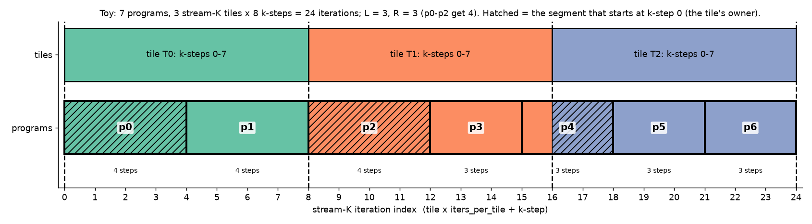

The seams between programs (thick boxes) are independent of the tile boundaries (dashed lines). The paper says the splitting seams are "completely dissociated from the tiling structure" (§4). Hatched segments start at k-step 0, so their program owns that tile.

**Real example**, 4352x4352x8192: `total_streamk_iters = 33 x 128 = 4224`, `L = 16`, `R = 128`. Programs p0-p127 get 17 k-steps and p128-p255 get 16. So p7 owns `[119, 136)`: k-steps 119-127 of tile 0 (9 steps), then k-steps 0-7 of tile 1 (8 steps).

### The policy is the host's choice: one-tile vs two-tile

Nothing in the kernel assumes one tile per program. The loop is the paper's generic Algorithm 5, and every invariant it relies on (section 6) holds for any partition. If the host moves one full wave into stream-K, `STREAMK_TILES = total_tiles % NUM_SMS + NUM_SMS`, you get the paper's two-tile hybrid:

- `total_full_tiles` is still a whole number of waves (one fewer), so phase 1 is unchanged.
- `L >= iters_per_tile`, so each range covers one to two tiles' worth of k-steps. A range can now have **three** segments: the tail of tile t, all of tile t+1, and the head of tile t+2. The middle segment starts at k-step 0 and ends at the tile end, so the walk finds no peers and it just writes C.
- Every tile has **at most one peer**: what remains of a tile after the owner's segment is shorter than a tile, and the next program's range is at least a tile long.
- It needs at least one full wave to borrow. On 4352x4096x8192 (272 tiles) that makes all 272 tiles stream-K and leaves the persistent loop empty; that still works, but the paper only claims good latency hiding with at least two full waves.

The single-leftover-tile case shows how different the two policies are. For 257 tiles on 256 programs with 128 k-steps per tile:

| policy | `L` | `R` | idle programs | peers of the worst owner | partials read in total |
|---|---|---|---|---|---|
| one-tile (`STREAMK_TILES = 1`) | 0 | 128 | 128 | **127** | 127 |
| two-tile (`STREAMK_TILES = 257`) | 128 | 128 | 0 | **1** | 127 |

The one-tile version is correct but terrible: programs 128-255 get empty ranges (their `while` loop never runs), and p0 does 1 k-step and then serially reads 127 partials, about 32 MiB.

The last column is the same in both rows, and the same holds for the real shapes (240 partials for 4352x4096x8192, 239 for 4352x4352x8192). Every seam inside a tile costs one partial, whatever the policy. **Two-tile does not reduce fixup traffic; it breaks up the serial chain** on each owner (15 peers become at most 1 on 4352x4096x8192) and gives the late publishers slack. Measured on v15's kernel, two-tile nevertheless loses, because every program then reads A/B from its own k offset for more than a tile, and L2 reuse collapses (section 14).

## 4. The segment loop, publishing a partial, and the fixup

```python
while start_iter < last_iter:                                          # line 185
    remainder = start_iter % iters_per_tile
    end_iter  = min(start_iter + (iters_per_tile - remainder), last_iter)
    tile_id   = start_iter // iters_per_tile
    acc = MAC loop over k-steps [start_iter, end_iter) of tile_id      # lines 215-232
    tile_iter = tile_id * iters_per_tile
    if start_iter != tile_iter:        # does not contain k-step 0: contributor
        store acc -> P[pid] (.wt);  debug_barrier;  locks[pid] = 1 (.wt)   # lines 245-254
    else:                              # contains k-step 0: owner
        fixup walk over pid+1, pid+2, ... (next section); add bias; store C
    start_iter = end_iter                                              # line 378
```

- A segment runs from `start_iter` to whichever comes first: the end of the current tile, or the end of the program's range. The next segment then starts exactly on a tile boundary.
- **Contributor path.** Any segment that does not start at k-step 0 writes its fp32 accumulator to its own slot `P[pid]` and then sets `locks[pid] = 1`. For quantised inputs the A/B scales are applied first, which is fine because scaling is linear. Bias is not added here.
- **Owner path.** The owner first finishes its own k-steps. Then, for each peer in turn, it spins on `locks[peer]` with a volatile `.cv` load and adds `P[peer]` into its accumulator. Finally it adds bias once, converts, and writes C.
- If an owner's segment covers the whole tile (`end_iter == tile_iter + iters_per_tile`), the walk finds no peers, and the owner just writes C, like a data-parallel tile.

### Large tiles: read the partial back in quadrants

For tiles of at least 128x128, TensorAtlas splits the owner's accumulator into four quadrants, `acc00..acc11` (lines 266-308), and adds each peer's partial one quadrant at a time. That is a register-pressure measure, not a different algorithm, and the Gluon port needs the same thing, only more so:

- At 4 warps, v14's 256x256 fp32 accumulator is 256 values per thread, which fills all 256 AGPRs. There is no room to load a whole 256 KiB partial into registers next to it.
- One quadrant, matching v14's `acc_tl` / `acc_bl` / `acc_tr` / `acc_br`, is 128x128 fp32 = 64 KiB, or 64 VGPRs per thread. v14 already uses 488 of 512 VGPRs with the tail present, so even one quadrant does not fit comfortably.
- So either read half-quadrants (32 VGPRs at a time), or stage each quadrant through the A/B LDS buffers, which are free by then (4 buffers x 32 KiB = 128 KiB), with `buffer_load_to_shared`, then read it from LDS in small pieces and add.
- Interleave this with v14's existing four-quadrant C store: add the partial into `acc_tl`, store `c_tl`, then move on to the next quadrant.
- Write the partial in the accumulator's own register layout. The reader uses the same layout, so neither side needs a `convert_layout`.

In the toy example:

| pid | iterations | count | segments (tile: k-steps, role) | fixup |
|---|---|---|---|---|
| p0 | [0, 4) | 4 | T0 k0-3 reduce | reads P[1] for T0 |
| p1 | [4, 8) | 4 | T0 k4-7 partial | read by p0 |
| p2 | [8, 12) | 4 | T1 k0-3 reduce | reads P[3, 4] for T1 |
| p3 | [12, 15) | 3 | T1 k4-6 partial | read by p2 |
| p4 | [15, 18) | 3 | T1 k7 partial, T2 k0-1 reduce | reads P[5, 6] for T2; read by p2 |
| p5 | [18, 21) | 3 | T2 k2-4 partial | read by p4 |
| p6 | [21, 24) | 3 | T2 k5-7 partial | read by p4 |

The same schedule on a time axis. Each program starts its stream-K work at t = 0 and retires one k-step per unit of time. The store and read boxes use an illustrative cost of half a k-step. Arrows go from the moment a partial becomes visible to the moment its owner consumes it.

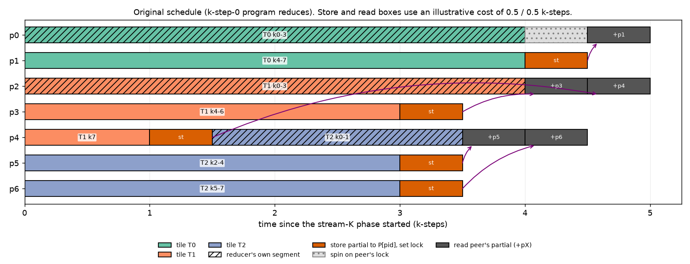

Three things to notice:

- Tile T0 has one peer, and T1 and T2 have two each.
- p4 plays both roles: it contributes the tail of T1, then owns T2.
- p0 has to spin briefly. Its peer p1 has as much work as p0 does, so p1's partial lands after p0 finishes its own k-steps.

## 5. How the owner knows which neighbours to read (question 9)

The owner never looks anything up. It uses two facts:

1. Ranges are contiguous and ordered by pid, so the k-steps after the owner's segment belong to `pid + 1`, then `pid + 2`, and so on.
2. Each program's length is a pure function of its pid: `L + (pid < R)`.

So the owner starts a running end at its own `end_iter`. It then keeps adding the next pid's length until the running end reaches the end of the tile:

```python
next_pid      = pid + 1
tile_iter_end = tile_iter + iters_per_tile
end           = end_iter                   # = this owner's last_iter
while end < tile_iter_end and next_pid < NUM_SMS:            # lines 290 / 352
    while load(locks + next_pid, volatile, ".cv") != 1: pass
    acc += load(P + next_pid * BLOCK_M * BLOCK_N, ".cv")
    end += streamk_iters_pcu + (next_pid < streamk_remainder_iters)   # length of next_pid
    next_pid += 1
```

After adding peer `pid + j`, `end` is exactly `last_iter` of that peer. The loop stops at the first peer whose range reaches or passes the tile's last k-step. That is why the number of neighbours varies from tile to tile, even though every program runs the same code.

**Toy walkthrough, owner p2 of T1** (`tile_iter_end = 16`):

| step | `next_pid` | `end < 16`? | action | `end` afterwards |
|---|---|---|---|---|
| start | 3 | 12 < 16, yes | wait `locks[3]`, add `P[3]` | 12 + 3 + (3 < 3) = 15 |
| 2 | 4 | 15 < 16, yes | wait `locks[4]`, add `P[4]` | 15 + 3 = 18 |
| 3 | 5 | 18 < 16, no | stop: 2 peers | |

**Real walkthrough, 4352x4352x8192.** Tile 256's owner p0 walks p1-p7, and the running end goes 17, 34, ..., 136, which passes 128 at p7: 7 peers. Tile 257's owner p7 starts at 136 and walks p8-p15 (8 peers), stopping at p15's end of 272, which passes 256.

The paper's Algorithm 5 (lines 31-36) writes the same loop with the last peer's index computed up front. The kernel's running sum avoids a division. For the Gluon port, a closed-form inverse of the partition gives the peer count directly, which would allow issuing all peer loads together instead of strictly one after another:

```python
def pid_of_iter(i):   # program whose range contains stream-K iteration i
    head = R * (L + 1)
    return i // (L + 1) if i < head else R + (i - head) // L
num_peers = pid_of_iter(tile_iter_end - 1) - pid
```

When `L = 0` only the first `R` programs have work and every iteration falls in the first branch, so the second branch (which divides by `L`) is never reached. `streamk_diagrams.py` checks this formula against the walk for every tile of every example. Under two-tile it is unnecessary: the peer, if any, is `pid + 1`.

The figures below show, for every stream-K tile, which program computes which k-steps. The owner is hatched, colour is the program's XCD, and the right-hand column gives the number of partials each owner reads.

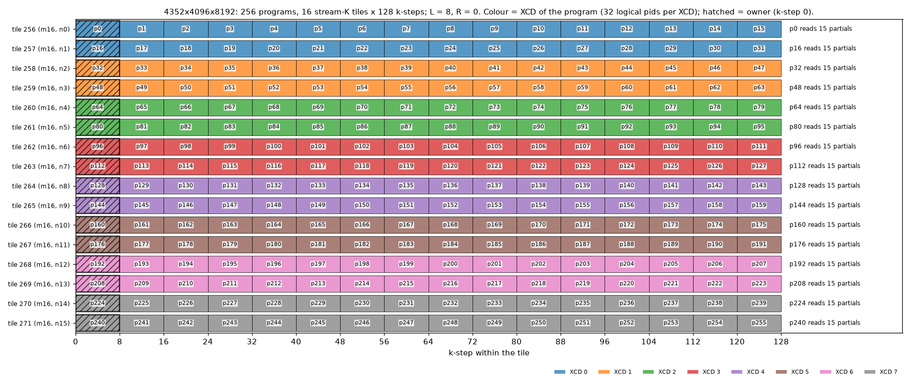

For 4352x4096x8192, `L = 8` divides 128, so every tile is split into exactly 16 chunks. The owners are p0, p16, p32, ..., and each reads 15 partials. Two tiles share each XCD. All 16 stream-K tiles are in tile row m16, because the last `GROUP_SIZE_M` group is one row tall.

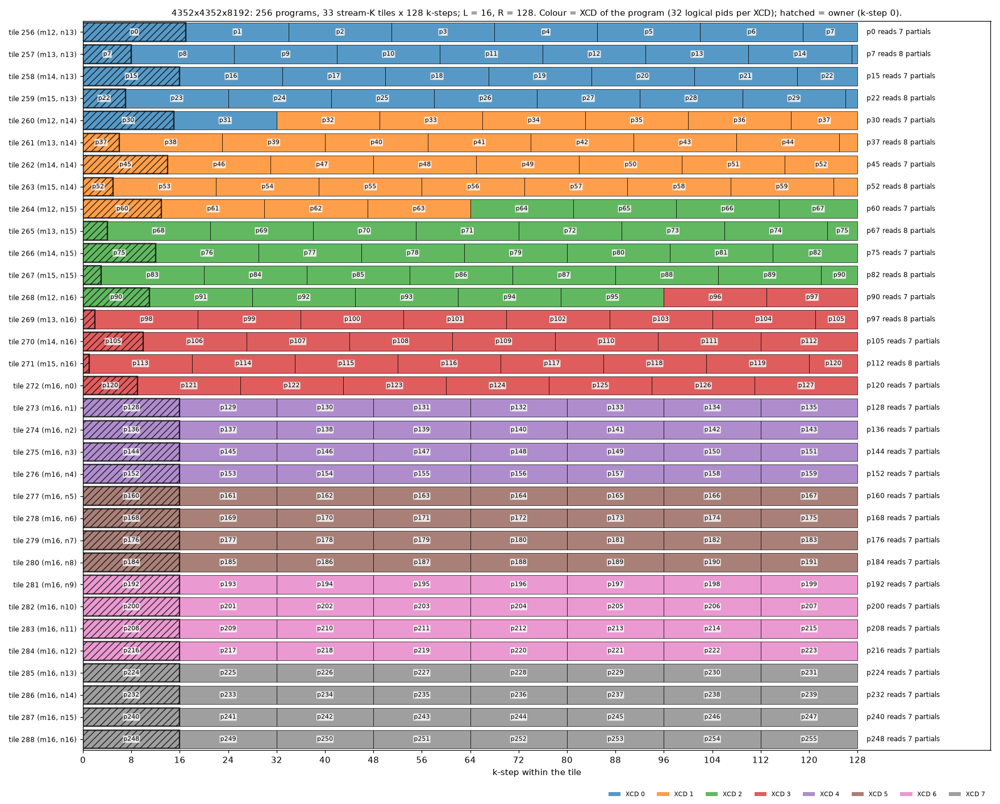

For 4352x4352x8192, `L = 16` or 17 does not divide 128. The seams drift from tile to tile, owners read 7 or 8 partials, and 16 programs cross a tile boundary. Some owner segments are only 1-3 k-steps long (tiles 267, 269 and 271). Some tiles straddle two XCDs (tiles 260, 264 and 268).

## 6. Why the k-step-0 program reduces (question 8)

This is the rule in the paper's Algorithm 5: "each output tile in C is written by the CTA that performed that tile's k = 0 MAC-loop iteration" (§4). The paper states the rule without much justification, but three properties follow from it. All three hold for any partition, not just this hybrid.

1. **Only a program's first segment can be a partial.** Every segment after the first starts where the previous one ended, which is a tile boundary, so it contains k-step 0 of its tile. Therefore each program publishes **at most one** partial. One `P` slot and one lock per program are enough.
2. **An owner segment that needs a fixup is always the program's last segment.** If an owner's segment stops before the end of its tile, it stopped because it reached `last_iter`. So the owner waits only after it has done all its own MAC work.
3. **Waits only point to higher pids, and nobody waits before publishing.** A contributor publishes at the end of its first segment, before it can ever wait on anyone. The wait graph is therefore acyclic, so there is no deadlock, provided all programs are resident at once. This is why stream-K needs a persistent grid of at most one wave (v14's `STREAMK_NUM_PROGRAMS` comment).

Together, (1) and (2) give the latency-hiding argument your intuition was reaching for. Partials are produced as early as possible (each is the first thing its program does), and they are consumed as late as possible (each owner consumes after everything else it does). The tail program, the one that finishes a tile, publishes after its short first segment and then moves on to own the next tile, so its partial is almost always ready.

**The caveat for this one-tile hybrid.** The paper's argument is strongest when each program has more than one tile of work (§4: "the tile-processing skew ensures that the accumulating CTA will not need its peer contributions until well after those collaborators have finished"). Here each program has less than one tile of work, and the middle contributors' only segment is their whole range. They publish at about time `L`, which is when the owner finishes its own segment. The paper calls this out for exactly this schedule (§5.2): "this strategy has little ability to hide the synchronization latency ... when three or more CTAs cover the same tile ... the basic version of our scheme for aggregating partials is serialized within a single CTA". For 4352x4096x8192:

| per owner | bytes |
|---|---|
| own MAC-loop operands: 8 k-steps x (256x64 + 64x256) x 2 B | 512 KiB |
| fixup reads: 15 partials x 256x256 x 4 B | 3.75 MiB |
| whole stream-K phase: 240 partials written and read | 60 MiB each way |

Each owner reads 7.5x more bytes in its serial fixup than it loaded for its own MAC work. The other 15 programs of the tile have already exited. This, rather than the wait, is the main cost to attack in the Gluon port; section 9 compares the options.

## 7. Checking the nine-point description

| # | claim | verdict |
|---|---|---|
| 1 | The kernel starts with a persistent loop over the tiles that are not stream-K tiles. | **Correct.** It runs `total_tiles - STREAMK_TILES` tiles with stride `NUM_SMS`. Because the host picks `STREAMK_TILES = total_tiles % NUM_SMS`, that is a whole number of waves, and the stream-K tiles are the last tile ids. |
| 2 | Stream-K takes the total number of k-steps and divides by the number of SMs. | **Correct.** `L = STREAMK_TILES * iters_per_tile // NUM_SMS`, where `NUM_SMS` is the grid size, which need not equal the CU count. Every program joins, including those that had no tile of their own in the last wave. |
| 3 | Each program takes an even share, +-1. | **Almost.** It is +0 or +1, never -1: the first `R = total % NUM_SMS` pids get `L + 1` and the rest get `L`. The `min(pid, R)` term in `start_iter` accounts for that. |
| 4 | Each program runs from its first k-step to the end of the current tile. | **Correct.** Then the next segment starts at the next tile boundary and runs to the end of that tile or of the range. With the host's one-tile choice there are at most two segments; with two-tile, up to three. |
| 5 | If the start k-step is k-step 0 of a tile, wait on an atomic, then do the fixup, reading all other programs' workspace values plus bias. | **Correct in substance.** The owner first computes its own k-steps. It then spins on each peer's flag *in pid order* with a volatile `.cv` load: not an atomic (the `atomic_xchg` variant is commented out). Bias is added once, after all partials. |
| 6 | If the start k-step is the end, write our accumulator to our workspace slot. | **Needs rewording.** The test is "the segment does not start at k-step 0 of its tile" (`start_iter != tile_iter`). That covers tail chunks and middle chunks. In 4352x4096x8192, 14 of the 16 programs per tile hold middle chunks. The program stores to `P[pid]`, then sets `locks[pid] = 1`. |
| 7 | Keep going until the last k-step of our allocation. | **Correct** (`while start_iter < last_iter`). |
| 8 | The k-step-0 program reduces because it will not have to wait on the tail steps, since those are processed at the start of the following program. | **Right idea, and it is more general:** see section 6. It also gives one workspace slot per program and deadlock freedom. In this one-tile regime the middle contributors do not finish early, so waits are not fully hidden. |
| 9 | How does the owner know which neighbours to load from? | It walks `pid + 1, pid + 2, ...`, re-deriving each one's length from the partition formula, until the running end reaches the end of the tile (section 5). |

## 8. The reversed variant

**Definition.**

- The program that holds a tile's **last** k-step reduces it.
- Each program processes its segments **last to first**. A boundary-crossing program first does the head of its second tile (k-step 0 upward) and publishes that as its partial. It then does the tail of its first tile, and reduces.
- The reducer walks **downward**:

```python
prev_pid, start = pid - 1, start_iter_of_this_segment
while start > tile_iter:
    wait locks[prev_pid]; acc += P[prev_pid]
    start -= L + (prev_pid < R)
    prev_pid -= 1
```

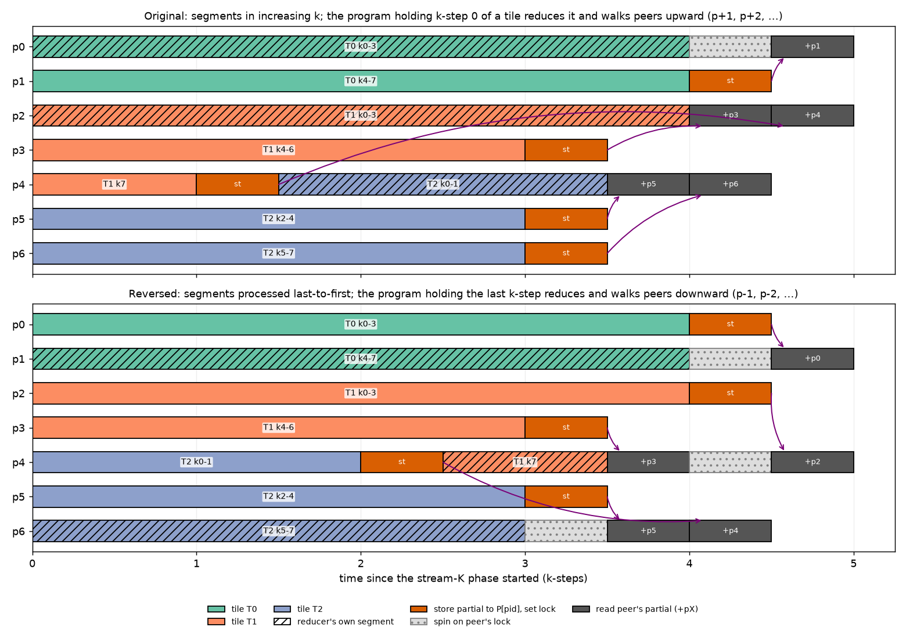

**What is preserved.** Section 6's argument mirrors exactly, and `streamk_diagrams.py` checks it:

- Only a program's last segment in k order can end before its tile's end, so each program still has at most one partial and one `P` slot.
- That partial is processed first, and the reduce segment is processed last.
- Waits now point only to lower pids, so the wait graph is still acyclic.

**What changes.**

1. **Who reduces.** In 4352x4096x8192 the reducers become p15, p31, ..., instead of p0, p16, .... Nothing else changes for that shape: `L` divides `iters_per_tile`, no program crosses a boundary, and every program's single chunk is processed in the same order in both variants.
2. **k-step alignment of boundary-crossing programs.** In the original order, a crossing program starts mid-tile at an offset that differs for every such program. In the reversed order, all crossing programs start at k-step 0 of some tile at t = 0, and they all end at the last k-step at t of about `L`. Programs that lie wholly inside one tile start at the same drifting offset in both variants. This is the paper's "tile-processing skew" (§5.2) that you want to reduce.
3. **The first stream-K load is k-step 0 for crossing programs.** This fits v14's persistent epilogue, which already prefetches the next tile's k-steps 0-1. Non-crossing programs still start at an arbitrary k-step, so the port needs an offset prefetch either way (section 12).
4. **Waiting on lower pids is safer if stream-K workgroups are ever launched after the persistent ones** (rather than inside them): lower pids are dispatched first, so a waiter only ever waits on a workgroup that has already been launched.

**What the lockstep model says about reuse.** The script counts how many A and B k-slice loads are also made by another program *on the same XCD* within `w` k-steps of the same time. This is a crude proxy for L2 hits. It assumes lockstep progress, an unbounded L2, the TensorAtlas tile order, and v14's pid-to-XCD mapping.

| shape | STREAMK_TILES | L | R | peers per owner | crossing programs | A / B coincident, original | A / B coincident, reversed |
|---|---|---|---|---|---|---|---|
| 4352x4096x8192 | 16 | 8 | 0 | 15 | 0 | w=0: 100% / 0%; w=4: 100% / 0% | identical |
| 4352x4352x8192 | 33 | 16 | 128 | 7-8 | 16 | w=0: 48% / 0%; w=4: 53% / 37% | w=0: 49% / 5%; w=4: 53% / 38% |

In the one-tile regime, only 16 of the 256 programs cross a boundary, so the reversal moves the proxy very little. For 4352x4096x8192 the A reuse is already perfect: chunk j of the two tiles on each XCD runs at the same time and reads the same row-m16 A slice. B is never shared, because every stream-K tile has a distinct n. The larger levers in this regime look like these:

- the fixup cost (sections 6 and 9);
- which stream-K tiles share an XCD, which the tile order and the pid mapping decide;
- whether chunk boundaries line up across tiles, which tile-aligned splits give for free (section 9).

The reversal should matter more in the two-tile hybrid, where every program crosses at least one boundary.

The lockstep proxy understates the problem. In v15 the measured L2 hit rate on long ranges falls far below data-parallel's: from 76% to 10% on 3840x4096x8192 (one-tile, 120-k-step ranges), and from 65% to 11% on 4352x4352x8192 under two-tile. Where chunk boundaries line up across tiles (4352x4096x8192), one-tile keeps 67%. See section 14.

**Hypotheses to measure** (on the Gluon port, 4352x4352x8192, plus a shape with at least two full waves under the two-tile hybrid):

1. Stream-K tail time, original vs reversed. From the model, expect near-equality in the one-tile regime.
2. L2 hit rate and read traffic to memory during the stream-K phase, from rocprof counters.
3. Owner time split into spinning and reading, measured with `s_memtime` around the fixup, to confirm that the serial reads dominate.
4. The same three measurements under two-tile stream-K + data-parallel, where the reversal changes the start offset of every program.

## 9. Choosing the split

**What we are trying to achieve.** The tail takes as long as its slowest tile, and a tile finishes when two things are done:

1. **Compute:** every program working on the tile has done its chunk of k-steps.
2. **Collect:** somebody has added up all the partials and written C.

Splitting a tile more ways shrinks the compute but lengthens the collection, because today one owner collects every other partial, one after another. The three options change a different part of that picture:

| option | what it changes, in plain terms | effect |
|---|---|---|
| (a) tile-aligned | **Where the cuts go.** Only cut inside tiles, never across a tile boundary, so each program works on exactly one tile. | Housekeeping: no program straddles two tiles, no tiny 1-3 k-step pieces, one fewer partial where a tile had a straddler. It does not change how many ways a tile is cut. |
| (b) fewer programs | **How many ways each tile is cut.** For example 8 pieces instead of 16: each piece is bigger, but the owner has 7 partials to collect instead of 15. The unused CUs go idle. | Trades compute for less collection. There is a sweet spot: too few pieces means long compute, too many means a long collection. |
| (c) reduce-scatter | **Who does the collecting.** Instead of one owner adding 15 whole partials, all 16 programs each add up 1/16 of the tile from everybody's partials, at the same time. | The collection takes about one partial's worth of time instead of fifteen. |

In 4352x4096x8192 terms, with a tile of 128 k-steps and storing or reading one partial costing about 2 k-steps:

| scheme | compute | store partial | collect | tail |
|---|---|---|---|---|
| no stream-K (last wave) | 128 | - | - | 128 |
| today: 16 pieces, owner collects | 8 | 2 | 15 x 2 = 30 | 40 |
| (b) 8 pieces, owner collects | 16 | 2 | 7 x 2 = 14 | 32 |
| (c) 16 pieces, everyone collects a slice | 8 | 2 | about 2 | about 12 |

(a) makes no difference on this shape, because its cuts already line up with tiles. Today the collection costs about four times the compute: (b) rebalances the two, and (c) attacks the collection directly.

**Measured** ([experiments/streamk_costs](../../../../../experiments/streamk_costs/README.md)): the read estimate holds, but storing is more expensive when everyone publishes at once.

- An owner reads a partial in about 2 k-steps.
- The 15 contributors of every tile publish in the same few microseconds, 60 MiB in total, so their store costs 4-11 k-steps rather than 2.
- Groups of 16 on a one-wave GEMM (15 contributors publish, the owner reads 15 partials) measured 36 k-steps of store plus collect. So today's tail is about 8 + 36 = 44.
- Reduce-scatter pays the same store burst, so its tail is nearer 8 + 6 + 2 = 16 than 12.

The same comparison on a small problem (11 programs, 2 tiles x 16 k-steps, storing or reading a partial costs 1 k-step), with where the cuts go on the left and the resulting timeline on the right:

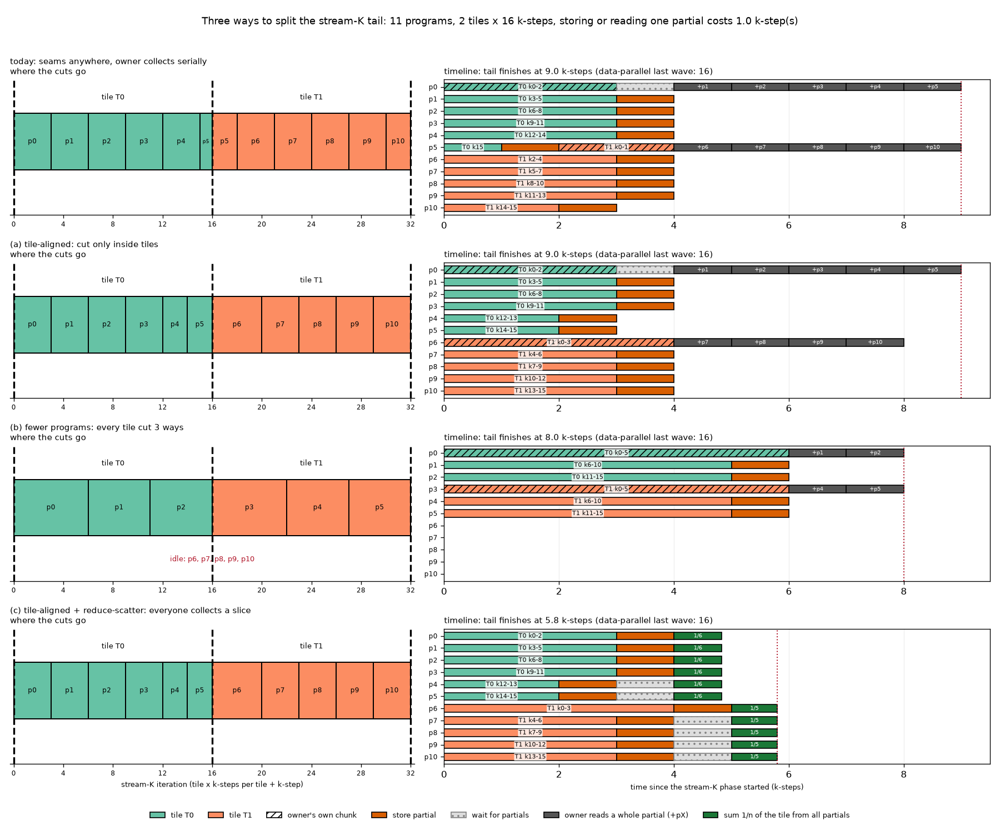

### The options in detail

Let `S = STREAMK_TILES`, `P = NUM_SMS`, `ipt = iters_per_tile` and let `c` be the cost of storing or reading one partial, in k-steps.

**(a) Tile-aligned.** Give each tile `n_t = P // S` programs, the first `P % S` tiles one more, and split each tile's k-steps evenly among its own programs (chunk lengths differ by at most one). On 4352x4352x8192, `256 = 7 x 33 + 25`, so 25 tiles get 8 programs (16-step chunks, 7 peers) and 8 tiles get 7 programs (18-19-step chunks, 6 peers). The longest chunk grows from 17 to 19, but no program crosses a tile boundary and the worst tile has one fewer peer. The tail goes from about 35 to 33 at `c = 2`: a small gain, because the serial collection still dominates. Its real value is removing tile switches (below) and making (c) simple.

**(b) Fewer programs.** This is v14's `STREAMK_NUM_PROGRAMS` knob and the paper's grid-size model (§5.1). With a serial fixup, a tile split `s` ways costs about `ipt/s + c + (s - 1) c`: compute, store, then `s - 1` serial reads. The best `s` is about `sqrt(ipt / c)`: 11 at `c = 1`, 8 at `c = 2`, 6 at `c = 4`, all well below 16. The constraint is `S x s <= P`: on 4352x4352x8192 that allows at most `s = 7` (231 programs).

**(c) Reduce-scatter.** Every program in the tile stores its partial. Then each of the `s` programs sums `1/s` of the tile from all the partials and writes that slice of C. The cost becomes about `ipt/s + c + (s - 1)/s c`. Total bytes are about the same (the owner's partial is now stored too); what changes is that the reads happen in parallel. In the one-tile regime all contributors finish at about the same time anyway, so the extra all-to-all wait costs little. Each program keeps its own slice in registers; the simplest version instead reads its own slice back from `P` too, which costs `c` rather than `(s - 1)/s c`.

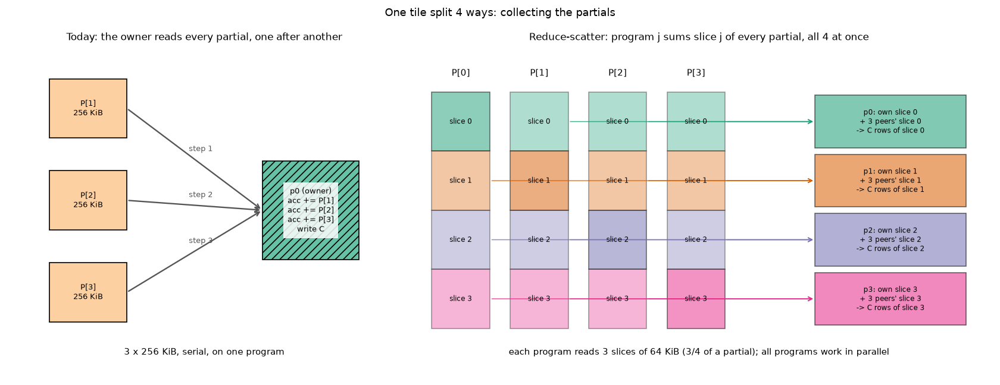

**Numbers.** The script's policies table (for (b), the three values in each cell go with the best `s` at `c` = 1, 2 and 4), as the critical path from the start of the last full wave, so that one-tile (a full wave, then the stream-K tail) and two-tile (both inside stream-K) compare directly. In the `c` columns the data-parallel baseline is two waves, `2 x 128 = 256`. That overstates it, because a nearly empty last wave runs faster than a full one (section 2); the "measured" column uses v13's measured last wave instead, 128 + 80 = 208 on 4352x4096x8192 and 128 + 83.5 = 211.5 on 4352x4352x8192. The model counts the partial stores, waits and reads but not the tile-switch cost (below), so it slightly flatters today's policy and two-tile, where every program crosses a boundary.

The "measured" column uses the costs from the experiment, with separate store costs by policy:
- In the one-tile policies every contributor publishes at the same moment, so they pay the burst store of 6.
- Two-tile publishes are spread over the range, so they pay 1.5.
- Every policy reads at 2.

With those costs two-tile moves slightly ahead of tile-aligned reduce-scatter.

4352x4096x8192 (16 leftover tiles):

| policy | programs | longest chunk | peers per tile | crossing programs | partials read | c = 1 | c = 2 | c = 4 | measured |
|---|---|---|---|---|---|---|---|---|---|
| data-parallel last wave | 16 | 128 | 0 | 0 | 0 | 256 | 256 | 256 | 208 |
| one-tile stream-K (today) | 256 | 8 | 15 | 0 | 240 | 152 | 168 | 200 | 172 |
| two-tile stream-K | 256 | 136 | 0-1 | 256 | 240 | 138 | 140 | 144 | 139.5 |
| (a) tile-aligned | 256 | 8 | 15 | 0 | 240 | 152 | 168 | 200 | 172 |
| (b) fewer programs | 160 / 128 / 80 | 13 / 16 / 26 | 9 / 7 / 4 | 0 | 144 / 112 / 64 | 151 (s = 10) | 160 (s = 8) | 174 (s = 5) | 164 (s = 8) |
| (c) tile-aligned + reduce-scatter | 256 | 8 | 15 | 0 | 240 (as slices) | 138 | 140 | 144 | 144 (v20: 155) |

4352x4352x8192 (33 leftover tiles):

| policy | programs | longest chunk | peers per tile | crossing programs | partials read | c = 1 | c = 2 | c = 4 | measured |
|---|---|---|---|---|---|---|---|---|---|
| data-parallel last wave | 33 | 128 | 0 | 0 | 0 | 256 | 256 | 256 | 211.5 |
| one-tile stream-K (today) | 256 | 17 | 7-8 | 16 | 239 | 154 | 163 | 181 | 167 |
| two-tile stream-K | 256 | 145 | 0-1 | 256 | 239 | 147 | 149 | 153 | 148.5 |
| (a) tile-aligned | 256 | 19 | 6-7 | 0 | 223 | 154 | 161 | 176 | 165 |
| (b) fewer programs | 231 / 231 / 165 | 19 / 19 / 26 | 6 / 6 / 4 | 0 | 198 / 198 / 132 | 154 (s = 7) | 161 (s = 7) | 174 (s = 5) | 165 (s = 7) |
| (c) tile-aligned + reduce-scatter | 256 | 19 | 6-7 | 0 | 223 (as slices) | 149 | 151 | 154 | 155 (v20: 172) |

Subtract 128 for the tail alone. On 4352x4096x8192 at `c = 2` that is 40 today, 32 for (b) and about 12 for (c); with the measured costs it is 44, 36 and 16. The data-parallel tail they compete with is 80 measured k-steps, not 128.

The "v20" values are v20's measured tails (do_bench, minus v13's one-wave time). They are about 11 and 17 k-steps above the model on the two shapes: the slice read is a burst of about 8 k-steps rather than 2, and the tail's MAC phase is HBM-bound (section 14, finding 9).

These rows assume lane-contiguous partials and no L2 penalty. v15 measured two effects the model leaves out (section 14):
- With row-major partials, one-tile's 4352x4096x8192 tail is 110 k-steps, so it loses to data-parallel.
- Long ranges lose their L2 reuse. That matters most for two-tile, where every program runs more than a tile's worth of k-steps from its own k offset.

The single-leftover-tile case (257 tiles) is the extreme. Today's one-tile policy takes 385 at `c = 2` (389 measured), worse than the data-parallel 256. Two-tile and reduce-scatter both take about 133 (132.5 and 137 measured).

**About `c`.** Measured in [experiments/streamk_costs](../../../../../experiments/streamk_costs/README.md). There, v14's pipeline stores and reads real partials on a one-wave 4096x4096x8192 GEMM, and each cost is a slope over how many partials are moved. One k-step there is 1.27 us.

| cost, in k-steps | lane-contiguous partials | row-major partials |
|---|---|---|
| store one partial, 16 programs storing | 1.5 | 4.1 |
| store the first partial, 240-256 programs storing at once | 4-11 | 6-12 |
| owner reads one partial in the fixup | 1.8 | 4.9 |
| owner reads one partial from a workspace filled by the host | 2.8 | 5.7 |

- **Layout.**
  - The partial is written from the accumulator's own MFMA layout. Addressed row-major, every 16-byte store instruction then covers 16 half cache lines.
  - The lane-contiguous layout, `[16 register vectors][4 warps][64 lanes][4 fp32]`, is a bit permutation of the accumulator's layout, so each wave writes 1 KiB contiguously.
  - The port should use that layout.
- **Caching.** `.wt` / `.cv` and default caching cost the same.
- **Flag polling** costs nothing measurable, provided the owner polls with relaxed atomics and acquires once. An acquire in the spin loop invalidates the XCD's L2 under the neighbours' K loops, and it doubled the fixup intercept.

### Rounding `L` to a divisor is split-K of the tail

If every stream-K program gets exactly `L'` k-steps and `L'` divides `iters_per_tile`, no program crosses a tile boundary and each tail tile is split into exactly `iters_per_tile / L'` chunks. That is the paper's fixed-split decomposition (Algorithm 4) applied to the leftover tiles only. The paper notes stream-K reduces to fixed-split whenever the grid is a whole multiple of the tile count (§4); here that holds for the tail region only. It differs from classic split-K in three ways:

- **Only the tail pays for the reduction.** Classic split-K splits every tile. Here the full waves stay data-parallel.
- **The reduction mechanism is unchanged**: the in-kernel workspace and flags, with no separate reduction kernel and no atomics on C.
- **The grid size becomes an output.** Fixing `L'` fixes how many programs are needed (`S x iters_per_tile / L'`), which usually is not `NUM_SMS`.

The divisor condition is stricter than needed. With 128 k-steps per tile the divisors are powers of two. That suits 4352x4096x8192 (16 tiles x 16 chunks = 256 programs, `L = 8`: today's kernel is already a 16-way split-K of the tail), but not 4352x4352x8192: 4-way uses only 132 programs and 8-way would need 264. What we want is tile-aligned seams with a per-tile split count, which is option (a).

### Why tile-aligned seams are desirable

1. **Each program touches one tile.** There is no tile switch in the middle of a range (the cost is below), and no tiny 1-3 k-step segments, where the prologue and epilogue dominate.
2. **Fewer partials.** Each boundary-crossing program adds one extra partial: 223 instead of 239 on 4352x4352x8192.
3. **Independent tiles.** A slow program delays only one tile's reduction. Today a crossing program, like p4 in the toy example, links two tiles' fixups.
4. **Group-wide schemes become simple.** Reduce-scatter (option c) or a last-arriver reduction only involve the programs of one tile, and each program needs one `P` slot.
5. **Chunk j of every tile runs at the same time.** That is where the 100% same-XCD A-sharing on 4352x4096x8192 comes from (section 8).
6. **Trivial index maths.** Mapping a pid to its (tile, chunk) is a division, with no walk.

The cost is coarser balance when `NUM_SMS % STREAMK_TILES != 0`: 19-step chunks against 17 on 4352x4352x8192.

### The cost of a tile switch

v14's persistent loop already switches tiles cheaply. The epilogue of tile *i* prefetches tile *i+1*'s first two k-steps, converts the accumulator to bf16, and interleaves the four quadrant C stores with the last MFMAs, so nothing stalls. A stream-K switch mid-range, such as p7 on 4352x4352x8192 finishing the tail of tile 256 and then starting the head of tile 257, is harder:

| step | persistent tile change | stream-K switch |
|---|---|---|
| Write the finished segment | 128 KiB of bf16 C, fire-and-forget | 256 KiB of fp32 partial: twice the bytes |
| Tell someone it's done | nothing | raise the flag, which is only legal once the partial stores have **completed** (section 11) |
| Refill the pipeline | next tile's k-steps 0-1 were prefetched during the epilogue | same trick possible (the next segment's address depends only on pid), but see the drain below |
| Restart the accumulator | inline-zero MFMAs in the peeled pair, free | same |

**The drain.** CDNA has one per-wave counter (`vmcnt`) for all outstanding vector memory operations: loads, stores, and the async copies into LDS. The release before the flag waits on it, and a GPU-scope release lowers to a full `vmcnt(0)` wait. That waits for everything in flight: the partial stores, and also the next segment's prefetch just issued. So the overlap v14 relies on disappears at a switch, and the pipeline restarts. The workaround is to issue the stores first, then the prefetch, and wait on a partial count (`vmcnt(N)`, where N covers the later prefetch), which waits only for the stores but means hand-rolling the release (section 11). Only the contributor path pays this; an owner's segment ends with the fixup and a normal C store.

**Measured size** ([experiments/streamk_costs](../../../../../experiments/streamk_costs/README.md)). Each tile runs as 1-8 segments, and the slope over the number of switches gives the cost of one. One k-step is 1.27 us.

| switch, 16 programs switching | k-steps per switch |
|---|---|
| segment boundary with no store, all programs: the pipeline restart alone, even with the next segment's k-steps 0-1 prefetched | 1.2 |
| bf16 C store (v14's persistent tile change, when only 16 programs do it) | 2.8 |
| fp32 partial, lane-contiguous, drain + release flag | 3.4 |
| same, relaxed flag without the drain | 2.9 |
| fp32 partial, row-major, drain + release flag | 6.0 |

- The drain costs only about 0.5 k-steps.
- When all 256 programs switch at the same moment, each switch writes 64 MiB and costs 13-16 k-steps. In the two-tile regime the switches are spread out, so that is an upper bound.

So a switch costs about **3.4 k-steps** on the switching program, and it lands on the critical path: the switching program's second segment is the owner segment of the next tile, and that tile's reduction cannot start until the switch has finished. In the one-tile regime on 4352x4352x8192 only 16 programs pay it, adding about 10% to the tiles they own. In the two-tile regime every program pays it once or twice, about 2-5% of a 144-step range; the paper accepts that. The lockstep model counts the partial store but not the refill or the drain, so it slightly flatters schedules with crossings.

**Short segments.** Each segment carries a roughly fixed overhead, whatever its length: one refill, a pipeline with no steady state, and one ending (a partial store and flag, or a fixup and C store):

| segment length (k-steps) | useful work | fixed overhead (measured switch) | efficiency |
|---|---|---|---|
| 128 (full tile) | 128 | about 3.4 | about 97% |
| 16 | 16 | about 3.4 | about 82% |
| 3 | 3 | about 3.4 | about 47% |
| 1 (tile 271's owner on 4352x4352x8192) | 1 | about 3.4 | about 23% |

v14's tile body also assumes at least 4 k-steps, so short segments need their own code path (section 12).

## 10. Caches

**The partial exchange is designed to skip L2.** Contributors write `P` with `.wt` (write-through), so the data reaches the memory side, and the owner reads with `.cv`, which forces the load past L2. This is needed for correctness, not only as an optimisation:

- **The flag spin must bypass L2.** If the spin load could hit L2, the first stale "0" could stay cached in the reader's L2, and the loop would never exit.
- **L2 is per-XCD and not coherent across XCDs**, and there is no "same XCD" memory scope to rely on, even though v14's pid mapping puts most of a tile's peers on one XCD. A peer's partial written into its own XCD's L2 is invisible to an owner on another XCD.
- **The alternative is a GPU-scope acquire after the flag**, which on multi-XCD parts invalidates the reader's L2. That is heavier, and it throws away lines other programs on that XCD are using. Per-access bypass (`.cv` on the reads, `.wt` on the writer's stores) is the cheapest correct option.
- Not polluting L2 with data read exactly once is a welcome side effect, not the reason. Whether `.cv` loads also allocate lines in L2 depends on the cache policy, and I have not checked it on gfx950.

Within one launch, a plain load of `P` would probably return the right data, because nothing on the reader's XCD has cached that slot. That is luck, not a guarantee.

**Last-level cache.** The partials should stay resident. The workspace is 64 MiB (256 x 256 KiB) and MI355X has 256 MB of Infinity Cache; it is memory-side, so whether a line hits depends on its address, not on which XCD asked for it. The pressure is real, though: 4352x4352x8192 bf16 is about 71 MB of A, 71 MB of B and 38 MB of C, and the redundant zero-init of `P` (section 13) pushes another 64 MiB of writes through just before the stream-K phase. That can evict A/B lines the stream-K tiles would otherwise reuse from the persistent phase.

**L2 during the fixup is mostly moot.** In the one-tile regime contributors exit as soon as they publish, so when an owner reduces, its XCD's L2 has almost no other live users (about two owners per XCD). The owner accumulates partials straight into registers, so they never need to live in L2. Pollution would only matter if the fixup overlapped other useful work, as in two-tile or reduce-scatter.

**Writing C.** The final tile is 128 KiB of bf16, written once and never read again in the kernel. v14 writes C with `gl.amd.cdna3.buffer_store` and the default cache policy, so C lines land in L2 and later drain to the last-level cache and HBM. That is harmless at the end of the kernel; in the persistent phase, a streaming store for C could keep more A/B in L2, which is worth measuring.

## 11. Memory ordering: release and acquire

**The problem.** A contributor writes its 256 KiB partial to `P[pid]` and then sets `locks[pid] = 1`. The owner, on a different CU and often a different XCD, does the reverse: it sees `locks[pid] == 1`, then reads `P[pid]`. Nothing in the hardware promises that the owner sees those two writes in the order they were issued. If the flag becomes visible first, the owner reads a half-written partial and gets wrong numbers. Nothing crashes; the result is just wrong.

### Why issue order is not enough

A wave's memory instructions do leave the CU in program order: they go through the address unit and L1 in order. After L1, each store is routed **by its address** into a large parallel memory system:

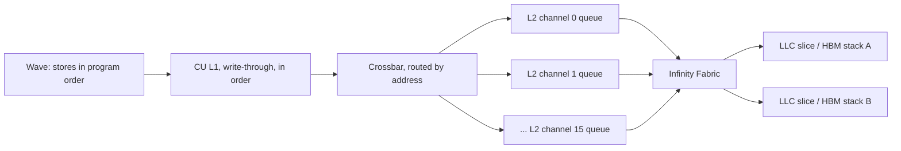

- L2 is split into many channels (16 per XCD, I believe), each owning an address-interleaved slice. Behind them, the fabric, last-level cache slices and HBM stacks are also split by address, and every path queues on its own.
- The 256 KiB partial is about 2048 cache lines of 128 B, spread over all channels. The flag is one line in one channel. If the flag's channel happens to be quiet while a few `P` lines are stuck behind other traffic, the flag reaches the memory side first.
- There is no explicit "reorder" step. Ordering is only preserved **per address** (per cache line), not across addresses. GPU memory models, including the HSA/LLVM AMDGPU one, are weakly ordered precisely so the hardware can run those channels in parallel.
- A shared cache line would not save you: the flag and `P` are never in the same line (`locks` is a separate allocation, and `P` covers 2048 lines), and write-combining never spans lines.

A store only counts as done in `vmcnt` once the memory system **acknowledges** it. So `s_waitcnt vmcnt(0)` before the flag turns "all `P` stores issued" into "all `P` stores acknowledged". For another XCD to see the data, the acknowledgement must come from beyond this XCD's L2, which is why a release also writes back L2, or why the reference kernel uses `.wt` stores.

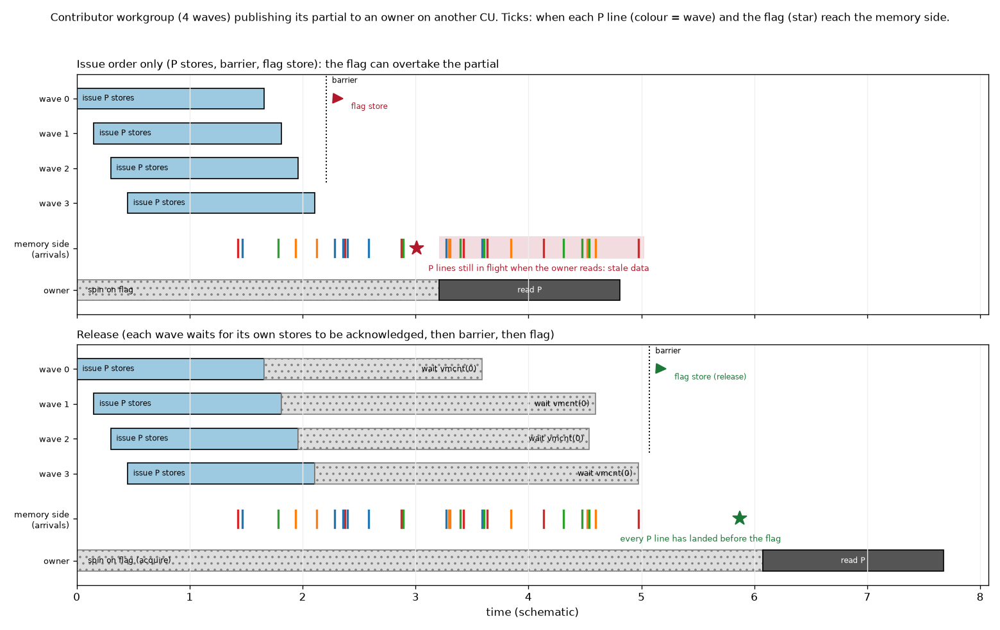

### Release, acquire and scope

- **Release** (on the flag write): every memory write I made before this one must be visible before this write is.
- **Acquire** (on the flag read): nothing I read after this may return data older than what the writer published before its release.

A release on the writer paired with an acquire on the reader gives exactly the guarantee we need: if the owner sees the flag, it sees the whole partial. Scope says who must be able to see the writes in the right order:

| scope (`scope=` in Triton/Gluon) | who must observe the ordering | typical use |
|---|---|---|
| `"cta"` (workgroup) | waves of the same workgroup, on one CU | LDS / intra-workgroup handshakes |
| `"gpu"` (LLVM's "agent") | every workgroup on the device, including other XCDs | **our case**: contributor and owner are different workgroups |
| `"sys"` | the host CPU and other GPUs as well | host-visible flags |

**What a GPU-scope release and acquire cost on CDNA3/4.** This is my understanding of the LLVM AMDGPU memory model for gfx942; check the AMDGPUUsage docs for the exact gfx950 sequences.

- A release waits for this wave's earlier memory operations to complete (`s_waitcnt vmcnt(0)`). `vmcnt` is per wave and covers global loads, global stores *and* the `buffer_load_to_shared` async copies that feed v14's pipeline. It cannot pick out just the stores to `P`, so it also drains any prefetch in flight (section 9).
- A release also writes back dirty L2 lines (`buffer_wbl2`), so other XCDs can see them on the memory side.
- An acquire waits for the flag load and then invalidates the reader's L1, and L2 lines another XCD could have written (`buffer_inv`), so later reads cannot hit stale copies. Every other program on that XCD loses those L2 lines too.

Triton's atomics default to `sem="acq_rel", scope="gpu"` (`_str_to_sem` / `_str_to_scope` in `triton/language/semantic.py`, lines 970-996 in the tutorial checkout), so a plain `gl.atomic_xchg(locks + pid, 1)` is already a full GPU-scope acquire-release, with both costs. Gluon also has `gl.amd.cdna4.buffer_atomic_xchg(..., sem=, scope=)`.

### Where it applies for us

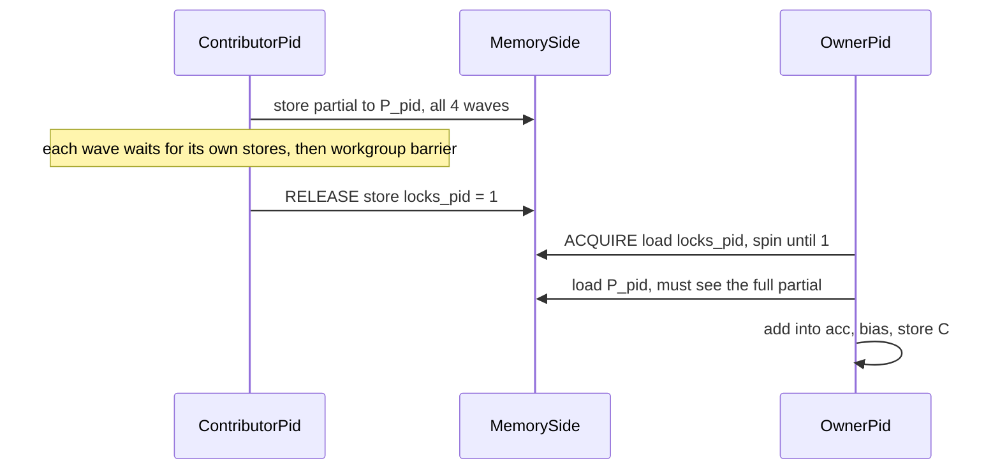

1. **Contributor, partial then flag: release.** All four waves write part of `P[pid]`. Because `vmcnt` is per wave, **each wave** must wait for its own stores, then a workgroup barrier, then one flag store. A barrier alone only proves every wave has *issued* its stores.
2. **Owner, spin then read: acquire.** It must be on the flag load; otherwise the reads of `P[peer]` could hit a stale line in the owner's own L1 or L2.
3. **Kernel boundaries: already handled.** The runtime puts a release at kernel end and an acquire at kernel start, which is why an ordinary GEMM never thinks about any of this. Stream-K is unusual because workgroups talk to each other *within* one launch. The lock reset (section 13) can be a relaxed store if the owner resets the flag after reading, because the kernel boundary orders it against the next launch.

**How the release cost differs by program.** A contributor whose chunk is its whole range pays nothing for the wait: it exits straight afterwards. A program that crosses a tile boundary pays it in the middle of its range, and the stall pushes back the owner segment it runs next:

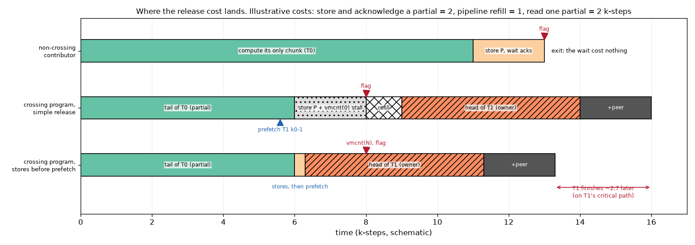

**The reference kernel** does `.wt` stores to `P`, then `tl.debug_barrier()`, then a `.wt` store of the flag, and the reader uses volatile `.cv` loads. That approximates release/acquire with per-access cache hints: `.wt` stands in for the L2 writeback and `.cv` for the L2 invalidate. It is missing a guaranteed "wait until my stores completed" before the flag: whether `debug_barrier`'s workgroup-scope fence includes a `vmcnt(0)` is an implementation detail, not promised at GPU scope.

**Options for the Gluon port.**

- **Simple and correct:** flag store with `gl.atomic_xchg(..., sem="release", scope="gpu")`, spin with an acquire atomic (for example `gl.atomic_add(ptr, 0, sem="acquire", scope="gpu")`). This pays the full drain, the L2 writeback and the invalidate. In the two-tile scheme that happens about once per program, which is probably fine.
- **Targeted, cheaper, hand-rolled:** `.wt` stores of `P` issued *before* the next segment's prefetch; a per-wave partial wait (`vmcnt(N)`, N covering only the later prefetch); a barrier; a relaxed GPU-scope flag store. On the reader, a relaxed spin and `.cv` loads of `P`. This keeps the prefetch in flight and avoids the L2 writeback and invalidate, but it leans on hardware behaviour the memory model does not formally promise (the reference kernel leans on the same things). It needs a stress test: many launches with rotating inputs, checked against a reference result.

Start with the simple version, measure the switch cost, and only move to the targeted one if the drain shows up.

## 12. Gluon port: the pipeline

**The stream-K first segment can be prefetched (its address depends only on pid), but not with v14's k-step-0/1 pair pipeline.** Each program's first stream-K tile is `start_iter // ipt` and its k-offset is `start_iter % ipt`, so the last persistent tile's epilogue can prefetch those two k-steps instead of the next tile's k-steps 0 and 1; that is just a different scalar base pointer. What blocks it is the pipeline's shape: `persistent_tile` assumes k-steps 0 and 1 are in flight, runs the loop in pairs (even k-steps in LDS buffer 0, odd in buffer 1), ends with a two-step epilogue, and relies on `K % (2*BLOCK_K) == 0` and `iterMax > 3`. Stream-K segments break all of that:

- they start at any k-step;
- they can be odd-length (`L = 17` on 4352x4352x8192);
- they can be 1-3 k-steps long (tiles 267, 269 and 271 on 4352x4352x8192), and two-tile tails can be a single k-step.

The two-k-step unroll is needed for main-loop performance, so the question is how to handle the leftover half pair.

**Recommended: partition stream-K work in units of 2 k-steps.** Hand out pairs instead of single k-steps. Tiles are an even number of k-steps (v14 already requires `K % (2*BLOCK_K) == 0`), so tile boundaries fall on pair boundaries, every segment is even-length and starts on an even k-step, and v14's "buffer 0 is next" invariant holds unchanged. No masking is needed.

**This does not give up any CUs.** Every program still takes part; only the balance granularity doubles. On 4352x4352x8192 the 4224 k-steps are 2112 pairs over 256 programs, so p0-p63 get 9 pairs (18 k-steps) and p64-p255 get 8 pairs (16), against 17 and 16 today:

| shape | policy | longest range, 1-k-step units | longest range, 2-k-step units |
|---|---|---|---|
| 4352x4096x8192 | one-tile | 8 | 8 |
| 4352x4096x8192 | two-tile | 136 | 136 |
| 4352x4352x8192 | one-tile | 17 | 18 (about 6%) |
| 4352x4352x8192 | two-tile | 145 | 146 (about 0.7%) |

In the one-tile regime that extra k-step is about 1 k-step on a tail of about 35, most of which is collection.

**The remaining corner case is a 2-step segment.** v14's tile body needs at least 4 k-steps: a peeled starting pair, the loop, and a two-step ending. A 2-step segment is exactly the ending block on its own: it consumes two k-steps and prefetches the next segment. So one uniform scalar branch ("is this segment 2 k-steps?"), taken once per segment and outside the hot loop, covers it.

**Why not mask the second half of the pair.**

- Per-lane masks cost VGPRs: v14 measured about 12 VGPRs for its masked tail prefetch (`MASK_TAIL_PREFETCH`), enough to push it into spills.
- A masked load still leaves the MFMAs running on zeros, which wastes a k-step of compute.
- Branching around half the MFMAs inside the pair would break the interleaving the LLIR scheduler builds.

If odd lengths ever become unavoidable, add a one-step ending variant behind the same kind of once-per-segment uniform branch, rather than masking inside the loop.

## 13. Pitfalls in the reference kernel not to copy into the Gluon port

1. **Locks are never reset.** The reset `tl.store(locks + pid, 0)` at line 173 is commented out, and the only store to `locks` sets it to 1 (line 254). `utils/streamk_workspace.py` caches `locks` across launches; its comment says the kernel resets them, but it no longer does. `ops/matmul.py` even allocates its global lock buffer with `torch.empty`. From the second launch onward (or from garbage on the first, in `ops/matmul.py`), an owner's spin passes immediately. It can then read a peer's `P` before this launch's partial lands: either the previous launch's partial or the zero from line 170. Benchmarks that reuse inputs can hide this; the unit tests allocate fresh zeroed locks per call, so they pass.

   Resetting at launch start is racy too: an owner can see the previous launch's 1 before the peer's reset lands. Since each partial has exactly one consumer, the safe options are:
   - the owner resets `locks[peer] = 0` after reading `P[peer]`, or
   - use a launch epoch: the host passes a counter, the writer stores it, and the reader waits for equality.
2. **No device-scope release/acquire.** The writer does a `.wt` store of `P`, then `debug_barrier` (a workgroup barrier), then a `.wt` store of the flag. Nothing formally orders the `P` stores before the flag at device scope. See section 11 for what the port should do.
3. **Redundant `P` zero-init** (lines 164-170). Every partial fully overwrites its slot before signalling, and owners read only after a signal. That makes the zero-init 256 KiB of write traffic per program (64 MiB for 256 programs) at the start of the stream-K phase, for nothing, and it adds last-level-cache pressure (section 10).
4. **Strictly serial fixup.** The owner blocks on peer `pid + 1` before it can even issue loads for `pid + 2`. With the closed-form peer count from section 5, the port can poll all flags and issue loads as partials become ready. Better still, change the split (section 9).
5. **Host guards that assume one-tile.** Moving to two-tile needs host changes, and two existing guards would trip:
   - v14's `matmul` asserts `STREAMK_TILES <= STREAMK_NUM_PROGRAMS <= NUM_PROGRAMS`, which fails for `STREAMK_TILES = total % NUM_PROGRAMS + NUM_PROGRAMS`.
   - TensorAtlas `allocate_streamk_workspace` decides whether to allocate a real workspace from `total % num_sms`. If that remainder is 0 and you force two-tile anyway, it hands back the 1x1 dummy `P`, and the kernel writes out of bounds.

## 14. What the first port measured (v15)

[v15_streamk_onetile](../v15_streamk_onetile/WORKLOG.md) is this note's algorithm ported to v14's pipeline with only the forced changes:
- work is handed out in pairs of k-steps (section 12);
- release/acquire flags (section 11);
- owners re-arm the flags, and `P` is not zero-filled (section 13).

Partials are row-major, as in TensorAtlas, and every segment starts with a fresh prologue. Raw numbers are in `v15_streamk_onetile/results/`; k-steps below are 1.21 us.

**XCD grouping fix (2026-10-01).** v15-v17 first grouped the stream-K tiles by XCD twice under the default v9 order:
- once in the stream-K program id `spid`;
- once more in the tile lookup `persistent_tile_id(total_full_tiles + t)`.

That scattered each XCD's stream-K tiles across the matrix. `streamk_tile_id` now groups once: the same leftover tiles in ascending order, so consecutive spids get neighbouring tiles (v15 WORKLOG entry 3, `check_mapping.py`). The numbers below are after the fix unless marked; the old ones are in each version's `results/pre_xcd_fix/`.

**1. The data-parallel last wave is cheap.** v13's tail (its kernel time minus one whole wave's) is much shorter than `iters_per_tile` contended k-steps, because a few tiles running alone get the whole memory system:

| shape | leftover tiles | last wave, measured | as k-steps | the model's assumption |
|---|---|---|---|---|
| 4352x4096x4096 | 16 | 36 us | 30 | 64 |
| 4352x4096x8192 | 16 | 97 us | 80 | 128 |
| 4352x4352x8192 | 33 | 101 us | 83.5 | 128 |
| 4352x4096x16384 | 16 | 236 us | 195 | 256 |
| 4096x6144x8192 | 128 | 129 us | 107 | 128 |

So stream-K has less to win than sections 6 and 9 suggest, and the least at small K. The "measured" column of section 9's tables now uses these values.

**2. The one-tile tail follows the model, with row-major costs.** The model in 2-k-step units (`v15_streamk_onetile/streamk_predict.py`, store 7 and read 4.9 k-steps) predicts v15's tail within 10-30%. The gap is segment prologues, C stores and spills. With 15 serial reads per owner, 4352x4096x8192's tail is 133 us against data-parallel's 97, so v15 is 11% slower than v13 there. With 63 peers (3328x5120x8192) it is 454 us, 56% slower. It wins where the last wave is long: +13% at K=16384 and +9% with 128 leftover tiles. Lane-contiguous partials should halve the fixup-bound tails (the model's lane column).

**3. Long ranges lose L2 reuse.** In data-parallel, the programs of an XCD read the same k-slice of shared A rows and B columns at about the same time. In stream-K each program starts at `start % iters_per_tile`, its own offset, so those reads stop coinciding:

| shape, policy | range per program | L2 hit rate | memory read requests |
|---|---|---|---|
| 3840x4096x8192, v13 | 128 (whole tiles) | 76% | 3.65M |
| 3840x4096x8192, v15 one-tile | 120, drifting | 10% | 15.89M |
| 4352x4096x8192, v13 | 128 | 73% | 4.81M |
| 4352x4096x8192, v15 one-tile (before the fix) | 8, aligned across tiles | 67% | 5.62M |
| 4352x4352x8192, v15 one-tile | 16-18 | 66% | 6.34M |
| 4352x4352x8192, v15 two-tile (before the fix) | 144-146, drifting | 11% | 18.59M |

The XCD mapping cannot rescue drifting offsets. After the fix, each XCD works on neighbouring tiles, which need the same A rows but at about 30 different k offsets, and the hit rate on 3840x4096x8192 is 10%. The old double-grouped map measured 16%.

**4. Two-tile loses on v15's kernel.** The kernel runs the two-tile policy unchanged and correctly (`v15_streamk_onetile/two_tile_check.py`). It removes the serial collection, but runs every program's whole range from a drifting k offset, so it pays finding 3 across a whole wave of tiles. It is below one-tile on 6 of 7 shapes (for example 4352x4352x8192: v13 1085, one-tile 1073, two-tile 833 TFLOPS). Section 9's two-tile advantage assumed L2 reuse is unaffected.

The exception shows what an aligned two-tile could do. On 3328x5120x8192 the two-tile ranges are 130 k-steps long, so neighbouring programs' offsets differ by only 2 k-steps. With neighbouring tiles on one XCD (after the fix), two-tile reaches 1136 TFLOPS there (1160 in v16), 15-17% above v13's 991. That is the best result on that shape of any version.

**5. Lane-contiguous partials (v16) bring the fixup-bound tails down to the lane model.** [v16_streamk_lane_partials](../v16_streamk_lane_partials/WORKLOG.md) changes only the address map of `P`. Its tails:

| shape | v15 tail | v16 tail | lane model |
|---|---|---|---|
| 4352x4096x8192 | 131 us | 67 us | 53 us |
| 3328x5120x8192 | 452 us | 169 us | 162 us |
| 4352x4096x4096 | 119 us | 47 us | 48 us |

v16 beats v13 on 6 of the 9 test shapes, for example +17% on 4352x4096x8192, +16% on 4352x4352x8192 and +24% on 4352x4096x16384. The long-range shapes hardly change (-43% and -14% after the fix), as expected: their loss is L2 (finding 3).

**6. Tile-aligned cuts (v17) restore L2 reuse.** [v17_streamk_tile_aligned](../v17_streamk_tile_aligned/WORKLOG.md) replaces the end-to-end partition with option (a) of section 9: each program works inside one tile, and tiles with the same program count share chunk boundaries.
- On 3840x4096x8192 the L2 hit rate goes from 8% (v16) to 76%, data-parallel's level, and v17 is 4.8% faster than v13 instead of 43% slower.
- Before the XCD grouping fix, v17 reached only 53% in v9 order; that remaining gap is what exposed the double grouping.
- In v9 order, v17 beats v13 on 6 of the 9 test shapes and is level on 8192x7936x8192. rocprof with cold caches gives +18% and +19% on the two main shapes.
- With one segment per program the build also loses all its VGPR spills.

What remains is the serial collection when a tile has many programs: 3328x5120x8192 (-21%) and K=4096 (-2%).

**7. Chunk-major mapping (v18) is neutral.** [v18_streamk_chunk_major](../v18_streamk_chunk_major/WORKLOG.md) puts chunk j of neighbouring tiles on the same XCD, with a rotating owner.
- It stays within ±3% of v17 on every shape, and the L2 counters do not move.
- The stream-K phase carries little of these kernels' A/B traffic, and under v9 order the leftover tiles come in vertical pairs that tile-major already keeps on one XCD.
- The one lasting lesson is about owners: a fixed chunk-0 owner costs up to 8%, so owners must be spread over the XCDs.

**8. Reversed two-tile (v19) wins with few leftover tiles.** [v19_streamk_two_tile_reversed](../v19_streamk_two_tile_reversed/WORKLOG.md) borrows one full wave into stream-K, so every tile has at most one peer, and processes each program's pieces last to first, as in section 8. A sweep over leftover tiles S = 2 to 255 found:
- **Reversed order is essential.** It beats forward order by 2-55% on every shape. For S up to 64 it raises two-tile's L2 hit rate from 5-29% to 61-68%: the programs of an XCD read about 2 distinct k-steps at once instead of 16-32.
- **S up to 16: v19 is the best version.** +38% over v13 at S = 2, +32% at S = 4, +23% at S = 16 (+45% at K = 16384, +15% at K = 4096). These are exactly the cases where one-tile is collection-bound.
- **S = 32-33: level with v17.**
- **S = 64 and up: v17 is better.** From S = 192, v19 loses 6-26% to v13: the extra wave in stream-K costs pipeline restarts, partial traffic and spills; the lag reaches 100-128 k-steps; and the L2 hit rate falls to 28% at S = 240.

A follow-up varied K at fixed S, and S at fixed lag (v19 WORKLOG entry 2). The lag alone is not the limit: at the same `d` = 16 k-steps, v19 leads v17 by 10 points at S = 16 and trails by 5 at S = 64.

What decides is whether v17's owner spends longer collecting partials than computing its chunk. The collection is `n - 1` serial reads of about 2 k-steps each, with `n = 256 // S`; the chunk is `iters_per_tile / n` k-steps. The rule "two-tile if `2 (n - 1) > iters_per_tile / n`" matches 12 of 14 measured points, and the other two are within 2 points. It gives two-tile for S <= 16 at every K tested, for S = 32-33 only at K = 4096, and never for S >= 64. Reduce-scatter would shrink v17's collection, so it should be tested before this rule is fixed (finding 9 does, and revises the rule).

**9. Reduce-scatter (v20) flattens the one-tile fixup, but two-tile still wins with short lags.** [v20_streamk_reduce_scatter](../v20_streamk_reduce_scatter/WORKLOG.md) adds option (c) to v17's tile-aligned split:
- every program of a tile publishes its partial;
- a self-resetting per-tile barrier (an arrival count and a generation) replaces the flags;
- each program then sums 1/n of the tile from all n partials and stores that slice of C.

Timed with `s_memrealtime` stamps, the ending costs about 25 k-steps at every n: the store takes about 8, the barrier wait 7-9 and the slice 8-10. The owner's ending costs about 10 plus 2.2 per peer, so the two cross at n = 8. Three things the model missed:
- **The slice read is a burst.** All programs read 64 MiB at once, so it costs about 8 k-steps, not 2.
- **At n = 2 reduce-scatter moves twice the partial bytes**, so v17's owner stays better for n <= 4 (S >= 64).
- **The tail's MAC phase is HBM-bound.** On 4352x4096x8192 each 8-k-step chunk takes about 15.6 contended k-steps: the 16 tiles' 64 MiB of B is unique and is read in that window.

Against v17, reduce-scatter gains 64% at S = 2-4 and 11-19% at S = 16. Against v19's two-tile, the verdict depends on the memory system at launch:
- **do_bench** zeroes 256 MB before every launch, and the dirty lines' write-back costs v19 14% and v20 2%. Under it v20 ties or beats v19.
- **With clean or mildly dirty caches** (read 256 MB, zero 64 MB, idle or back-to-back), two-tile still wins by 3-15% wherever `n >= 7` and the lag `d = iters_per_tile * S / 256 <= 18` (+1-2% with four waves before the tail). Cold rocprof agrees.

So reduce-scatter does not remove the case for two-tile. v20's host rule (`STREAMK_POLICY=auto`) is:
- data-parallel for S > 128;
- two-tile with a full wave to borrow, `n >= 7` and `d <= 18`;
- otherwise one-tile, with reduce-scatter if every tile has at least 8 programs and the owner's ending below that.

Reduce-scatter's place is then one-tile tails with long lags (S <= 32 at K = 16384: +5.7% over v17, +10% over v19) or no full wave to borrow.

**10. For S > 128, an even split beats data-parallel at large K** (v20 WORKLOG entry 3). The tile-aligned split cannot help when S > 128: most tiles keep one program and run whole. The end-to-end split of v15/v16 gives every program `S / 256` of a tile instead (at S = 192, each 3 tiles to 4 programs). v20's `STREAMK_POLICY=spread` runs it in reversed order, which keeps an XCD's programs on about 2 distinct k-steps.
- **S = 192, clean caches, against data-parallel:** -4% at K = 8192, level at 16384, +7% at 32768, +10% at 65536 (the ideal is 12.5%).
- **Power:** the board sits at its 1.4 kW limit at K = 32768 for both kernels, and spread is still 5.3% faster.
- **S = 224 and 240** (ideal about 3%): +1-2.5%.
- **Order:** forward order (v16) is 17-40% behind at S = 224-240, because of its 8-16 distinct offsets per XCD.

The proposed rule, spread for S > 128 when K >= 32768, waits for a wider sweep.

**11. Fewer programs per tile, and a minimum K** ([experiments/streamk_split_count](../../../../../experiments/streamk_split_count/README.md)). Every version now honours `STREAMK_NUM_PROGRAMS`, with the idle programs spread over the XCDs. This tests section 9's option (b).
- **Fewer splits help the serial owner.** At K = 8192, capping n cuts its time by 39% at S = 4, 10% at S = 16 and 4% at S = 38.
  - The best n follows the model `sqrt(iters_per_tile / c)`, with `c` rising from 2.2 k-steps at small S to about `S / 5`.
  - Reduce-scatter's flat ending wants more splits (n = 16 at S = 4).
- **Capped one-tile ties or beats two-tile.** Most of two-tile's advantage in finding 9 was the over-split default. Fewer programs only slow two-tile down.
- **Small K:** at 16 k-steps per tile or fewer (K <= 1024), data-parallel beats every split. At K = 2048 only small S gains, with 2-3 splits.
- **Threshold that fits:** split when `(256 - S) / 256 * iters_per_tile` is at least about 20 k-steps.

**12. Atomic endings do not pay** ([experiments/streamk_atomics](../../../../../experiments/streamk_atomics/README.md)). A synthetic 256x256 accumulator in v14's MFMA layout, with each ending timed per program:
- **fp32 atomics lose outright.**
  - There is no wide fp32 atomic: a tile is 256 `buffer_atomic_add_f32` per thread, against 64 `dwordx4` stores.
  - With lanes on consecutive dwords, one CU adds a 256 KiB tile in 5.9 k-steps. Storing it and reading it back costs 3.1.
  - In the accumulator's natural 16-bytes-per-lane map it takes 10.9 k-steps.
  - Chip-wide they saturate at 1.35 TB/s coalesced, or 320 GB/s in the lane map; stores reach 8.2 TB/s.
- **bf16 `pk_add` straight into C is the one design that can help, and only with one peer.**
  - The contributor stores its partial as bf16 into C and raises the flag; the owner then does `pk_add` of its accumulator into C.
  - The owner's ending drops from 5.1 to 3.9 k-steps, because it replaces both the partial read and the C store. The whole handshake is 0.8-1.1 k-steps faster at S <= 8, and 1.8-3.8 at S = 16-32.
  - For v19 that is about 1% of the kernel. The cost is an extra bf16 rounding of the partial, and it needs bf16 or fp16 C.
  - It failed the experiment's pre-set bar (`pk_add` under the read alone, about 2 us; measured 4.8 us), so it has not been prototyped.
- **Several writers on one tile cost nothing extra** (1-4 writers on different XCDs). Device-scope atomics on coarse-grained memory summed correctly across XCDs.

**What this changes in the plan.**
- The fixup cost (lane-contiguous partials, the split options of section 9) matters for one-tile.
- Before two-tile or any long-range policy can pay, the programs of an XCD have to read the same A/B k-slices again. Options:
  - cuts aligned across tiles, so chunk j of every tile covers the same k-steps (done in v17);
  - the reversed order (section 8), which starts every crossing program at k-step 0.

  Two-tile with nearly aligned offsets already beats every one-tile version on 3328x5120x8192 (finding 4), so the reversed order is the next candidate for the collection-bound shapes.
- A host rule should skip stream-K where the last wave is short (small K) or nearly full.
- **Launch heuristic: data-parallel when any tile would stay whole.** A split only shortens the tail if every leftover tile is split. With the tile-aligned split that means `S <= 128`.
  - For `S > 128`, most tiles run whole from k-step 0 and set the tail's length. The split tiles can at best finish earlier, so stream-K is at best equal to data-parallel, and their extra traffic runs alongside the critical path.
  - Measured: v17 is within noise of v13 for S = 192-255, against +14% at S = 128.
  - Spreading the work does not save power either (v17 `results/power.md`). At S = 240 both kernels sit at the board's 1.4 kW limit, and v17 uses 1% more energy per launch. At S = 16, v17 draws 18% more power but finishes 17% sooner, using 2% less energy. Spreading saves energy only when it also shortens the kernel.
